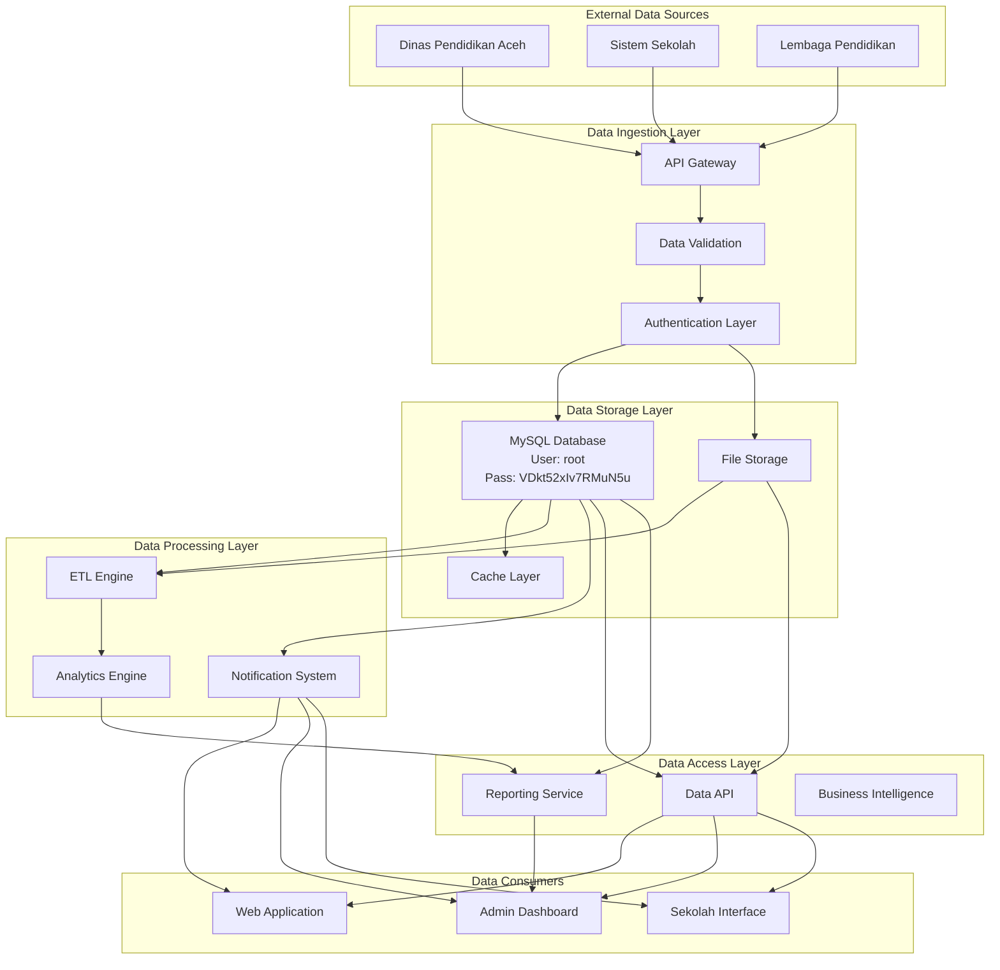
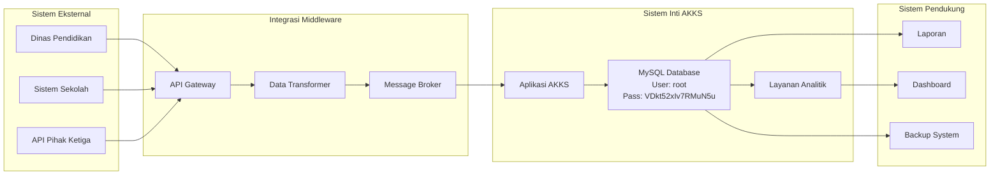
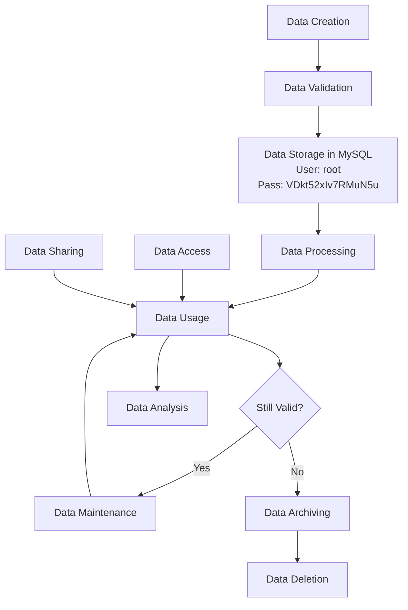
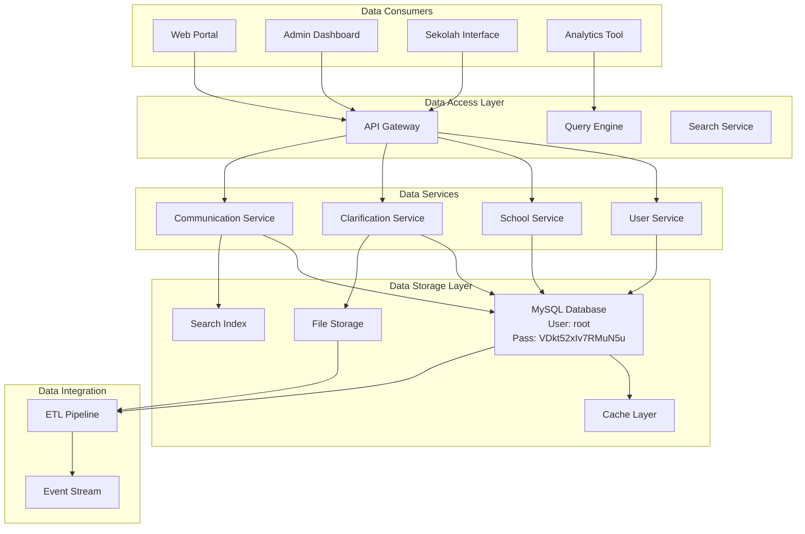
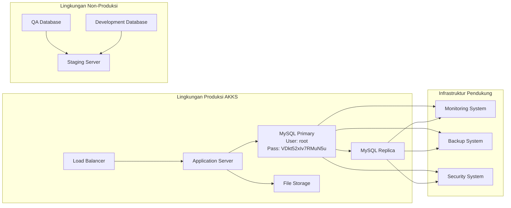
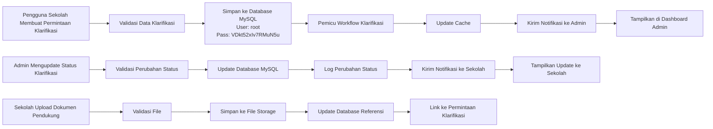

# Aplikasi AKKS - Data Architecture Document (DAD)
**Dokumen Arsitektur Data**

---

**Standar Referensi:** ISO/IEC/IEEE 42010 + TOGAF ADM (Phase C)

**Tanggal Pembuatan:** 29 Oktober 2025
**Penulis:** Arsitek Data
**Versi:** 1.0

---

## 1. Tujuan dan Lingkup (Purpose and Scope)

### 1.1 Tujuan (Purpose)
Dokumen ini menyediakan deskripsi komprehensif dari arsitektur data untuk aplikasi AKKS (Aplikasi Klarifikasi dan Komunikasi Sekolah) yang berada di dev.akks.pusakagtkaceh.id, sesuai dengan standar ISO/IEC/IEEE 42010 dan metodologi TOGAF ADM (Phase C - Information Systems Architecture). Tujuan utamanya adalah untuk mendefinisikan struktur data, aliran data, integrasi data, dan tata kelola data yang akan mendukung kebutuhan bisnis aplikasi ini.

### 1.2 Lingkup (Scope)
Arsitektur data mencakup:
- Struktur data utama dalam sistem AKKS
- Domain data dan sumber data
- Integrasi data antar sistem
- Manajemen metadata dan data induk
- Kebijakan tata kelola data
- Aspek keamanan dan kepatuhan data
- Database MySQL dengan kredensial: username root, password VDkt52xIv7RMuN5u

### 1.3 Definisi, Akronim, dan Singkatan
- **DAD:** Data Architecture Document
- **AKKS:** Aplikasi Klarifikasi dan Komunikasi Sekolah
- **MDM:** Master Data Management
- **ETL:** Extract, Transform, Load
- **SOA:** Service-Oriented Architecture
- **API:** Application Programming Interface
- **RDBMS:** Relational Database Management System
- **TOGAF:** The Open Group Architecture Framework
- **ISO/IEC/IEEE 42010:** Standar untuk deskripsi arsitektur sistem dan perangkat lunak
- **MySQL:** Sistem manajemen basis data relasional open-source

### 1.4 Referensi
1. ISO/IEC/IEEE 42010 - Systems and software engineering — Architecture description
2. TOGAF 9.2 Standard - Phase C: Information Systems Architectures
3. Data Architecture: A Primer for the Data Scientist
4. Aplikasi AKKS - Software Requirements Specification
5. Aplikasi AKKS - Software Design Description
6. Aplikasi AKKS - Database Design Document
7. MySQL 8.0 Documentation

## 2. Gambaran Umum Arsitektur Data (Data Architecture Overview)

### 2.1 Visi Arsitektur Data (Data Architecture Vision)
Arsitektur data dirancang untuk mendukung sistem klarifikasi dan komunikasi pendidikan yang skalabel, aman, dan dapat dipercaya, dengan fokus pada:
- Ketersediaan data real-time untuk pengambilan keputusan pendidikan
- Konsistensi data lintas modul aplikasi
- Privasi dan keamanan data pendidikan
- Integrasi dengan sistem eksternal pendidikan
- Penggunaan database MySQL dengan kredensial: username root, password VDkt52xIv7RMuN5u

### 2.2 Prinsip Arsitektur Data (Data Architecture Principles)
1. **Data sebagai Aset:** Perlakukan data sebagai aset strategis organisasi
2. **Ketersediaan dan Akses:** Data harus tersedia dan dapat diakses secara aman
3. **Kualitas Data:** Data harus akurat, lengkap, konsisten, dan terbaru
4. **Integritas dan Keamanan:** Perlindungan data harus diterapkan sejak desain
5. **Kepatuhan:** Patuhi regulasi privasi data dan perlindungan informasi
6. **Optimalisasi Database:** Pastikan database MySQL dioptimalkan untuk kinerja

### 2.3 Peta Konseptual Arsitektur Data (Conceptual Data Architecture Map)



## 3. Domain Data dan Sumber (Data Domains and Sources)

### 3.1 Domain Data Utama (Main Data Domains)

#### 3.1.1 Domain Pengguna dan Otentikasi (User and Authentication Domain)
- **Deskripsi:** Informasi tentang semua pengguna sistem (admin, guru, staf sekolah)
- **Entitas Utama:** User, Role, Session
- **Sumber:** Registrasi mandiri, sinkronisasi dari sistem sekolah
- **Volume Data:** 10.000 pengguna estimasi
- **Frekuensi Pembaruan:** Harian

#### 3.1.2 Domain Sekolah (School Domain)
- **Deskripsi:** Data tentang sekolah-sekolah yang terdaftar dalam sistem
- **Entitas Utama:** School, SchoolProfile, SchoolStatistics
- **Sumber:** Input dari sekolah, verifikasi admin
- **Volume Data:** 2.000 sekolah estimasi
- **Frekuensi Pembaruan:** Mingguan atau saat pembaruan profil

#### 3.1.3 Domain Klarifikasi (Clarification Domain)
- **Deskripsi:** Data tentang permintaan klarifikasi dari sekolah
- **Entitas Utama:** ClarificationRequest, SupportingDocument, StatusHistory
- **Sumber:** Input dari pengguna sekolah, pemrosesan admin
- **Volume Data:** 50.000 permintaan per tahun estimasi
- **Frekuensi Pembaruan:** Harian

#### 3.1.4 Domain Komunikasi (Communication Domain)
- **Deskripsi:** Data komunikasi antar pengguna dan sistem (notifikasi, forum)
- **Entitas Utama:** Notification, DiscussionForum, ForumPost
- **Sumber:** Input pengguna, sistem otomatis
- **Volume Data:** Ratusan ribu komunikasi per bulan
- **Frekuensi Pembaruan:** Real-time

### 3.2 Sumber Data Internal (Internal Data Sources)
- **Database Operasional:** MySQL dengan kredensial: username root, password VDkt52xIv7RMuN5u
- **Penyimpanan File:** Sistem penyimpanan objek untuk dokumen pendukung
- **Cache:** Redis untuk data yang sering diakses
- **Log Sistem:** Data operasional dan audit

### 3.3 Sumber Data Eksternal (External Data Sources)
- **Dinas Pendidikan Aceh:** Data resmi pendidikan
- **Sistem Akademik Sekolah:** Data siswa dan kelas
- **API Pihak Ketiga:** Layanan validasi, notifikasi, dll

## 4. Peta Integrasi Data (Data Integration Map)

### 4.1 Diagram Integrasi Data (Data Integration Diagram)



### 4.2 Mekanisme Integrasi (Integration Mechanisms)

#### 4.2.1 API Integration
- **Jenis:** RESTful API dan GraphQL
- **Deskripsi:** Integrasi sinkron dengan sistem eksternal
- **Protokol:** HTTPS dengan otentikasi OAuth 2.0
- **Frequensi:** Real-time atau request-response

#### 4.2.2 Database Connection
- **Jenis:** Koneksi langsung ke MySQL
- **Deskripsi:** Integrasi langsung dengan database utama
- **Protokol:** MySQL Protocol
- **Kredensial:** Username root, password VDkt52xIv7RMuN5u
- **Frequensi:** Continuous

### 4.3 Mapping Data (Data Mapping)
| Sumber | Target | Field Mapping | Transformasi |
|--------|--------|---------------|--------------|
| Sistem Sekolah | Users | NIP_Guru → user_id | Konversi format |
| Dinas Pendidikan | Schools | ID_Sekolah → school_id | Validasi dan normalisasi |
| Dokumen Manual | ClarificationRequests | Jenis_Klarifikasi → request_type | Klasifikasi kategori |

## 5. Manajemen Metadata dan Data Induk (Metadata and Master Data Management)

### 5.1 Metadata Management
#### 5.1.1 Metadata Bisnis (Business Metadata)
- Definisi data dan konteks bisnis
- Pemilik data dan kontak
- Kebijakan penggunaan data
- Klasifikasi sensitivitas data

#### 5.1.2 Metadata Teknis (Technical Metadata)
- Struktur skema database MySQL
- Tipe data dan batasan
- Indeks dan kinerja
- Sejarah perubahan skema
- Kredensial koneksi: username root, password VDkt52xIv7RMuN5u

#### 5.1.3 Metadata Operasional (Operational Metadata)
- Waktu pemrosesan data
- Status dan log kesalahan
- Metrik kualitas data
- Audit trail

### 5.2 Master Data Management (MDM)
#### 5.2.1 Domain Data Induk (Master Data Domains)
- **User Master:** Data pengguna yang konsisten lintas sistem
- **School Master:** Informasi sekolah terstandarisasi
- **Clarification Type Master:** Jenis-jenis permintaan klarifikasi
- **Role Master:** Peran-peran dalam sistem

#### 5.2.2 Hierarki Data Induk (Master Data Hierarchy)
```
Pendidikan Aceh
├── Sekolah
│   ├── Guru
│   └── Staf Administrasi
│       ├── Permintaan Klarifikasi
│       └── Notifikasi
└── Jenis Klarifikasi
    ├── Administrasi
    ├── Akademik
    └── Fasilitas
```

### 5.3 Glosarium Data (Data Glossary)
- **User ID:** Identifikasi unik untuk setiap pengguna, format UUID
- **School ID:** Identifikasi unik untuk setiap sekolah, format UUID
- **Clarification Request:** Permintaan klarifikasi data dari sekolah
- **Supporting Document:** Dokumen pendukung untuk permintaan klarifikasi
- **Status:** Status pemrosesan permintaan klarifikasi

## 6. Tata Kelola Data (Data Governance)

### 6.1 Peran dan Tanggung Jawab (Roles and Responsibilities)

#### 6.1.1 Data Owner
- **Tanggung Jawab:** Menentukan kebijakan penggunaan data
- **Peran:** Dinas Pendidikan Aceh, Manajemen AKKS
- **Akses:** Full akses administratif

#### 6.1.2 Data Steward
- **Tanggung Jawab:** Mengelola kualitas dan integritas data
- **Peran:** Tim IT Dinas Pendidikan
- **Akses:** Akses manajemen data
- **Koneksi Database:** Menggunakan kredensial: username root, password VDkt52xIv7RMuN5u

#### 6.1.3 Data Custodian
- **Tanggung Jawab:** Operasionalisasi sistem data
- **Peran:** Tim teknis dan pengembangan
- **Akses:** Akses teknis dan administratif
- **Koneksi Database:** Menggunakan kredensial: username root, password VDkt52xIv7RMuN5u

#### 6.1.4 Data Consumer
- **Tanggung Jawab:** Menggunakan data sesuai kebijakan
- **Peran:** Guru, staf sekolah, administrator
- **Akses:** Akses fungsional sesuai peran

### 6.2 Kebijakan Data (Data Policies)
1. **Kebijakan Privasi:** Perlindungan data pribadi sesuai UU Perlindungan Data Pribadi
2. **Kebijakan Kualitas:** Standar kualitas data dan prosedur pemeliharaan
3. **Kebijakan Keamanan:** Perlindungan data dari akses tidak sah
4. **Kebijakan Retensi:** Masa simpan data dan prosedur penghapusan
5. **Kebijakan Koneksi Database:** Penggunaan kredensial: username root, password VDkt52xIv7RMuN5u

### 6.3 Kualitas Data (Data Quality)
#### 6.3.1 Dimensi Kualitas
- **Akurasi:** Data mencerminkan realitas
- **Kelengkapan:** Tidak ada nilai penting yang hilang
- **Konsistensi:** Data konsisten lintas sistem
- **Kebaruan:** Data selalu terkini
- **Validitas:** Data sesuai format dan aturan

#### 6.3.2 Metrik Kualitas Data
- **Tingkat Kelengkapan:** Persentase field yang terisi
- **Tingkat Keakuratan:** Persentase data yang akurat
- **Tingkat Konsistensi:** Persentase data yang konsisten
- **Tingkat Duplikasi:** Jumlah entitas duplikat

## 7. Keamanan dan Kepatuhan (Security and Compliance)

### 7.1 Pengendalian Keamanan Data (Data Security Controls)

#### 7.1.1 ISO/IEC 27001 Controls Implementation
- **A.10.1 - Cryptographic Controls:** Enkripsi data sensitif
- **A.11.1 - Secure Configuration:** Konfigurasi aman sistem
- **A.12.6 - Management of Technical Vulnerabilities:** Manajemen kerentanan
- **A.13.1 - Network Security Management:** Keamanan jaringan
- **A.14.2 - Security in Development and Support Processes:** Keamanan dalam pengembangan

#### 7.1.2 Perlindungan Database (Database Protection)
- **Kredensial:** Username: root, Password: VDkt52xIv7RMuN5u
- **Enkripsi Koneksi:** SSL/TLS untuk koneksi ke MySQL
- **Otorisasi:** Hak akses berbasis peran
- **Audit:** Logging aktivitas database

#### 7.1.3 Perlindungan Data (Data Protection)
- **Enkripsi di Transit:** TLS 1.3 untuk semua komunikasi
- **Enkripsi di Rest:** AES-256 untuk data sensitif
- **Tokenisasi:** Data pribadi diganti dengan token
- **Masking:** Data untuk lingkungan non-produksi

#### 7.1.4 Akses Data (Data Access)
- **Otentikasi:** Multi-factor authentication
- **Otorisasi:** Role-Based Access Control (RBAC)
- **Audit Trail:** Log semua akses data
- **Segregation of Duties:** Pembagian tanggung jawab

### 7.2 Kepatuhan Regulator (Regulatory Compliance)
#### 7.2.1 Perlindungan Data Pribadi
- **UU No. 27 Tahun 2022:** Perlindungan Data Pribadi
- **Kebijakan Privasi:** Klarifikasi penggunaan data
- **Persetujuan:** Consent management yang jelas
- **Hak Subjek Data:** Hak akses, koreksi, hapus

#### 7.2.2 Standar Internasional
- **ISO 27001:** Sistem manajemen keamanan informasi
- **GDPR Prinsip:** Jika melibatkan data WNA
- **COPPA Prinsip:** Jika melibatkan data anak-anak

## 8. Siklus Hidup Data (Data Lifecycle)

### 8.1 Diagram Alir Siklus Hidup Data (Data Lifecycle Flow Diagram)



### 8.2 Tahapan Siklus Hidup (Lifecycle Stages)

#### 8.2.1 Penciptaan Data (Data Creation)
- **Sumber:** Input pengguna, integrasi sistem
- **Validasi:** Validasi format dan isi data
- **Dokumentasi:** Metadata awal dibuat
- **Database:** Data disimpan di MySQL dengan kredensial: username root, password VDkt52xIv7RMuN5u

#### 8.2.2 Pengolahan Data (Data Processing)
- **Transformasi:** Pembersihan dan normalisasi data
- **Integrasi:** Penggabungan dari berbagai sumber
- **Validasi Lanjutan:** Kualitas dan konsistensi data

#### 8.2.3 Penyimpanan Data (Data Storage)
- **Database Operasional:** MySQL sebagai database utama
- **Kredensial:** Username root, password VDkt52xIv7RMuN5u
- **File Storage:** Dokumen pendukung disimpan di sistem file

#### 8.2.4 Pemeliharaan Data (Data Maintenance)
- **Pembaruan:** Perubahan data sesuai kebutuhan
- **Pembersihan:** Penghapusan data tidak valid
- **Optimasi:** Peningkatan kinerja akses

#### 8.2.5 Penghapusan Data (Data Deletion)
- **Kebijakan Retensi:** Masa simpan berdasarkan kebijakan
- **Prosedur:** Prosedur aman untuk penghapusan
- **Audit:** Dokumentasi penghapusan data

### 8.3 Manajemen Versi Data (Data Versioning Management)
- **Audit Trail:** Catatan lengkap perubahan data
- **Snapshot:** Backup berkala untuk data penting
- **Recovery Point:** Titik pemulihan data maksimal 1 jam
- **Database:** Menggunakan MySQL dengan kredensial: username root, password VDkt52xIv7RMuN5u

## 9. Diagram Arsitektur Data (Data Architecture Diagrams)

### 9.1 Diagram Arsitektur Logis Data (Logical Data Architecture Diagram)



### 9.2 Diagram Arsitektur Fisik Data (Physical Data Architecture Diagram)



### 9.3 Diagram Alir Data (Data Flow Diagram)



## 10. Rencana Implementasi (Implementation Plan)

### 10.1 Tahapan Implementasi (Implementation Phases)
1. **Fase 1:** Persiapan infrastruktur dan skema dasar MySQL (Kredensial: root/VDkt52xIv7RMuN5u)
2. **Fase 2:** Implementasi layanan inti (otentikasi, pengguna)
3. **Fase 3:** Implementasi modul sekolah dan data induk
4. **Fase 4:** Implementasi modul klarifikasi dan komunikasi
5. **Fase 5:** Implementasi modul pelaporan dan analitik
6. **Fase 6:** Integrasi eksternal dan optimasi

### 10.2 Kriteria Sukses (Success Criteria)
- Ketersediaan data 99.9%
- Waktu respons database MySQL < 500ms
- Keamanan data terjamin (kredensial: root/VDkt52xIv7RMuN5u)
- Kepatuhan terhadap regulasi
- Skalabilitas untuk 10.000+ pengguna
- Integrasi lancar dengan sistem eksternal

---

**Lampiran:**
- Data Model Detail
- API Spesifikasi
- Panduan migrasi data
- Prosedur pemulihan bencana
- Template dokumentasi data
- Konfigurasi database: Host=localhost, Port=3306, User=root, Password=VDkt52xIv7RMuN5u

## Ringkasan Standar ISO/IEEE dan Tujuan

| Standar | Tujuan |
|---------|--------|
| ISO/IEC/IEEE 29148:2018 | Standar untuk rekayasa sistem dan perangkat lunak dalam manajemen kebutuhan |
| IEEE 1016-2009 | Praktik yang direkomendasikan untuk deskripsi desain perangkat lunak |
| ISO/IEC/IEEE 42010 | Standar untuk deskripsi arsitektur sistem dan perangkat lunak |
| TOGAF ADM | Metodologi untuk perencanaan dan pengembangan arsitektur perusahaan |