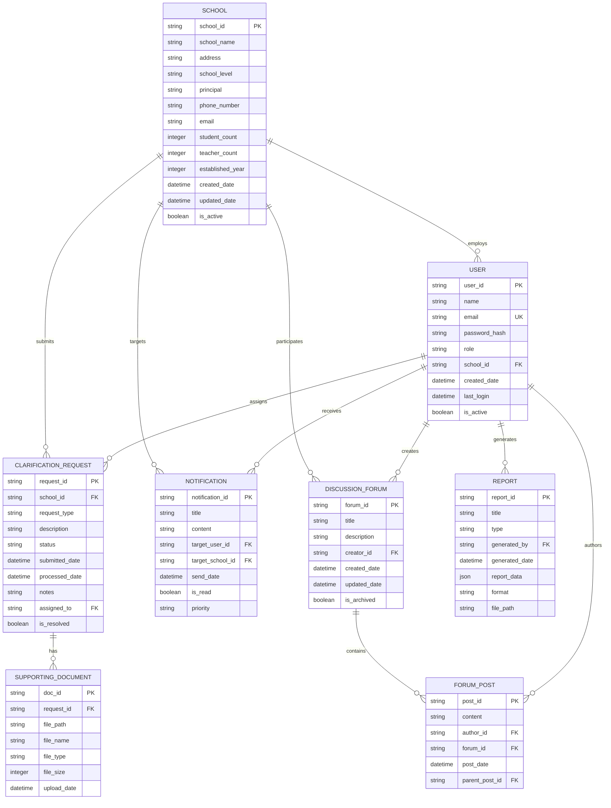
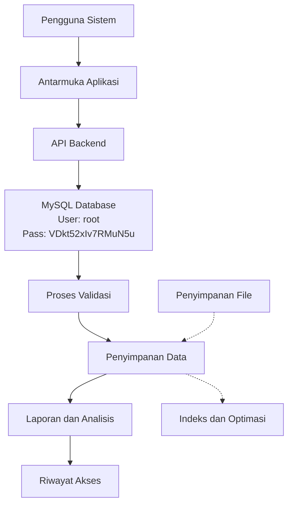

# Aplikasi AKKS - Database Design Document (DBDD)
**Dokumen Desain Database**

---

**Standar Referensi:** IEEE 1016 + ISO/IEC/IEEE 42010

**Tanggal Pembuatan:** 29 Oktober 2025
**Penulis:** Database Arsitek
**Versi:** 1.0

---

## 1. Pendahuluan dan Lingkup (Introduction and Scope)

### 1.1 Tujuan Dokumen (Document Purpose)
Dokumen ini menyediakan desain database komprehensif untuk aplikasi AKKS (Aplikasi Klarifikasi dan Komunikasi Sekolah) yang berada di dev.akks.pusakagtkaceh.id, sesuai dengan standar IEEE 1016 dan ISO/IEC/IEEE 42010. Tujuan utama adalah untuk mendokumentasikan arsitektur data, struktur tabel, hubungan antar entitas, dan strategi manajemen data untuk mendukung kebutuhan fungsional dan non-fungsional dari sistem.

### 1.2 Lingkup Sistem (System Scope)
Database ini akan mendukung semua aspek operasional aplikasi AKKS termasuk pengelolaan pengguna sekolah, manajemen data sekolah, proses klarifikasi data, sistem komunikasi, dan pelaporan hasil klarifikasi. Database menggunakan MySQL dengan username: root dan password: VDkt52xIv7RMuN5u.

### 1.3 Definisi, Akronim, dan Singkatan
- **DBMS:** Database Management System
- **ERD:** Entity Relationship Diagram
- **PK:** Primary Key
- **FK:** Foreign Key
- **DDL:** Data Definition Language
- **DML:** Data Manipulation Language
- **ACID:** Atomicity, Consistency, Isolation, Durability
- **SQL:** Structured Query Language
- **MySQL:** Sistem manajemen basis data relasional open-source

### 1.4 Referensi
1. IEEE 1016-2009 - IEEE Recommended Practice for Software Design Descriptions
2. ISO/IEC/IEEE 42010 - Systems and software engineering — Architecture description
3. MySQL 8.0 Documentation
4. Database Design for Mere Mortals by Michael J. Hernandez
5. Aplikasi AKKS - Software Requirements Specification
6. Aplikasi AKKS - Software Design Description

## 2. Model Data Konseptual (Conceptual Data Model)

### 2.1 Gambaran Umum (Overview)
Model data konseptual menyediakan representasi tingkat tinggi dari entitas data dan hubungan antar entitas dalam sistem AKKS. Model ini tidak tergantung pada teknologi atau DBMS tertentu dan fokus pada elemen data dan hubungan bisnis.

### 2.2 Entitas Utama dan Atribut (Main Entities and Attributes)

#### 2.2.1 Entitas Pengguna (User Entity)
- Entitas ini merepresentasikan semua jenis pengguna sistem (admin, guru, staf sekolah, dll)
- Atribut utama: ID Pengguna, Nama, Email, Peran, ID Sekolah

#### 2.2.2 Entitas Sekolah (School Entity)
- Entitas ini merepresentasikan sekolah-sekolah yang terdaftar dalam sistem
- Atribut utama: ID Sekolah, Nama Sekolah, Alamat, Jenjang Pendidikan, Jumlah Siswa

#### 2.2.3 Entitas Klarifikasi (Clarification Entity)
- Entitas ini merepresentasikan permintaan klarifikasi data dari sekolah
- Atribut utama: ID Klarifikasi, Jenis Permintaan, Deskripsi, Status, Tanggal Pengajuan

#### 2.2.4 Entitas Dokumen Pendukung (Supporting Document Entity)
- Entitas ini merepresentasikan dokumen pendukung untuk klarifikasi
- Atribut utama: ID Dokumen, Path File, Nama File, Tipe File, ID Klarifikasi

#### 2.2.5 Entitas Notifikasi (Notification Entity)
- Entitas ini merepresentasikan notifikasi yang dikirim ke pengguna
- Atribut utama: ID Notifikasi, Judul, Isi, Penerima, Tanggal, Status Dibaca

### 2.3 Diagram Entitas Relasi (Entity Relationship Diagram)



## 3. Model Data Logis (Logical Data Model)

### 3.1 Desain Detail Tabel (Detailed Table Design)

#### 3.1.1 Tabel Users
| Kolom | Tipe Data | Kunci | Nullable | Deskripsi |
|-------|-----------|-------|----------|-----------|
| user_id | VARCHAR(36) | PK | Tidak | ID unik pengguna (UUID) |
| name | VARCHAR(100) | - | Tidak | Nama lengkap pengguna |
| email | VARCHAR(100) | UK | Tidak | Email pengguna (unik) |
| password_hash | VARCHAR(255) | - | Tidak | Hash password (bcrypt) |
| role | ENUM('admin','school_officer','staff') | - | Tidak | Peran pengguna |
| school_id | VARCHAR(36) | FK | Ya | ID sekolah (nullable untuk admin) |
| created_date | TIMESTAMP | - | Tidak | Tanggal pembuatan akun |
| last_login | TIMESTAMP | - | Ya | Tanggal login terakhir |
| is_active | BOOLEAN | - | Tidak | Status aktif pengguna |

#### 3.1.2 Tabel Schools
| Kolom | Tipe Data | Kunci | Nullable | Deskripsi |
|-------|-----------|-------|----------|-----------|
| school_id | VARCHAR(36) | PK | Tidak | ID unik sekolah (UUID) |
| school_name | VARCHAR(200) | - | Tidak | Nama sekolah |
| address | TEXT | - | Tidak | Alamat lengkap sekolah |
| school_level | ENUM('sd','smp','sma','smk','slb') | - | Tidak | Jenjang pendidikan |
| principal | VARCHAR(100) | - | Ya | Nama kepala sekolah |
| phone_number | VARCHAR(20) | - | Ya | Nomor telepon sekolah |
| email | VARCHAR(100) | - | Ya | Email sekolah |
| student_count | INTEGER | - | Ya | Jumlah siswa |
| teacher_count | INTEGER | - | Ya | Jumlah guru |
| established_year | YEAR | - | Ya | Tahun berdiri |
| created_date | TIMESTAMP | - | Tidak | Tanggal entri dibuat |
| updated_date | TIMESTAMP | - | Ya | Tanggal entri diperbarui |
| is_active | BOOLEAN | - | Tidak | Status aktif sekolah |

#### 3.1.3 Tabel ClarificationRequests
| Kolom | Tipe Data | Kunci | Nullable | Deskripsi |
|-------|-----------|-------|----------|-----------|
| request_id | VARCHAR(36) | PK | Tidak | ID unik permintaan (UUID) |
| school_id | VARCHAR(36) | FK | Tidak | ID sekolah pengaju |
| request_type | VARCHAR(100) | - | Tidak | Jenis permintaan klarifikasi |
| description | TEXT | - | Tidak | Deskripsi permintaan |
| status | ENUM('pending','in_progress','resolved','rejected') | - | Tidak | Status klarifikasi |
| submitted_date | TIMESTAMP | - | Tidak | Tanggal pengajuan |
| processed_date | TIMESTAMP | - | Ya | Tanggal diproses |
| notes | TEXT | - | Ya | Catatan tambahan |
| assigned_to | VARCHAR(36) | FK | Ya | ID user yang menangani |
| is_resolved | BOOLEAN | - | Tidak | Status penyelesaian |

#### 3.1.4 Tabel SupportingDocuments
| Kolom | Tipe Data | Kunci | Nullable | Deskripsi |
|-------|-----------|-------|----------|-----------|
| doc_id | VARCHAR(36) | PK | Tidak | ID unik dokumen (UUID) |
| request_id | VARCHAR(36) | FK | Tidak | ID permintaan klarifikasi |
| file_path | VARCHAR(500) | - | Tidak | Path penyimpanan file |
| file_name | VARCHAR(200) | - | Tidak | Nama asli file |
| file_type | VARCHAR(20) | - | Tidak | Ekstensi file |
| file_size | INTEGER | - | Tidak | Ukuran file dalam bytes |
| upload_date | TIMESTAMP | - | Tidak | Tanggal upload dokumen |

#### 3.1.5 Tabel Notifications
| Kolom | Tipe Data | Kunci | Nullable | Deskripsi |
|-------|-----------|-------|----------|-----------|
| notification_id | VARCHAR(36) | PK | Tidak | ID unik notifikasi (UUID) |
| title | VARCHAR(200) | - | Tidak | Judul notifikasi |
| content | TEXT | - | Tidak | Isi notifikasi |
| target_user_id | VARCHAR(36) | FK | Ya | ID pengguna target |
| target_school_id | VARCHAR(36) | FK | Ya | ID sekolah target |
| send_date | TIMESTAMP | - | Tidak | Tanggal pengiriman |
| is_read | BOOLEAN | - | Tidak | Status sudah dibaca |
| priority | ENUM('low','medium','high') | - | Tidak | Prioritas notifikasi |

#### 3.1.6 Tabel DiscussionForums
| Kolom | Tipe Data | Kunci | Nullable | Deskripsi |
|-------|-----------|-------|----------|-----------|
| forum_id | VARCHAR(36) | PK | Tidak | ID unik forum (UUID) |
| title | VARCHAR(200) | - | Tidak | Judul forum |
| description | TEXT | - | Tidak | Deskripsi forum |
| creator_id | VARCHAR(36) | FK | Tidak | ID pembuat forum |
| created_date | TIMESTAMP | - | Tidak | Tanggal pembuatan |
| updated_date | TIMESTAMP | - | Ya | Tanggal terakhir diperbarui |
| is_archived | BOOLEAN | - | Tidak | Status arsip forum |

#### 3.1.7 Tabel ForumPosts
| Kolom | Tipe Data | Kunci | Nullable | Deskripsi |
|-------|-----------|-------|----------|-----------|
| post_id | VARCHAR(36) | PK | Tidak | ID unik postingan (UUID) |
| content | TEXT | - | Tidak | Isi postingan |
| author_id | VARCHAR(36) | FK | Tidak | ID penulis postingan |
| forum_id | VARCHAR(36) | FK | Tidak | ID forum tempat posting |
| post_date | TIMESTAMP | - | Tidak | Tanggal posting |
| parent_post_id | VARCHAR(36) | FK | Ya | ID postingan induk (jika balasan) |

#### 3.1.8 Tabel Reports
| Kolom | Tipe Data | Kunci | Nullable | Deskripsi |
|-------|-----------|-------|----------|-----------|
| report_id | VARCHAR(36) | PK | Tidak | ID unik laporan (UUID) |
| title | VARCHAR(200) | - | Tidak | Judul laporan |
| type | VARCHAR(50) | - | Tidak | Jenis laporan |
| generated_by | VARCHAR(36) | FK | Tidak | ID user pembuat laporan |
| generated_date | TIMESTAMP | - | Tidak | Tanggal pembuatan |
| report_data | JSON | - | Ya | Data laporan dalam format JSON |
| format | VARCHAR(10) | - | Tidak | Format laporan (pdf, excel, csv) |
| file_path | VARCHAR(500) | - | Ya | Path file laporan jika disimpan |

### 3.2 Hubungan Antar Tabel (Table Relationships)

**Hubungan Satu-ke-Banyak (One-to-Many):**
- Schools → Users (satu sekolah bisa memiliki banyak pengguna)
- Schools → ClarificationRequests (satu sekolah bisa membuat banyak permintaan)
- Users → ClarificationRequests (satu pengguna bisa menangani banyak permintaan)
- ClarificationRequests → SupportingDocuments (satu permintaan bisa memiliki banyak dokumen pendukung)
- Schools → Notifications (satu sekolah bisa menerima banyak notifikasi)
- Users → Notifications (satu pengguna bisa menerima banyak notifikasi)

**Hubungan Banyak-ke-Banyak (Many-to-Many):**
- Users ↔ DiscussionForums (melalui tabel perantara untuk partisipasi)
- Schools ↔ DiscussionForums (melalui tabel perantara untuk partisipasi)

## 4. Model Data Fisik (Physical Data Model)

### 4.1 Spesifikasi Database
- Database Management System: MySQL
- Nama Database: akks_db
- Skema Utama: public 
- Kredensial: Username - root, Password - VDkt52xIv7RMuN5u
- Engine: InnoDB

### 4.2 Skrip Pembuatan Tabel (Table Creation Scripts)

```sql
-- Tabel Schools
CREATE TABLE schools (
    school_id VARCHAR(36) PRIMARY KEY,
    school_name VARCHAR(200) NOT NULL,
    address TEXT NOT NULL,
    school_level ENUM('sd', 'smp', 'sma', 'smk', 'slb') NOT NULL,
    principal VARCHAR(100),
    phone_number VARCHAR(20),
    email VARCHAR(100),
    student_count INT,
    teacher_count INT,
    established_year YEAR,
    created_date TIMESTAMP NOT NULL DEFAULT CURRENT_TIMESTAMP,
    updated_date TIMESTAMP NULL ON UPDATE CURRENT_TIMESTAMP,
    is_active BOOLEAN NOT NULL DEFAULT TRUE
);

-- Tabel Users
CREATE TABLE users (
    user_id VARCHAR(36) PRIMARY KEY,
    name VARCHAR(100) NOT NULL,
    email VARCHAR(100) NOT NULL UNIQUE,
    password_hash VARCHAR(255) NOT NULL,
    role ENUM('admin', 'school_officer', 'staff') NOT NULL,
    school_id VARCHAR(36) NULL,
    created_date TIMESTAMP NOT NULL DEFAULT CURRENT_TIMESTAMP,
    last_login TIMESTAMP NULL,
    is_active BOOLEAN NOT NULL DEFAULT TRUE,
    FOREIGN KEY (school_id) REFERENCES schools(school_id)
);

-- Tabel ClarificationRequests
CREATE TABLE clarification_requests (
    request_id VARCHAR(36) PRIMARY KEY,
    school_id VARCHAR(36) NOT NULL,
    request_type VARCHAR(100) NOT NULL,
    description TEXT NOT NULL,
    status ENUM('pending', 'in_progress', 'resolved', 'rejected') NOT NULL DEFAULT 'pending',
    submitted_date TIMESTAMP NOT NULL DEFAULT CURRENT_TIMESTAMP,
    processed_date TIMESTAMP NULL,
    notes TEXT,
    assigned_to VARCHAR(36) NULL,
    is_resolved BOOLEAN NOT NULL DEFAULT FALSE,
    FOREIGN KEY (school_id) REFERENCES schools(school_id),
    FOREIGN KEY (assigned_to) REFERENCES users(user_id)
);

-- Tabel SupportingDocuments
CREATE TABLE supporting_documents (
    doc_id VARCHAR(36) PRIMARY KEY,
    request_id VARCHAR(36) NOT NULL,
    file_path VARCHAR(500) NOT NULL,
    file_name VARCHAR(200) NOT NULL,
    file_type VARCHAR(20) NOT NULL,
    file_size INT NOT NULL,
    upload_date TIMESTAMP NOT NULL DEFAULT CURRENT_TIMESTAMP,
    FOREIGN KEY (request_id) REFERENCES clarification_requests(request_id) ON DELETE CASCADE
);

-- Tabel Notifications
CREATE TABLE notifications (
    notification_id VARCHAR(36) PRIMARY KEY,
    title VARCHAR(200) NOT NULL,
    content TEXT NOT NULL,
    target_user_id VARCHAR(36) NULL,
    target_school_id VARCHAR(36) NULL,
    send_date TIMESTAMP NOT NULL DEFAULT CURRENT_TIMESTAMP,
    is_read BOOLEAN NOT NULL DEFAULT FALSE,
    priority ENUM('low', 'medium', 'high') NOT NULL DEFAULT 'medium',
    FOREIGN KEY (target_user_id) REFERENCES users(user_id),
    FOREIGN KEY (target_school_id) REFERENCES schools(school_id)
);

-- Tabel DiscussionForums
CREATE TABLE discussion_forums (
    forum_id VARCHAR(36) PRIMARY KEY,
    title VARCHAR(200) NOT NULL,
    description TEXT NOT NULL,
    creator_id VARCHAR(36) NOT NULL,
    created_date TIMESTAMP NOT NULL DEFAULT CURRENT_TIMESTAMP,
    updated_date TIMESTAMP NULL ON UPDATE CURRENT_TIMESTAMP,
    is_archived BOOLEAN NOT NULL DEFAULT FALSE,
    FOREIGN KEY (creator_id) REFERENCES users(user_id)
);

-- Tabel ForumPosts
CREATE TABLE forum_posts (
    post_id VARCHAR(36) PRIMARY KEY,
    content TEXT NOT NULL,
    author_id VARCHAR(36) NOT NULL,
    forum_id VARCHAR(36) NOT NULL,
    post_date TIMESTAMP NOT NULL DEFAULT CURRENT_TIMESTAMP,
    parent_post_id VARCHAR(36) NULL,
    FOREIGN KEY (author_id) REFERENCES users(user_id),
    FOREIGN KEY (forum_id) REFERENCES discussion_forums(forum_id),
    FOREIGN KEY (parent_post_id) REFERENCES forum_posts(post_id)
);

-- Tabel Reports
CREATE TABLE reports (
    report_id VARCHAR(36) PRIMARY KEY,
    title VARCHAR(200) NOT NULL,
    type VARCHAR(50) NOT NULL,
    generated_by VARCHAR(36) NOT NULL,
    generated_date TIMESTAMP NOT NULL DEFAULT CURRENT_TIMESTAMP,
    report_data JSON,
    format VARCHAR(10) NOT NULL COMMENT 'pdf, excel, csv',
    file_path VARCHAR(500) NULL,
    FOREIGN KEY (generated_by) REFERENCES users(user_id)
);
```

### 4.3 Indeks (Indexes)

```sql
-- Indeks pada kolom yang sering digunakan untuk pencarian
CREATE INDEX idx_users_email ON users(email);
CREATE INDEX idx_users_school_id ON users(school_id);
CREATE INDEX idx_users_role ON users(role);
CREATE INDEX idx_clarification_requests_school_id ON clarification_requests(school_id);
CREATE INDEX idx_clarification_requests_status ON clarification_requests(status);
CREATE INDEX idx_clarification_requests_assigned ON clarification_requests(assigned_to);
CREATE INDEX idx_supporting_documents_request_id ON supporting_documents(request_id);
CREATE INDEX idx_notifications_target_user ON notifications(target_user_id);
CREATE INDEX idx_notifications_target_school ON notifications(target_school_id);
CREATE INDEX idx_forum_posts_forum_id ON forum_posts(forum_id);
CREATE INDEX idx_forum_posts_author_id ON forum_posts(author_id);

-- Indeks komposit untuk query kompleks
CREATE INDEX idx_clarification_requests_status_date ON clarification_requests(status, submitted_date);
CREATE INDEX idx_notifications_unread ON notifications(is_read, send_date);
```

### 4.4 Tampilan (Views)

```sql
-- View untuk ringkasan klarifikasi per sekolah
CREATE VIEW school_clarification_summary AS
SELECT 
    s.school_id,
    s.school_name,
    COUNT(cr.request_id) AS total_requests,
    COUNT(CASE WHEN cr.status = 'pending' THEN 1 END) AS pending_requests,
    COUNT(CASE WHEN cr.status = 'in_progress' THEN 1 END) AS in_progress_requests,
    COUNT(CASE WHEN cr.status = 'resolved' THEN 1 END) AS resolved_requests
FROM schools s
LEFT JOIN clarification_requests cr ON s.school_id = cr.school_id
WHERE s.is_active = TRUE
GROUP BY s.school_id, s.school_name;

-- View untuk daftar permintaan dengan detail sekolah
CREATE VIEW clarification_with_school_details AS
SELECT 
    cr.request_id,
    cr.request_type,
    cr.description,
    cr.status,
    cr.submitted_date,
    s.school_name,
    s.school_level,
    u.name AS assigned_officer
FROM clarification_requests cr
JOIN schools s ON cr.school_id = s.school_id
LEFT JOIN users u ON cr.assigned_to = u.user_id;
```

### 4.5 Prosedur dan Fungsi (Stored Procedures and Functions)

```sql
-- Prosedur untuk membuat permintaan klarifikasi baru
DELIMITER //
CREATE PROCEDURE CreateClarificationRequest(
    IN p_school_id VARCHAR(36),
    IN p_request_type VARCHAR(100),
    IN p_description TEXT
)
BEGIN
    INSERT INTO clarification_requests (request_id, school_id, request_type, description, status, submitted_date)
    VALUES (UUID(), p_school_id, p_request_type, p_description, 'pending', NOW());
END //
DELIMITER ;

-- Fungsi untuk mendapatkan jumlah permintaan tertunda
DELIMITER //
CREATE FUNCTION GetPendingRequestsCount(p_school_id VARCHAR(36)) 
RETURNS INT
READS SQL DATA
DETERMINISTIC
BEGIN
    DECLARE pending_count INT;
    SELECT COUNT(*) INTO pending_count 
    FROM clarification_requests 
    WHERE school_id = p_school_id AND status = 'pending';
    RETURN pending_count;
END //
DELIMITER ;
```

## 5. Kamus Data (Data Dictionary)

| Entitas | Atribut | Tipe Data | Panjang | Kunci | Nullable | Deskripsi | Validasi |
|---------|---------|-----------|---------|-------|----------|-----------|----------|
| Users | user_id | VARCHAR | 36 | PK | Tidak | ID unik pengguna | Format UUID |
| Users | email | VARCHAR | 100 | UK | Tidak | Email pengguna | Format email valid |
| Users | role | ENUM | - | - | Tidak | Peran pengguna | admin, school_officer, staff |
| Schools | school_id | VARCHAR | 36 | PK | Tidak | ID unik sekolah | Format UUID |
| Schools | school_level | ENUM | - | - | Tidak | Jenjang pendidikan | sd, smp, sma, smk, slb |
| Schools | established_year | YEAR | - | - | Ya | Tahun berdiri | Tidak masa depan |
| ClarificationRequests | request_id | VARCHAR | 36 | PK | Tidak | ID unik permintaan | Format UUID |
| ClarificationRequests | status | ENUM | - | - | Tidak | Status klarifikasi | pending, in_progress, resolved, rejected |
| SupportingDocuments | file_size | INTEGER | - | - | Tidak | Ukuran file | Dalam bytes |
| Notifications | priority | ENUM | - | - | Tidak | Prioritas notifikasi | low, medium, high |

## 6. Integritas Data dan Keamanan (Data Integrity and Security)

### 6.1 Aturan Integritas Referensial (Referential Integrity Rules)
- CASCADE pada penghapusan sekolah: pengguna yang terkait akan diarsipkan, bukan dihapus
- RESTRICT pada penghapusan pengguna jika masih ditugaskan pada permintaan aktif
- CASCADE pada penghapusan permintaan: dokumen pendukung akan dihapus

### 6.2 Keamanan Data (Data Security)
- Enkripsi kolom sensitif seperti password dengan algoritma bcrypt
- Pembatasan akses berbasis peran (RBAC) di tingkat aplikasi
- Koneksi database menggunakan kredensial: username root, password VDkt52xIv7RMuN5u
- Audit trail untuk operasi penting pada data

### 6.3 Backup dan Restorasi (Backup and Recovery)
- Backup harian untuk data transaksional
- Backup mingguan untuk schema dan konfigurasi
- Backup offsite untuk keamanan bencana
- RTO (Recovery Time Objective): 4 jam
- RPO (Recovery Point Objective): 1 jam

## 7. Diagram Alir Data (Data Flow Diagram)



## 8. Rencana Migrasi dan Versi (Migration and Versioning Plan)

### 8.1 Strategi Migrasi Data
- Migrasi bertahap dari sistem lama (jika ada)
- Validasi data setelah migrasi
- Backup sebelum migrasi
- Uji coba migrasi di lingkungan staging

### 8.2 Manajemen Versi Skema
- Penggunaan skrip migrasi otomatis
- Sistem versi skema terpusat
- Rollback otomatis jika migrasi gagal
- Dokumentasi perubahan skema

### 8.3 Skrip Migrasi Contoh
```sql
-- Versi 1.1: Tambah kolom baru ke tabel schools
ALTER TABLE schools ADD COLUMN website_url VARCHAR(200);

-- Versi 1.2: Perbarui batasan pada kolom status
ALTER TABLE clarification_requests MODIFY COLUMN status ENUM('pending','in_progress','resolved','rejected','cancelled') NOT NULL DEFAULT 'pending';

-- Versi 1.3: Tambah tabel baru untuk log aktivitas
CREATE TABLE activity_logs (
    log_id VARCHAR(36) PRIMARY KEY,
    user_id VARCHAR(36) NOT NULL,
    action VARCHAR(100) NOT NULL,
    description TEXT,
    created_date TIMESTAMP NOT NULL DEFAULT CURRENT_TIMESTAMP,
    FOREIGN KEY (user_id) REFERENCES users(user_id)
);
```

---

**Lampiran:**
- Skrip SQL Lengkap
- Contoh Query Umum
- Panduan Administrasi Database
- Prosedur Backup dan Pemulihan
- Dokumentasi Koneksi: Host=localhost, Port=3306, User=root, Password=VDkt52xIv7RMuN5u