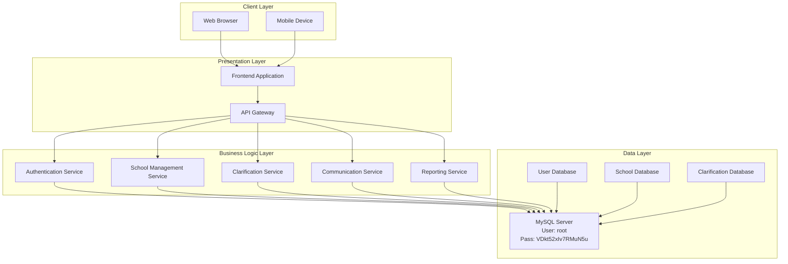
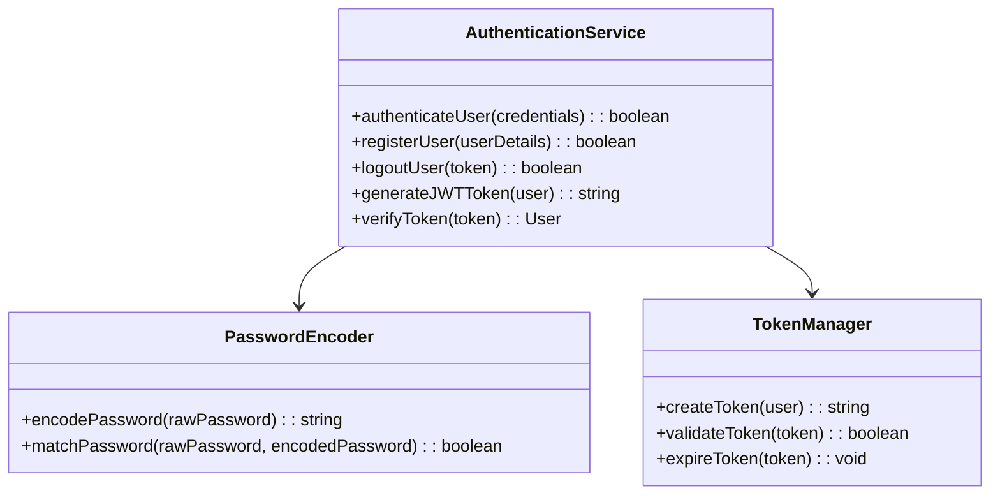
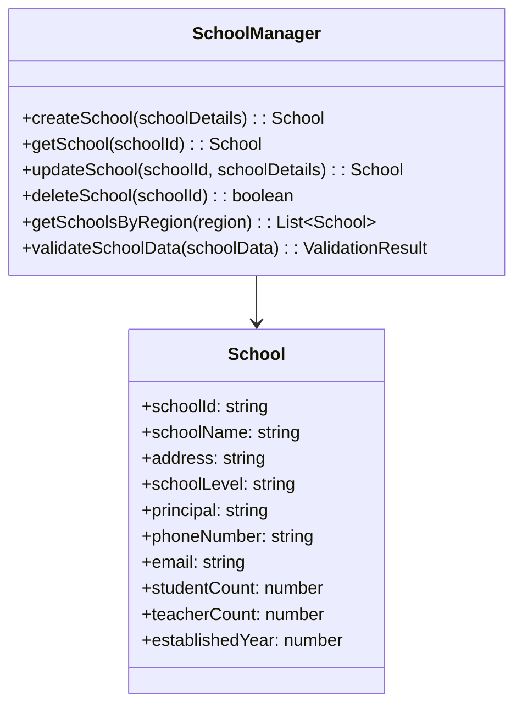
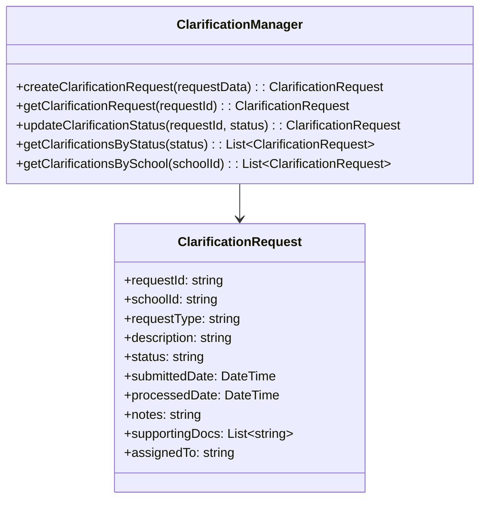
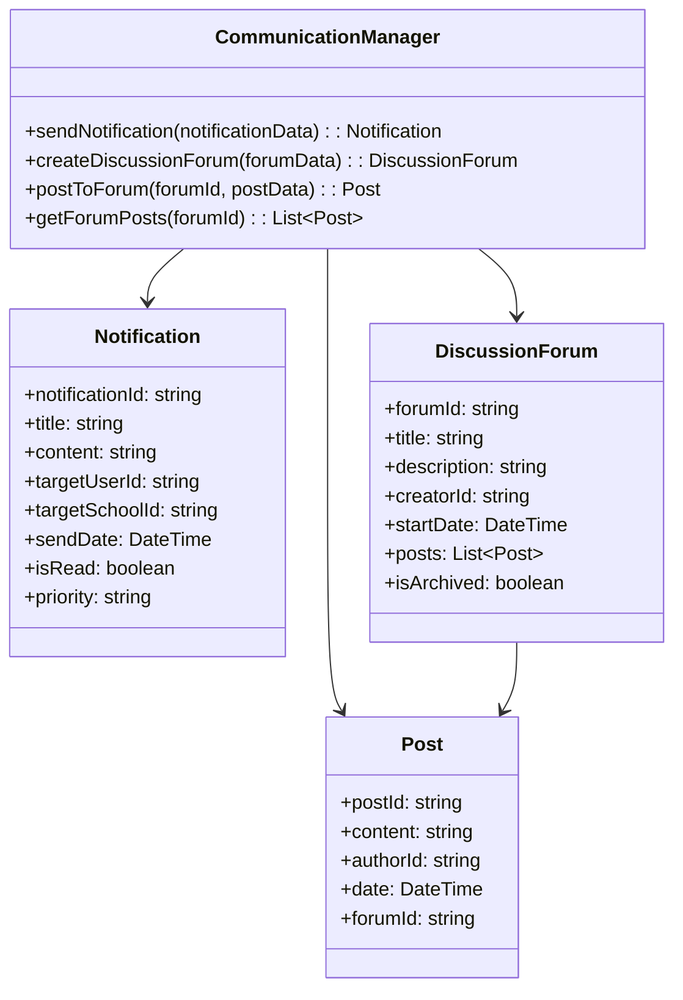
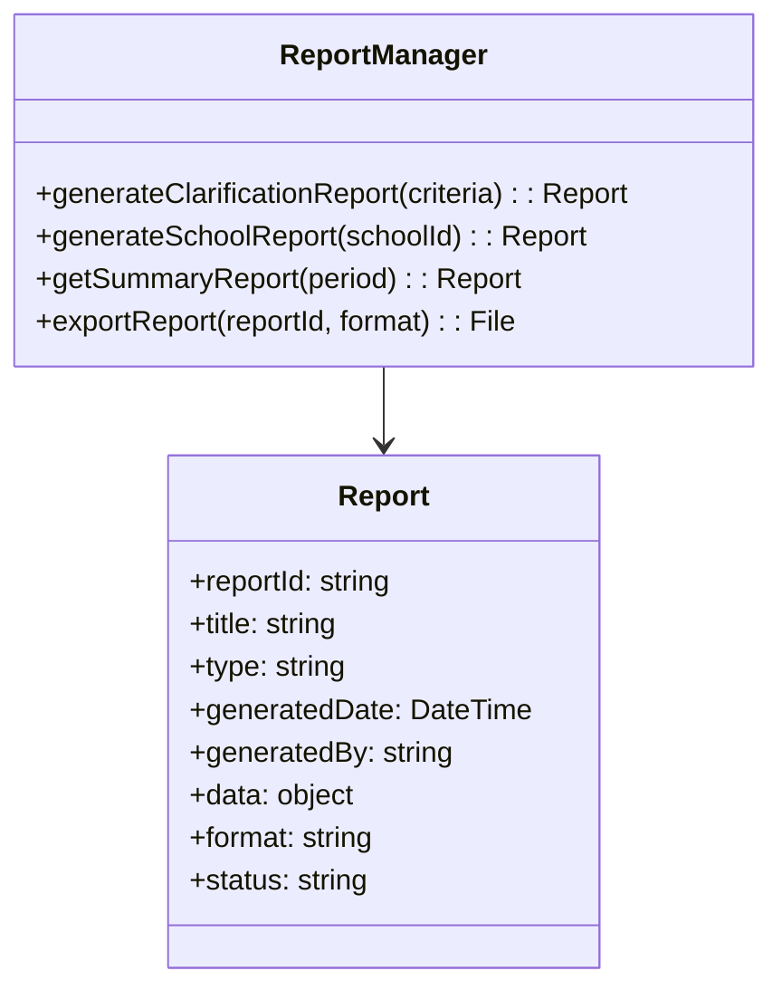
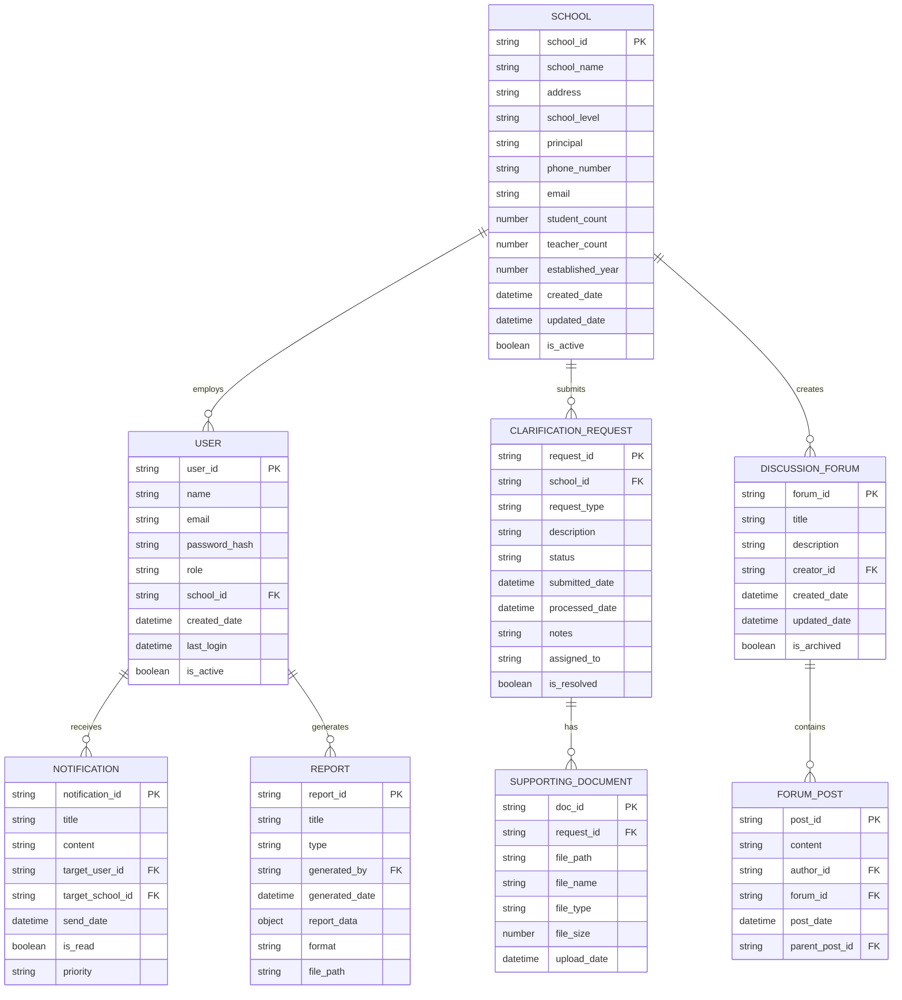
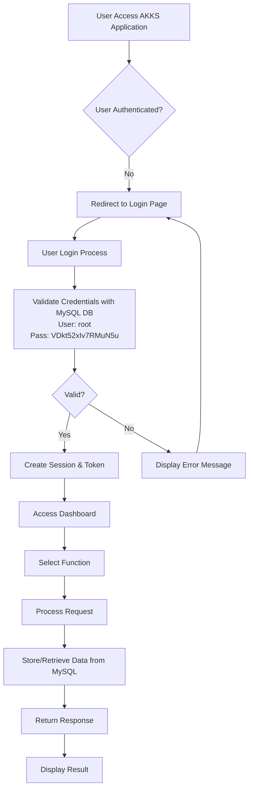
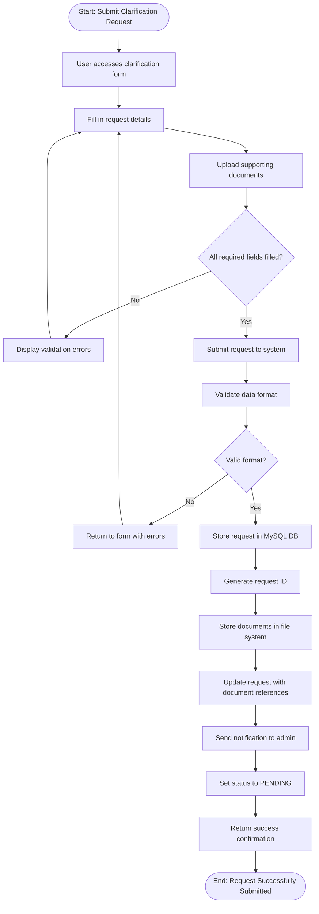

# Aplikasi AKKS - Software Design Description (SDD)
**Dokumen Deskripsi Desain Perangkat Lunak**

---

**Standar Referensi:** IEEE 1016-2009

**Tanggal Pembuatan:** 29 Oktober 2025
**Penulis:** Sistem Arsitek
**Versi:** 1.0

---

## 1. Pendahuluan (Introduction)

### 1.1 Tujuan (Purpose)
Dokumen ini merupakan deskripsi desain perangkat lunak (Software Design Description/SDD) untuk aplikasi AKKS (Aplikasi Klarifikasi dan Komunikasi Sekolah) yang berada di dev.akks.pusakagtkaceh.id. Tujuan dari dokumen ini adalah memberikan gambaran rinci tentang arsitektur dan desain sistem, termasuk struktur, komponen, antarmuka, dan fungsi-fungsi yang dirancang untuk memenuhi kebutuhan fungsional dan non-fungsional yang telah ditentukan dalam SRS.

### 1.2 Lingkup (Scope)
Dokumen ini mencakup desain arsitektur sistem, komponen perangkat lunak, desain data, desain antarmuka, dan pertimbangan implementasi untuk aplikasi AKKS. Ini berfungsi sebagai panduan teknis untuk pengembang dalam mengimplementasikan sistem sesuai dengan spesifikasi kebutuhan.

### 1.3 Referensi ke SRS (Reference to SRS)
- Nama Dokumen: Aplikasi AKKS - Software Requirements Specification
- Nomor Revisi: 1.0
- Tanggal: 29 Oktober 2025
- Penulis: Sistem Analis

### 1.4 Referensi Lain (Other References)
1. IEEE 1016-2009 - IEEE Recommended Practice for Software Design Descriptions
2. TOGAF 9.2 Standard for Enterprise Architecture
3. ISO/IEC/IEEE 42010 - Systems and software engineering — Architecture description
4. MySQL 8.0 Documentation
5. Standar Pengembangan Aplikasi Web

### 1.5 Ikhtisar (Overview)
Dokumen ini terstruktur dalam beberapa bagian utama: deskripsi arsitektur keseluruhan, desain komponen, desain data, desain antarmuka, desain proses, dan pertimbangan implementasi.

## 2. Gambaran Arsitektural (Architectural Overview)

### 2.1 Deskripsi Umum (General Description)
Aplikasi AKKS mengadopsi pendekatan arsitektur berbasis layanan (Service-Oriented Architecture) dengan pola arsitektur tiga lapis (3-tier architecture) yang mencakup:
- Lapisan Presentasi (Presentation Layer)
- Lapisan Logika Bisnis (Business Logic Layer)
- Lapisan Data (Data Layer)

Sistem ini menggunakan database MySQL dengan username: root dan password: VDkt52xIv7RMuN5u.

### 2.2 Diagram Arsitektur (Architecture Diagrams)



### 2.3 Prinsip-Prinsip Desain (Design Principles)
- Separation of Concerns: Memisahkan tanggung jawab antar komponen
- Scalability: Desain yang dapat berkembang sesuai kebutuhan
- Maintainability: Kode yang mudah dipelihara dan dimodifikasi
- Security by Design: Keamanan diterapkan sejak tahap desain
- Performance: Optimalisasi kinerja dari awal desain

## 3. Desain Komponen (Component Design)

### 3.1 Modul Otentikasi (Authentication Module)



**Deskripsi:**
- Modul ini bertanggung jawab untuk otentikasi dan otorisasi pengguna
- Menggunakan JWT (JSON Web Token) untuk manajemen sesi
- Mengimplementasikan enkripsi password menggunakan algoritma Bcrypt

### 3.2 Modul Manajemen Sekolah (School Management Module)



**Deskripsi:**
- Modul ini mengelola data sekolah
- Menyediakan fungsi CRUD (Create, Read, Update, Delete) untuk sekolah
- Melakukan validasi data sekolah sebelum disimpan

### 3.3 Modul Klarifikasi (Clarification Module)



**Deskripsi:**
- Modul ini mengelola permintaan klarifikasi dari sekolah
- Melacak status dan proses klarifikasi
- Menyediakan fungsi untuk mengelola dokumen pendukung

### 3.4 Modul Komunikasi (Communication Module)



**Deskripsi:**
- Modul ini mengelola komunikasi antar lembaga pendidikan
- Menyediakan sistem notifikasi dan forum diskusi
- Menyimpan riwayat komunikasi

### 3.5 Modul Pelaporan (Reporting Module)



**Deskripsi:**
- Modul ini menghasilkan laporan berkala dan sesuai permintaan
- Menyediakan berbagai format ekspor laporan
- Mengelola proses pembuatan dan distribusi laporan

## 4. Desain Data (Data Design)

### 4.1 Model Data Konseptual (Conceptual Data Model)



### 4.2 Model Data Logis (Logical Data Model)

**Tabel User:**
- user_id: string (Primary Key, UUID)
- name: string (Not Null)
- email: string (Unique, Not Null)
- password_hash: string (Not Null)
- role: enum('admin', 'school_officer', 'staff')
- school_id: string (Foreign Key to School, Nullable for admin)
- created_date: datetime
- last_login: datetime
- is_active: boolean (Default: true)

**Tabel School:**
- school_id: string (Primary Key, UUID)
- school_name: string (Not Null)
- address: string (Not Null)
- school_level: enum('sd', 'smp', 'sma', 'smk', 'slb') (Not Null)
- principal: string
- phone_number: string
- email: string
- student_count: integer
- teacher_count: integer
- established_year: integer
- created_date: datetime
- updated_date: datetime
- is_active: boolean (Default: true)

**Tabel ClarificationRequest:**
- request_id: string (Primary Key, UUID)
- school_id: string (Foreign Key to School)
- request_type: string (Not Null)
- description: text (Not Null)
- status: enum('pending', 'in_progress', 'resolved', 'rejected') (Default: 'pending')
- submitted_date: datetime (Not Null)
- processed_date: datetime
- notes: text
- assigned_to: string (Foreign Key to User)
- is_resolved: boolean (Default: false)

**Tabel SupportingDocument:**
- doc_id: string (Primary Key, UUID)
- request_id: string (Foreign Key to ClarificationRequest)
- file_path: string (Not Null)
- file_name: string (Not Null)
- file_type: string (Not Null)
- file_size: integer (Not Null)
- upload_date: datetime (Not Null)

### 4.3 Model Data Fisik (Physical Data Model)
- Database: MySQL
- Engine: InnoDB
- Koneksi: username: root, password: VDkt52xIv7RMuN5u
- Indeks pada kolom yang sering diquery
- Partisi tabel besar berdasarkan tanggal

## 5. Desain Antarmuka (Interface Design)

### 5.1 Antarmuka API (API Interface Design)

#### 5.1.1 Endpoints Otentikasi
```
POST /api/auth/login
Request: { "email": "string", "password": "string" }
Response: { "token": "string", "user": {...} }

POST /api/auth/register
Request: { "name": "string", "email": "string", "password": "string", "school_id": "string", "role": "string" }
Response: { "message": "string", "user": {...} }

POST /api/auth/logout
Authorization: Bearer <token>
Response: { "message": "string" }
```

#### 5.1.2 Endpoints Manajemen Sekolah
```
GET /api/schools
Authorization: Bearer <token>
Response: [{ "school_id": "string", "school_name": "string", ... }]

POST /api/schools
Authorization: Bearer <token>
Request: { "school_name": "string", "address": "string", ... }
Response: { "school_id": "string", "message": "string" }

GET /api/schools/{school_id}
Authorization: Bearer <token>
Response: { "school_id": "string", "school_name": "string", ... }

PUT /api/schools/{school_id}
Authorization: Bearer <token>
Request: { "school_name": "string", "address": "string", ... }
Response: { "message": "string" }
```

#### 5.1.3 Endpoints Klarifikasi
```
GET /api/clarifications
Authorization: Bearer <token>
Response: [{ "request_id": "string", "request_type": "string", ... }]

POST /api/clarifications
Authorization: Bearer <token>
Request: { "request_type": "string", "description": "string", ... }
Response: { "request_id": "string", "message": "string" }

GET /api/clarifications/{request_id}
Authorization: Bearer <token>
Response: { "request_id": "string", "description": "string", ... }

PUT /api/clarifications/{request_id}
Authorization: Bearer <token>
Request: { "status": "string", "notes": "string", "assigned_to": "string" }
Response: { "message": "string" }
```

#### 5.1.4 Endpoints Dokumen Pendukung
```
POST /api/clarifications/{request_id}/documents
Authorization: Bearer <token>
Content-Type: multipart/form-data
Request: { "file": "file" }
Response: { "doc_id": "string", "message": "string" }

GET /api/documents/{doc_id}/download
Authorization: Bearer <token>
Response: File download
```

### 5.2 Antarmuka Pengguna (UI Component Design)

#### 5.2.1 Komponen Dashboard
```
Dashboard Layout:
- Sidebar: Menu navigasi
- Header: Informasi pengguna dan notifikasi
- Main Content: Ringkasan informasi dan statistik
- Footer: Informasi sistem
```

#### 5.2.2 Komponen Form Klarifikasi
```
Clarification Form Component:
- Input jenis permintaan
- Area teks untuk deskripsi
- Upload dokumen pendukung
- Tombol kirim permintaan
```

## 6. Desain Proses (Process Design)

### 6.1 Diagram Alur Proses (Process Flow Diagram)



### 6.2 Diagram Urutan (Sequence Diagram)

```mermaid
sequenceDiagram
    participant U as User
    participant B as Browser
    participant A as API Gateway
    participant S as Authentication Service
    P as School Management Service
    C as Clarification Service
    D as MySQL Database<br/>User: root<br/>Pass: VDkt52xIv7RMuN5u
    
    U->>B: Akses halaman login
    B->>A: Request login form
    A->>B: Return login form
    U->>B: Masukkan kredensial
    B->>A: POST /login credentials
    A->>S: Validate credentials
    S->>D: Verify user credentials in MySQL
    D-->>S: Return user data
    S-->>A: Return JWT token
    A-->>B: Return session token
    B-->>U: Redirect to dashboard
    U->>B: Akses formulir klarifikasi
    B->>A: Request clarification form
    A->>C: Initialize clarification process
    C-->>B: Return clarification form
    B-->>U: Tampilkan formulir
    U->>B: Isi dan kirim formulir
    B->>A: POST clarification request
    A->>C: Process clarification request
    C->>D: Store clarification request in MySQL
    D-->>C: Confirmation stored
    C-->>A: Return success response
    A-->>B: Return success response
    B-->>U: Tampilkan konfirmasi
```

### 6.3 Diagram Aktivitas (Activity Diagram)



## 7. Desain Non-Fungsional (Non-Functional Design)

### 7.1 Desain Keamanan (Security Design)
- Otentikasi berbasis JWT token
- Otorisasi berbasis peran (Role-Based Access Control)
- Enkripsi data sensitif di database MySQL
- Validasi input untuk mencegah serangan SQL Injection dan XSS
- Rate limiting untuk mencegah abuse API
- Koneksi aman ke database dengan kredensial: username root, password VDkt52xIv7RMuN5u

### 7.2 Desain Skalabilitas (Scalability Design)
- Arsitektur mikroservis untuk kemudahan scaling
- Penggunaan cache (Redis) untuk data yang sering diakses
- Load balancing untuk distribusi beban
- Database clustering dan replikasi MySQL

### 7.3 Desain Ketersediaan (Availability Design)
- Sistem backup dan failover
- Monitoring dan alerting sistem
- Penanganan error yang robust
- Graceful degradation untuk komponen yang tidak penting

### 7.4 Desain Pemeliharaan (Maintainability Design)
- Kode modular dan terdokumentasi
- Logging komprehensif
- Monitoring dan metric
- Konfigurasi yang fleksibel

## 8. Pertimbangan Implementasi (Implementation Considerations)

### 8.1 Teknologi yang Digunakan (Technology Stack)
- Backend: PHP/Python/Node.js
- Frontend: React.js, Vue.js, atau framework HTML5
- Database: MySQL (username: root, password: VDkt52xIv7RMuN5u)
- Web Server: Apache/Nginx
- File Storage: Sistem file lokal atau cloud storage

### 8.2 Pustaka dan Framework (Libraries and Frameworks)
- Otentikasi: JWT atau library auth bawaan framework
- Validasi: Library validasi input
- Database ORM: Library koneksi MySQL
- Dokumentasi API: Swagger atau OpenAPI

### 8.3 Alat Pengembangan (Development Tools)
- Version Control: Git
- CI/CD: GitHub Actions atau GitLab CI
- Deployment: Docker atau deployment script
- Database Management: phpMyAdmin atau MySQL Workbench

### 8.4 Spesifikasi Koneksi Database
- Database Server: MySQL
- Host: localhost (berdasarkan informasi dari folder aplikasi)
- Port: 3306 (default)
- Username: root
- Password: VDkt52xIv7RMuN5u
- Database Name: akks_db (asumsi)

## 9. Pertimbangan Uji Coba (Testing Considerations)

### 9.1 Strategi Pengujian (Testing Strategy)
- Unit Testing: Pengujian komponen individual
- Integration Testing: Pengujian integrasi antar komponen
- End-to-End Testing: Pengujian alur pengguna secara menyeluruh
- Security Testing: Pengujian keamanan sistem
- Performance Testing: Pengujian kinerja dan beban
- Database Testing: Pengujian koneksi dan operasi database dengan kredensial yang ditentukan

### 9.2 Alat Uji Coba (Testing Tools)
- Unit Testing: Framework testing sesuai bahasa backend
- End-to-End Testing: Selenium atau Cypress
- Load Testing: JMeter atau Artillery
- Security Testing: OWASP ZAP atau tools sejenis
- Database Testing: Alat pengujian koneksi MySQL

---

**Lampiran:**
- Diagram UML Detail
- Spesifikasi API Lengkap
- Panduan Deployment
- Dokumentasi Konfigurasi Database MySQL