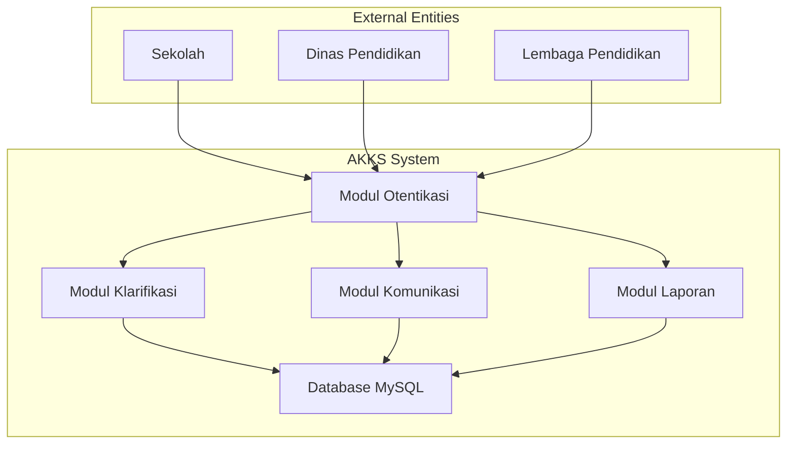

# Aplikasi AKKS - Software Requirements Specification (SRS)
**Dokumen Spesifikasi Kebutuhan Perangkat Lunak**

---

**Standar Referensi:** ISO/IEC/IEEE 29148:2018

**Tanggal Pembuatan:** 29 Oktober 2025
**Penulis:** Sistem Analis
**Versi:** 1.0

---

## 1. Pendahuluan (Introduction)

### 1.1 Tujuan (Purpose)
Dokumen ini merupakan Spesifikasi Kebutuhan Perangkat Lunak (Software Requirements Specification/SRS) untuk aplikasi AKKS (Aplikasi Klarifikasi dan Komunikasi Sekolah) yang berada di dev.akks.pusakagtkaceh.id. Tujuan dari dokumen ini adalah untuk menentukan secara rinci kebutuhan fungsional dan non-fungsional dari sistem aplikasi yang mendukung proses klarifikasi dan komunikasi antara sekolah dan lembaga pendidikan di Aceh.

### 1.2 Lingkup (Scope)
Aplikasi AKKS adalah platform digital yang dirancang untuk mendukung proses klarifikasi data dan komunikasi antara sekolah-sekolah dengan lembaga pendidikan terkait, khususnya di wilayah Aceh. Platform ini menyediakan berbagai fitur untuk pengelolaan data sekolah, proses klarifikasi informasi, serta komunikasi efektif antar pihak terkait.

### 1.3 Definisi, Akronim, dan Singkatan
- **AKKS**: Aplikasi Klarifikasi dan Komunikasi Sekolah
- **Sekolah**: Institusi pendidikan yang terdaftar dalam sistem
- **Admin**: Pengguna dengan hak akses tertinggi untuk mengelola sistem
- **Pengguna Sekolah**: Guru atau staf administrasi dari sekolah terdaftar
- **Data Klarifikasi**: Informasi yang perlu diklarifikasikan atau dikonfirmasi
- **API**: Application Programming Interface
- **UI**: User Interface
- **UX**: User Experience
- **MySQL**: Sistem manajemen basis data relasional

### 1.4 Referensi
1. ISO/IEC/IEEE 29148:2018 - Systems and software engineering - Life cycle processes - Requirements engineering
2. Permendikbud Nomor 22 Tahun 2016 tentang Standar Proses Pendidikan
3. Panduan Penggunaan Teknologi Informasi dalam Pendidikan
4. Standar Data Pendidikan Indonesia

### 1.5 Ikhtisar (Overview)
Bagian ini menyediakan informasi tentang struktur dokumen SRS, mencakup pendahuluan, deskripsi umum, persyaratan fungsional dan non-fungsional, serta kebutuhan antarmuka eksternal.

## 2. Deskripsi Umum (Overall Description)

### 2.1 Konteks Sistem (System Context)
Aplikasi AKKS berfungsi sebagai sistem pusat untuk klarifikasi data pendidikan dan komunikasi antar sekolah. Sistem ini berjalan sebagai platform web yang dapat diakses dari berbagai perangkat dan terintegrasi dengan database MySQL.

### 2.2 Posisi Sistem (System Positioning)
- Pengguna Utama: Guru dan staf administrasi sekolah
- Sistem Pendukung: Sistem akademik sekolah, sistem pendataan pendidikan
- Integrasi Eksternal: Sistem Dinas Pendidikan Aceh

### 2.3 Definisi dan Asumsi (Definitions and Assumptions)
- Asumsi konektivitas internet tersedia bagi pengguna
- Pengguna memiliki pengetahuan dasar dalam penggunaan aplikasi digital
- Sistem akan digunakan di seluruh wilayah Aceh dengan berbagai kondisi infrastruktur
- Database MySQL menggunakan kredensial dengan username: root dan password: VDkt52xIv7RMuN5u

### 2.4 Keterbatasan (Constraints)
- Keterbatasan bandwidth di beberapa daerah di Aceh
- Kebutuhan akan kompatibilitas dengan berbagai perangkat dan browser
- Kepatuhan terhadap regulasi perlindungan data pendidikan

### 2.5 Fungsi-fungsi Sistem (System Functions)
- Manajemen data sekolah
- Proses klarifikasi data
- Komunikasi antar sekolah dan lembaga
- Pelaporan hasil klarifikasi
- Pengelolaan akun pengguna

### 2.6 Karakteristik Pengguna (User Characteristics)
- Guru atau staf administrasi di sekolah-sekolah di Aceh
- Memiliki pengetahuan dasar komputer
- Menggunakan sistem untuk mengklarifikasi dan mengomunikasikan data sekolah

## 3. Persyaratan Fungsional (Functional Requirements)

### 3.1 Modul Otentikasi (Authentication Module)
**FR-001 - Register Pengguna Sekolah**
- ID: FR-001
- Deskripsi: Sistem harus memungkinkan pengguna dari sekolah untuk mendaftar
- Input: Nama, email, NIP/NIS, nama sekolah, password
- Output: Konfirmasi registrasi dan akun pengguna
- Kondisi Awal: Pengguna belum memiliki akun
- Kondisi Akhir: Pengguna memiliki akun yang dapat digunakan untuk login

**FR-002 - Login Pengguna**
- ID: FR-002
- Deskripsi: Sistem harus memungkinkan pengguna untuk login menggunakan kredensial
- Input: Email dan password
- Output: Akses ke dashboard pengguna
- Kondisi Awal: Pengguna memiliki akun yang valid
- Kondisi Akhir: Pengguna diotentikasi dan dapat mengakses fitur sesuai peran

**FR-003 - Logout Pengguna**
- ID: FR-003
- Deskripsi: Sistem harus memungkinkan pengguna untuk logout dari sistem
- Input: Permintaan logout
- Output: Pengguna tidak lagi login
- Kondisi Awal: Pengguna dalam keadaan login
- Kondisi Akhir: Pengguna kembali ke halaman login

### 3.2 Modul Profil Pengguna (User Profile Module)
**FR-004 - Lihat Profil**
- ID: FR-004
- Deskripsi: Pengguna dapat melihat informasi profil mereka
- Input: Tidak ada
- Output: Informasi profil lengkap
- Kondisi Awal: Pengguna telah login
- Kondisi Akhir: Informasi profil ditampilkan

**FR-005 - Edit Profil**
- ID: FR-005
- Deskripsi: Pengguna dapat memperbarui informasi profil mereka
- Input: Informasi profil yang diperbarui
- Output: Konfirmasi perubahan profil
- Kondisi Awal: Pengguna telah login dan mengakses edit profil
- Kondisi Akhir: Informasi profil telah diperbarui

### 3.3 Modul Data Sekolah (School Data Module)
**FR-006 - Input Data Sekolah**
- ID: FR-006
- Deskripsi: Pengguna sekolah dapat memasukkan data sekolah
- Input: Data sekolah (nama, alamat, jumlah siswa, jumlah guru, dll)
- Output: Data sekolah disimpan
- Kondisi Awal: Pengguna dari sekolah terdaftar telah login
- Kondisi Akhir: Data sekolah tersimpan dalam sistem

**FR-007 - Lihat Data Sekolah**
- ID: FR-007
- Deskripsi: Pengguna dapat melihat data sekolah mereka
- Input: ID sekolah atau permintaan lihat data
- Output: Informasi lengkap sekolah
- Kondisi Awal: Pengguna telah login
- Kondisi Akhir: Data sekolah ditampilkan

**FR-008 - Update Data Sekolah**
- ID: FR-008
- Deskripsi: Pengguna dapat memperbarui data sekolah mereka
- Input: Informasi data sekolah yang diperbarui
- Output: Konfirmasi perubahan data
- Kondisi Awal: Pengguna dari sekolah yang valid telah login
- Kondisi Akhir: Data sekolah telah diperbarui

### 3.4 Modul Klarifikasi (Clarification Module)
**FR-009 - Buat Klaim Klarifikasi**
- ID: FR-009
- Deskripsi: Pengguna dapat membuat klaim klarifikasi data
- Input: Data yang perlu diklarifikasi, deskripsi klaim, bukti pendukung
- Output: Klaim tersimpan dan dalam proses klarifikasi
- Kondisi Awal: Pengguna telah login
- Kondisi Akhir: Klaim klarifikasi terdaftar dan dalam antrian

**FR-010 - Lihat Status Klarifikasi**
- ID: FR-010
- Deskripsi: Pengguna dapat melihat status klarifikasi yang diajukan
- Input: ID klaim atau permintaan status
- Output: Status klarifikasi beserta catatan
- Kondisi Awal: Pengguna telah login dan memiliki klaim
- Kondisi Akhir: Status klarifikasi ditampilkan

**FR-011 - Lihat Semua Klarifikasi**
- ID: FR-011
- Deskripsi: Admin dapat melihat semua permintaan klarifikasi
- Input: Tidak ada (untuk admin)
- Output: Daftar semua klaim klarifikasi
- Kondisi Awal: Pengguna dengan peran admin telah login
- Kondisi Akhir: Daftar semua klaim ditampilkan

**FR-012 - Proses Klarifikasi**
- ID: FR-012
- Deskripsi: Admin dapat memproses dan menindaklanjuti klaim klarifikasi
- Input: ID klaim, tindakan, catatan proses
- Output: Status klaim diperbarui
- Kondisi Awal: Admin telah login dan memiliki akses ke klaim
- Kondisi Akhir: Status dan catatan klaim diperbarui

### 3.5 Modul Komunikasi (Communication Module)
**FR-013 - Kirim Notifikasi**
- ID: FR-013
- Deskripsi: Sistem dapat mengirim notifikasi terkait klarifikasi
- Input: Target penerima, isi notifikasi
- Output: Notifikasi terkirim
- Kondisi Awal: Sistem memiliki informasi dan otorisasi
- Kondisi Akhir: Notifikasi diterima oleh penerima

**FR-014 - Forum Diskusi**
- ID: FR-014
- Deskripsi: Sistem menyediakan forum diskusi antar lembaga
- Input: Pesan baru dalam forum
- Output: Pesan tampil di forum
- Kondisi Awal: Pengguna telah login
- Kondisi Akhir: Pesan ditampilkan di forum

### 3.6 Modul Penilaian Klarifikasi (Clarification Assessment Module)
**FR-015 - Evaluasi Hasil Klarifikasi**
- ID: FR-015
- Deskripsi: Admin dapat mengevaluasi hasil proses klarifikasi
- Input: ID hasil klarifikasi, evaluasi, catatan
- Output: Status evaluasi disimpan
- Kondisi Awal: Admin telah login
- Kondisi Akhir: Hasil evaluasi disimpan dalam sistem

**FR-016 - Laporan Klarifikasi**
- ID: FR-016
- Deskripsi: Sistem menyediakan laporan berkala klarifikasi
- Input: Parameter laporan (periode, jenis, dll)
- Output: Laporan dalam format yang bisa diunduh
- Kondisi Awal: Pengguna dengan akses laporan telah login
- Kondisi Akhir: File laporan tersedia untuk diunduh

## 4. Persyaratan Non-Fungsional (Non-Functional Requirements)

### 4.1 Kinerja (Performance Requirements)
**NFR-001 - Waktu Respon**
- Deskripsi: Sistem harus merespon permintaan pengguna dalam waktu kurang dari 3 detik
- Kondisi: Normal load (maksimal 1000 pengguna aktif simultan)
- Kriteria: 95% permintaan diselesaikan dalam waktu < 3 detik

**NFR-002 - Throughput**
- Deskripsi: Sistem harus mampu menangani minimal 500 permintaan per detik
- Kondisi: Normal load
- Kriteria: Tidak ada penurunan kinerja yang signifikan

**NFR-003 - Kapasitas**
- Deskripsi: Sistem harus mendukung hingga 50.000 pengguna terdaftar
- Kondisi: Jumlah total pengguna
- Kriteria: Sistem tetap stabil dan responsif

### 4.2 Kegunaan (Usability Requirements)
**NFR-004 - Intuitifitas**
- Deskripsi: Antarmuka pengguna harus intuitif dan mudah digunakan oleh staf pendidikan
- Kondisi: Pengguna baru yang belum familiar dengan sistem
- Kriteria: Pengguna baru dapat menyelesaikan task utama dalam waktu < 10 menit pelatihan

**NFR-005 - Aksesibilitas**
- Deskripsi: Sistem harus bisa diakses oleh pengguna dengan berbagai kondisi
- Kondisi: Semua pengguna
- Kriteria: Memenuhi standar WCAG 2.1 Level AA

**NFR-006 - Bantuan dan Panduan**
- Deskripsi: Sistem harus menyediakan bantuan dan panduan penggunaan
- Kondisi: Saat pengguna membutuhkan bantuan
- Kriteria: Bantuan tersedia dalam bentuk tooltips, FAQ, dan dokumentasi

### 4.3 Keamanan (Security Requirements)
**NFR-007 - Otentikasi**
- Deskripsi: Sistem harus mengotentikasi semua pengguna sebelum memberikan akses
- Kondisi: Saat pengguna mencoba mengakses fitur yang dilindungi
- Kriteria: Otentikasi wajib sebelum akses diberikan

**NFR-008 - Enkripsi Data**
- Deskripsi: Data sensitif harus dienkripsi saat disimpan dan saat transmisi
- Kondisi: Saat menyimpan atau mentransmisikan data sensitif
- Kriteria: Menggunakan TLS 1.3 dan enkripsi AES-256

**NFR-009 - Hak Akses**
- Deskripsi: Sistem harus menerapkan kontrol hak akses berdasarkan peran
- Kondisi: Saat pengguna mengakses fitur
- Kriteria: Hanya pengguna dengan hak akses yang sesuai yang dapat mengakses fitur

### 4.4 Kehandalan (Reliability Requirements)
**NFR-010 - Waktu Hidup (Uptime)**
- Deskripsi: Sistem harus tersedia 99.5% dari waktu dalam satu bulan
- Kondisi: Normal operation
- Kriteria: Downtime < 36 jam per bulan

**NFR-011 - Pemulihan Bencana**
- Deskripsi: Sistem harus dapat dipulihkan dalam waktu maksimal 4 jam setelah kegagalan
- Kondisi: Terjadi kegagalan sistem
- Kriteria: Sistem beroperasi kembali dalam 4 jam

### 4.5 Pemeliharaan (Maintainability Requirements)
**NFR-012 - Modularitas**
- Deskripsi: Kode harus modular untuk memudahkan pemeliharaan dan pengembangan
- Kondisi: Seluruh kode aplikasi
- Kriteria: Modul bersifat loosely coupled dan highly cohesive

**NFR-013 - Dokumentasi Kode**
- Deskripsi: Semua kode harus didokumentasikan dengan baik
- Kondisi: Setiap penambahan atau perubahan kode
- Kriteria: Komentar dan dokumentasi memenuhi standar

### 4.6 Portabilitas (Portability Requirements)
**NFR-014 - Kompatibilitas Database**
- Deskripsi: Sistem harus berjalan secara efektif di lingkungan MySQL dengan kredensial yang telah ditentukan
- Kondisi: Menggunakan database MySQL dengan username: root dan password: VDkt52xIv7RMuN5u
- Kriteria: Semua fungsi database berjalan tanpa kesalahan

**NFR-015 - Responsif**
- Deskripsi: Tampilan harus responsif untuk berbagai ukuran perangkat
- Kondisi: Akses dari desktop, tablet, dan mobile
- Kriteria: Tampilan sesuai dengan ukuran layar

## 5. Persyaratan Antarmuka Eksternal (External Interface Requirements)

### 5.1 Antarmuka Pengguna (User Interfaces)
**EI-001 - Dashboard**
- Deskripsi: Tampilan utama untuk pengguna setelah login
- Format: HTML, CSS, JavaScript
- Standar: Antarmuka web responsif yang kompatibel dengan berbagai ukuran layar

**EI-002 - Formulir Klarifikasi**
- Deskripsi: Antarmuka untuk membuat dan mengelola klaim klarifikasi
- Format: HTML form dengan validasi
- Standar: Pengalaman pengguna yang konsisten dan validasi real-time

### 5.2 Antarmuka Database (Database Interface)
**EI-003 - MySQL Connection**
- Deskripsi: Koneksi ke database MySQL dengan kredensial yang ditentukan
- Format: Koneksi TCP/IP ke server database
- Standar: Protokol MySQL dengan otentikasi username: root dan password: VDkt52xIv7RMuN5u

### 5.3 Antarmuka API (API Interfaces)
**EI-004 - REST API**
- Deskripsi: Antarmuka untuk integrasi sistem eksternal
- Format: RESTful API dengan JSON
- Standar: OAuth 2.0 untuk otentikasi dan autorisasi

### 5.4 Antarmuka Jaringan (Network Interfaces)
**NFR-016 - Protokol Jaringan**
- Deskripsi: Sistem harus mendukung protokol jaringan standar
- Standar: HTTP/HTTPS, TCP/IP, DNS

## 6. Matriks Jejakbilitas (Traceability Matrix)

| ID Kebutuhan | Kode Modul | Tujuan Bisnis | Prioritas | Sumber |
|--------------|------------|---------------|-----------|---------|
| FR-001 | AUTH | Membuat akun pengguna sekolah | Tinggi | Kebijakan pendidikan |
| FR-002 | AUTH | Mendapatkan akses ke sistem | Tinggi | Kebijakan pendidikan |
| FR-003 | AUTH | Logout aman dari sistem | Sedang | Kebijakan pendidikan |
| FR-004 | PROFILE | Menampilkan informasi pengguna | Sedang | Kebijakan pendidikan |
| FR-005 | PROFILE | Memperbarui informasi pengguna | Sedang | Kebijakan pendidikan |
| FR-006 | SCHOOL | Mengelola data sekolah | Tinggi | Kebijakan pendidikan |
| FR-007 | SCHOOL | Menampilkan data sekolah | Tinggi | Kebijakan pendidikan |
| FR-008 | SCHOOL | Memperbarui data sekolah | Tinggi | Kebijakan pendidikan |
| FR-009 | CLARIFY | Membuat permintaan klarifikasi | Tinggi | Kebijakan pendidikan |
| FR-010 | CLARIFY | Melihat status klarifikasi | Tinggi | Kebijakan pendidikan |
| FR-011 | CLARIFY | Melihat semua permintaan klarifikasi | Tinggi | Kebijakan pendidikan |
| FR-012 | CLARIFY | Memproses permintaan klarifikasi | Tinggi | Kebijakan pendidikan |
| FR-013 | COMM | Mengirim notifikasi | Sedang | Kebijakan pendidikan |
| FR-014 | COMM | Memfasilitasi komunikasi | Sedang | Kebijakan pendidikan |
| FR-015 | REPORT | Mengevaluasi hasil klarifikasi | Sedang | Kebijakan pendidikan |
| FR-016 | REPORT | Menyediakan laporan | Sedang | Kebijakan pendidikan |

## 7. Kriteria Penerimaan (Acceptance Criteria)

### 7.1 Fitur Otentikasi
- Pengguna sekolah dapat mendaftar, login, dan logout tanpa kesalahan
- Keamanan otentikasi terpenuhi sesuai standar

### 7.2 Fitur Data Sekolah
- Pengguna dapat menginput, melihat, dan memperbarui data sekolah
- Data disimpan dengan aman di database MySQL

### 7.3 Fitur Klarifikasi
- Proses klarifikasi berjalan lancar dari pengajuan hingga penyelesaian
- Status klarifikasi dapat dilacak secara real-time

### 7.4 Fitur Komunikasi
- Notifikasi terkirim dengan tepat
- Forum diskusi berfungsi dengan baik

### 7.5 Fitur Laporan
- Laporan dapat dihasilkan sesuai kebutuhan
- Data laporan akurat dan terkini

---

**Lampiran:**
- Glossary of Terms
- Use Case Diagrams
- User Story Map