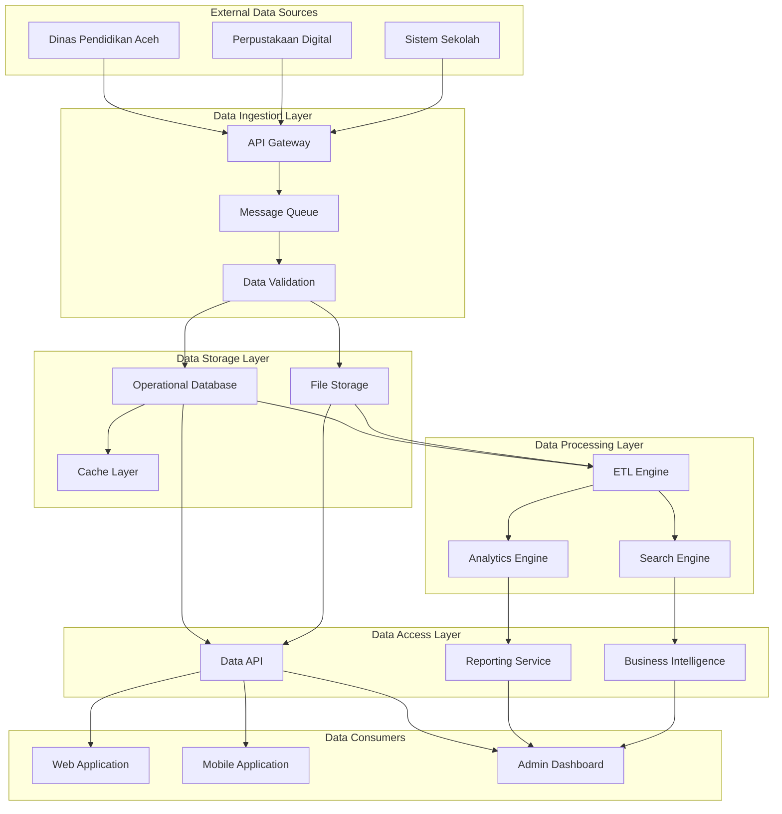
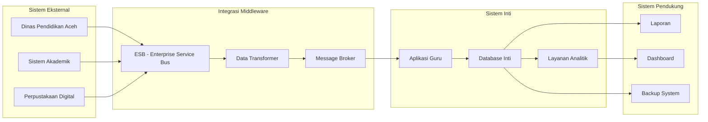
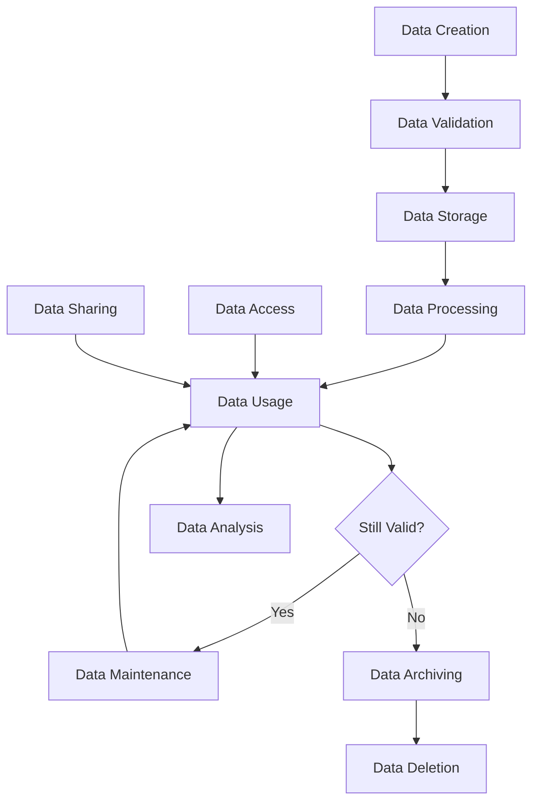
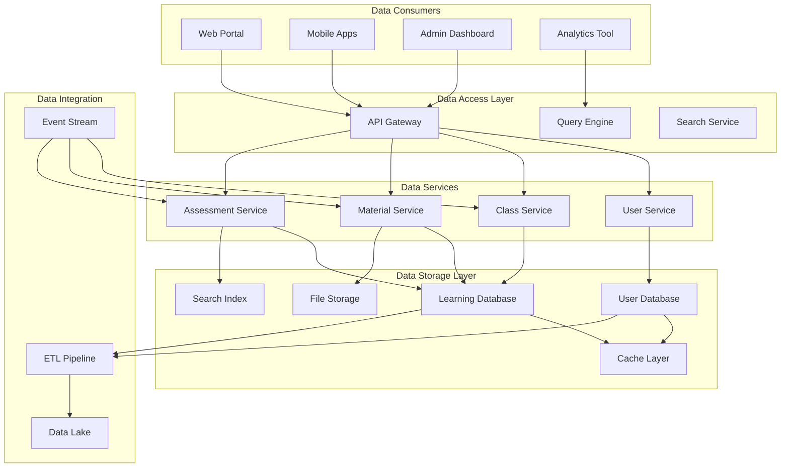
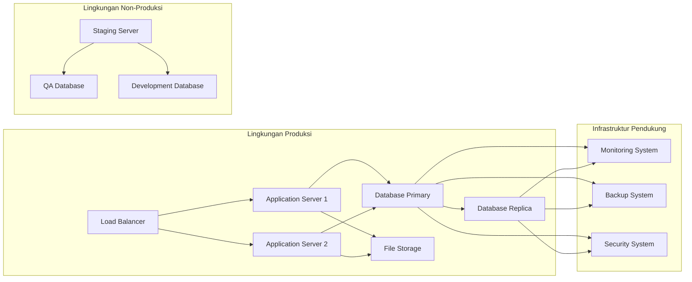
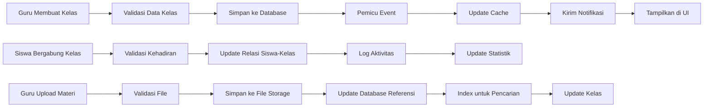

# Guru Aceh Application - Data Architecture Document (DAD)
**Dokumen Arsitektur Data**

---

**Standar Referensi:** ISO/IEC/IEEE 42010 + TOGAF ADM (Phase C)

**Tanggal Pembuatan:** 29 Oktober 2025
**Penulis:** Arsitek Data
**Versi:** 1.0

---

## 1. Tujuan dan Lingkup (Purpose and Scope)

### 1.1 Tujuan (Purpose)
Dokumen ini menyediakan deskripsi komprehensif dari arsitektur data untuk aplikasi guru.acehapp.com, sesuai dengan standar ISO/IEC/IEEE 42010 dan metodologi TOGAF ADM (Phase C - Information Systems Architecture). Tujuan utamanya adalah untuk mendefinisikan struktur data, aliran data, integrasi data, dan tata kelola data yang akan mendukung kebutuhan bisnis aplikasi pendidikan ini.

### 1.2 Lingkup (Scope)
Arsitektur data mencakup:
- Struktur data utama dalam sistem
- Domain data dan sumber data
- Integrasi data antar sistem
- Manajemen metadata dan data induk
- Kebijakan tata kelola data
- Aspek keamanan dan kepatuhan data

### 1.3 Definisi, Akronim, dan Singkatan
- **DAD:** Data Architecture Document
- **MDM:** Master Data Management
- **ETL:** Extract, Transform, Load
- **SOA:** Service-Oriented Architecture
- **API:** Application Programming Interface
- **RDBMS:** Relational Database Management System
- **TOGAF:** The Open Group Architecture Framework
- **ISO/IEC/IEEE 42010:** Standar untuk deskripsi arsitektur sistem dan perangkat lunak

### 1.4 Referensi
1. ISO/IEC/IEEE 42010 - Systems and software engineering — Architecture description
2. TOGAF 9.2 Standard - Phase C: Information Systems Architectures
3. Data Architecture: A Primer for the Data Scientist
4. Guru Aceh Application - Software Requirements Specification
5. Guru Aceh Application - Software Design Description
6. Guru Aceh Application - Database Design Document

## 2. Gambaran Umum Arsitektur Data (Data Architecture Overview)

### 2.1 Visi Arsitektur Data (Data Architecture Vision)
Arsitektur data dirancang untuk mendukung sistem pendidikan digital yang skalabel, aman, dan dapat dipercaya, dengan fokus pada:
- Ketersediaan data real-time untuk pengambilan keputusan pendidikan
- Konsistensi data lintas modul aplikasi
- Privasi dan keamanan data pendidikan
- Integrasi dengan sistem eksternal pendidikan

### 2.2 Prinsip Arsitektur Data (Data Architecture Principles)
1. **Data sebagai Aset:** Perlakukan data sebagai aset strategis organisasi
2. **Ketersediaan dan Akses:** Data harus tersedia dan dapat diakses secara aman
3. **Kualitas Data:** Data harus akurat, lengkap, konsisten, dan terbaru
4. **Integritas dan Keamanan:** Perlindungan data harus diterapkan sejak desain
5. **Kepatuhan:** Patuhi regulasi privasi data dan perlindungan informasi

### 2.3 Peta Konseptual Arsitektur Data (Conceptual Data Architecture Map)



## 3. Domain Data dan Sumber (Data Domains and Sources)

### 3.1 Domain Data Utama (Main Data Domains)

#### 3.1.1 Domain Pengguna (User Domain)
- **Deskripsi:** Informasi tentang semua pengguna sistem (guru, admin, dll)
- **Entitas Utama:** User, Profile, Role
- **Sumber:** Registrasi mandiri, sinkronisasi dari dinas pendidikan
- **Volume Data:** 100.000 pengguna estimasi
- **Frekuensi Pembaruan:** Harian

#### 3.1.2 Domain Kelas dan Pembelajaran (Class and Learning Domain)
- **Deskripsi:** Data tentang kelas, materi pembelajaran, dan aktivitas pembelajaran
- **Entitas Utama:** Class, Material, Lesson Plan, Learning Path
- **Sumber:** Input guru, upload admin, integrasi konten eksternal
- **Volume Data:** 10.000 kelas, jutaan materi
- **Frekuensi Pembaruan:** Harian

#### 3.1.3 Domain Penilaian (Assessment Domain)
- **Deskripsi:** Data penilaian, ujian, dan hasil belajar siswa
- **Entitas Utama:** Assessment, Grade, Score, Evaluation
- **Sumber:** Input guru, hasil ujian otomatis, integrasi LMS
- **Volume Data:** Jutaan catatan penilaian
- **Frekuensi Pembaruan:** Harian

#### 3.1.4 Domain Komunikasi (Communication Domain)
- **Deskripsi:** Data komunikasi antar pengguna (pengumuman, diskusi)
- **Entitas Utama:** Announcement, Discussion, Message, Notification
- **Sumber:** Input pengguna, sistem otomatis
- **Volume Data:** Ratusan ribu komunikasi per bulan
- **Frekuensi Pembaruan:** Real-time

### 3.2 Sumber Data Internal (Internal Data Sources)
- **Database Operasional:** PostgreSQL sebagai database utama
- **Penyimpanan File:** Sistem penyimpanan objek untuk materi pembelajaran
- **Cache:** Redis untuk data yang sering diakses
- **Log Sistem:** Data operasional dan audit

### 3.3 Sumber Data Eksternal (External Data Sources)
- **Dinas Pendidikan Aceh:** Data resmi pendidikan
- **Sistem Akademik Sekolah:** Data siswa dan kelas
- **Perpustakaan Digital Nasional:** Konten pembelajaran
- **API Pihak Ketiga:** Layanan validasi, notifikasi, dll

## 4. Peta Integrasi Data (Data Integration Map)

### 4.1 Diagram Integrasi Data (Data Integration Diagram)



### 4.2 Mekanisme Integrasi (Integration Mechanisms)

#### 4.2.1 API Integration
- **Jenis:** RESTful API dan GraphQL
- **Deskripsi:** Integrasi sinkron dengan sistem eksternal
- **Protokol:** HTTPS dengan otentikasi OAuth 2.0
- **Frequensi:** Real-time atau request-response

#### 4.2.2 Message Queue Integration
- **Jenis:** Apache Kafka atau RabbitMQ
- **Deskripsi:** Integrasi asinkron untuk proses batch
- **Protokol:** AMQP atau Kafka protocol
- **Frequensi:** Event-driven

#### 4.2.3 File Transfer Integration
- **Jenis:** SFTP atau API berbasis file
- **Deskripsi:** Transfer data batch dalam format standar
- **Format:** JSON, CSV, XML
- **Frequensi:** Harian atau mingguan

### 4.3 Mapping Data (Data Mapping)
| Sumber | Target | Field Mapping | Transformasi |
|--------|--------|---------------|--------------|
| Dinas Pendidikan | Users | NIP → user_id | Prefix + UUID |
| Sistem Akademik | Students | NIS → student_id | Validasi format |
| Perpustakaan Digital | Materials | ID_extern → material_id | Enkripsi referensi |

## 5. Manajemen Metadata dan Data Induk (Metadata and Master Data Management)

### 5.1 Metadata Management
#### 5.1.1 Metadata Bisnis (Business Metadata)
- Definisi data dan konteks bisnis
- Pemilik data dan kontak
- Kebijakan penggunaan data
- Klasifikasi sensitivitas data

#### 5.1.2 Metadata Teknis (Technical Metadata)
- Struktur skema database
- Tipe data dan batasan
- Indeks dan kinerja
- Sejarah perubahan skema

#### 5.1.3 Metadata Operasional (Operational Metadata)
- Waktu pemrosesan data
- Status dan log kesalahan
- Metrik kualitas data
- Audit trail

### 5.2 Master Data Management (MDM)
#### 5.2.1 Domain Data Induk (Master Data Domains)
- **User Master:** Data pengguna yang konsisten lintas sistem
- **School Master:** Informasi sekolah yang terstandarisasi
- **Subject Master:** Mata pelajaran terstandarisasi
- **Curriculum Master:** Data kurikulum resmi

#### 5.2.2 Hierarki Data Induk (Master Data Hierarchy)
```
Pendidikan Aceh
├── Sekolah
│   ├── Guru
│   └── Siswa
│       └── Kelas
│           └── Penilaian
└── Mata Pelajaran
    └── Kurikulum
```

### 5.3 Glosarium Data (Data Glossary)
- **User ID:** Identifikasi unik untuk setiap pengguna, format UUID
- **NIP:** Nomor Induk Pegawai untuk guru, opsional
- **Class:** Wadah untuk pengelolaan siswa, materi, dan penilaian
- **Material:** Konten pembelajaran berupa dokumen, video, dll.
- **Assessment:** Evaluasi atau penilaian yang diberikan kepada siswa

## 6. Tata Kelola Data (Data Governance)

### 6.1 Peran dan Tanggung Jawab (Roles and Responsibilities)

#### 6.1.1 Data Owner
- **Tanggung Jawab:** Menentukan kebijakan penggunaan data
- **Peran:** Dinas Pendidikan Aceh, Manajemen Guru Aceh App
- **Akses:** Full akses administratif

#### 6.1.2 Data Steward
- **Tanggung Jawab:** Mengelola kualitas dan integritas data
- **Peran:** Tim IT Dinas Pendidikan
- **Akses:** Akses manajemen data

#### 6.1.3 Data Custodian
- **Tanggung Jawab:** Operasionalisasi sistem data
- **Peran:** Tim teknis dan pengembangan
- **Akses:** Akses teknis dan administratif

#### 6.1.4 Data Consumer
- **Tanggung Jawab:** Menggunakan data sesuai kebijakan
- **Peran:** Guru, siswa, administrator
- **Akses:** Akses fungsional sesuai peran

### 6.2 Kebijakan Data (Data Policies)
1. **Kebijakan Privasi:** Perlindungan data pribadi sesuai UU Perlindungan Data Pribadi
2. **Kebijakan Kualitas:** Standar kualitas data dan prosedur pemeliharaan
3. **Kebijakan Keamanan:** Perlindungan data dari akses tidak sah
4. **Kebijakan Retensi:** Masa simpan data dan prosedur penghapusan

### 6.3 Kualitas Data (Data Quality)
#### 6.3.1 Dimensi Kualitas
- **Akurasi:** Data mencerminkan realitas
- **Kelengkapan:** Tidak ada nilai penting yang hilang
- **Konsistensi:** Data konsisten lintas sistem
- **Kebaruan:** Data selalu terkini
- **Validitas:** Data sesuai format dan aturan

#### 6.3.2 Metrik Kualitas Data
- **Tingkat Kelengkapan:** Persentase field yang terisi
- **Tingkat Keakuratan:** Persentase data yang akurat
- **Tingkat Konsistensi:** Persentase data yang konsisten
- **Tingkat Duplikasi:** Jumlah entitas duplikat

## 7. Keamanan dan Kepatuhan (Security and Compliance)

### 7.1 Pengendalian Keamanan Data (Data Security Controls)

#### 7.1.1 ISO/IEC 27001 Controls Implementation
- **A.10.1 - Cryptographic Controls:** Enkripsi data sensitif
- **A.11.1 - Secure Configuration:** Konfigurasi aman sistem
- **A.12.6 - Management of Technical Vulnerabilities:** Manajemen kerentanan
- **A.13.1 - Network Security Management:** Keamanan jaringan
- **A.14.2 - Security in Development and Support Processes:** Keamanan dalam pengembangan

#### 7.1.2 Perlindungan Data (Data Protection)
- **Enkripsi di Transit:** TLS 1.3 untuk semua komunikasi
- **Enkripsi di Rest:** AES-256 untuk data sensitif
- **Tokenisasi:** Data pribadi diganti dengan token
- **Masking:** Data untuk lingkungan non-produksi

#### 7.1.3 Akses Data (Data Access)
- **Otentikasi:** Multi-factor authentication
- **Otorisasi:** Role-Based Access Control (RBAC)
- **Audit Trail:** Log semua akses data
- **Segregation of Duties:** Pembagian tanggung jawab

### 7.2 Kepatuhan Regulator (Regulatory Compliance)
#### 7.2.1 Perlindungan Data Pribadi
- **UU No. 27 Tahun 2022:** Perlindungan Data Pribadi
- **Kebijakan Privasi:** Klarifikasi penggunaan data
- **Persetujuan:** Consent management yang jelas
- **Hak Subjek Data:** Hak akses, koreksi, hapus

#### 7.2.2 Standar Internasional
- **ISO 27001:** Sistem manajemen keamanan informasi
- **GDPR Prinsip:** Jika melibatkan data WNA
- **COPPA Prinsip:** Jika melibatkan data anak-anak

## 8. Siklus Hidup Data (Data Lifecycle)

### 8.1 Diagram Alir Siklus Hidup Data (Data Lifecycle Flow Diagram)



### 8.2 Tahapan Siklus Hidup (Lifecycle Stages)

#### 8.2.1 Penciptaan Data (Data Creation)
- **Sumber:** Input pengguna, integrasi sistem, upload file
- **Validasi:** Validasi format dan isi data
- **Dokumentasi:** Metadata awal dibuat

#### 8.2.2 Pengolahan Data (Data Processing)
- **Transformasi:** Pembersihan dan normalisasi data
- **Integrasi:** Penggabungan dari berbagai sumber
- **Validasi Lanjutan:** Kualitas dan konsistensi data

#### 8.2.3 Penyimpanan Data (Data Storage)
- **Database Operasional:** Data aktif dan sering diakses
- **Data Warehouse:** Data historis untuk analisis
- **Archive:** Data tidak aktif tapi perlu disimpan

#### 8.2.4 Pemeliharaan Data (Data Maintenance)
- **Pembaruan:** Perubahan data sesuai kebutuhan
- **Pembersihan:** Penghapusan data tidak valid
- **Optimasi:** Peningkatan kinerja akses

#### 8.2.5 Penghapusan Data (Data Deletion)
- **Kebijakan Retensi:** Masa simpan berdasarkan kebijakan
- **Prosedur:** Prosedur aman untuk penghapusan
- **Audit:** Dokumentasi penghapusan data

### 8.3 Manajemen Versi Data (Data Versioning Management)
- **Audit Trail:** Catatan lengkap perubahan data
- **Snapshot:** Backup berkala untuk data penting
- **Recovery Point:** Titik pemulihan data maksimal 1 jam

## 9. Diagram Arsitektur Data (Data Architecture Diagrams)

### 9.1 Diagram Arsitektur Logis Data (Logical Data Architecture Diagram)



### 9.2 Diagram Arsitektur Fisik Data (Physical Data Architecture Diagram)



### 9.3 Diagram Alir Data (Data Flow Diagram)



## 10. Rencana Implementasi (Implementation Plan)

### 10.1 Tahapan Implementasi (Implementation Phases)
1. **Fase 1:** Persiapan infrastruktur dan skema dasar
2. **Fase 2:** Implementasi layanan inti (otentikasi, pengguna)
3. **Fase 3:** Implementasi modul kelas dan materi
4. **Fase 4:** Implementasi modul penilaian dan laporan
5. **Fase 5:** Integrasi eksternal dan optimasi

### 10.2 Kriteria Sukses (Success Criteria)
- Ketersediaan data 99.9%
- Waktu respons database < 500ms
- Keamanan data terjamin
- Kepatuhan terhadap regulasi
- Skalabilitas untuk 100.000+ pengguna

---

**Lampiran:**
- Data Model Detail
- API Spesifikasi
- Panduan migrasi data
- Prosedur pemulihan bencana
- Template dokumentasi data

## Ringkasan Standar ISO/IEEE dan Tujuan

| Standar | Tujuan |
|---------|--------|
| ISO/IEC/IEEE 29148:2018 | Standar untuk rekayasa sistem dan perangkat lunak dalam manajemen kebutuhan |
| IEEE 1016-2009 | Praktik yang direkomendasikan untuk deskripsi desain perangkat lunak |
| ISO/IEC/IEEE 42010 | Standar untuk deskripsi arsitektur sistem dan perangkat lunak |
| TOGAF ADM | Metodologi untuk perencanaan dan pengembangan arsitektur perusahaan |