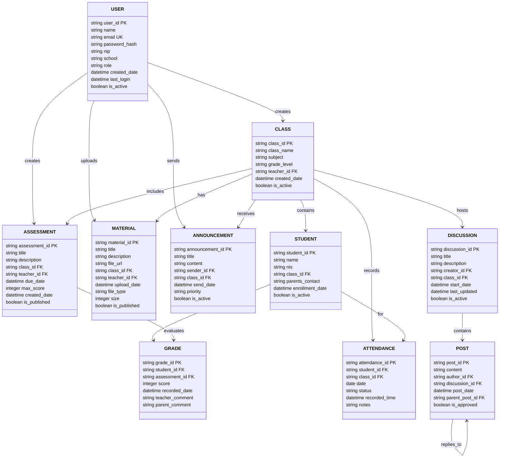
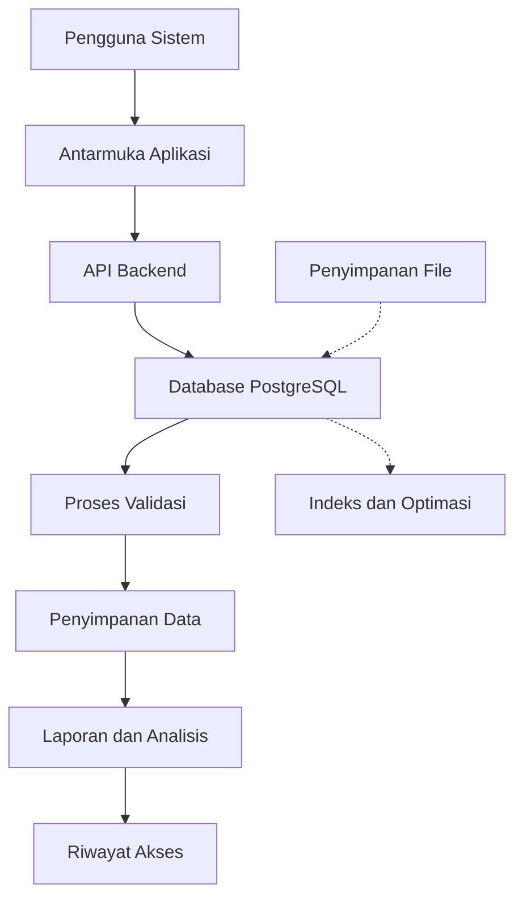

# Guru Aceh Application - Database Design Document (DBDD)
**Dokumen Desain Database**

---

**Standar Referensi:** IEEE 1016 + ISO/IEC/IEEE 42010

**Tanggal Pembuatan:** 29 Oktober 2025
**Penulis:** Database Arsitek
**Versi:** 1.0

---

## 1. Pendahuluan dan Lingkup (Introduction and Scope)

### 1.1 Tujuan Dokumen (Document Purpose)
Dokumen ini menyediakan desain database komprehensif untuk aplikasi guru.acehapp.com sesuai dengan standar IEEE 1016 dan ISO/IEC/IEEE 42010. Tujuan utama adalah untuk mendokumentasikan arsitektur data, struktur tabel, hubungan antar entitas, dan strategi manajemen data untuk mendukung kebutuhan fungsional dan non-fungsional dari sistem.

### 1.2 Lingkup Sistem (System Scope)
Database ini akan mendukung semua aspek operasional aplikasi guru.acehapp.com termasuk pengelolaan pengguna, manajemen kelas, distribusi materi pembelajaran, komunikasi pendidikan, dan pelaporan penilaian.

### 1.3 Definisi, Akronim, dan Singkatan
- **DBMS:** Database Management System
- **ERD:** Entity Relationship Diagram
- **PK:** Primary Key
- **FK:** Foreign Key
- **DDL:** Data Definition Language
- **DML:** Data Manipulation Language
- **ACID:** Atomicity, Consistency, Isolation, Durability
- **SQL:** Structured Query Language

### 1.4 Referensi
1. IEEE 1016-2009 - IEEE Recommended Practice for Software Design Descriptions
2. ISO/IEC/IEEE 42010 - Systems and software engineering — Architecture description
3. PostgreSQL 14 Documentation
4. Database Design for Mere Mortals by Michael J. Hernandez
5. Guru Aceh Application - Software Requirements Specification

## 2. Model Data Konseptual (Conceptual Data Model)

### 2.1 Gambaran Umum (Overview)
Model data konseptual menyediakan representasi tingkat tinggi dari entitas data dan hubungan antar entitas dalam sistem. Model ini tidak tergantung pada teknologi atau DBMS tertentu dan fokus pada elemen data dan hubungan bisnis.

### 2.2 Entitas Utama dan Atribut (Main Entities and Attributes)

#### 2.2.1 Entitas Pengguna (User Entity)
- Entitas ini merepresentasikan semua jenis pengguna sistem (guru, admin, dll)
- Atribut utama: ID Pengguna, Nama, Email, NIP, Sekolah, Peran, Tanggal Dibuat

#### 2.2.2 Entitas Kelas (Class Entity)
- Entitas ini merepresentasikan kelas yang dibuat dan dikelola oleh guru
- Atribut utama: ID Kelas, Nama Kelas, Mata Pelajaran, Tingkat Kelas, Guru Pengampu

#### 2.2.3 Entitas Siswa (Student Entity)
- Entitas ini merepresentasikan peserta didik yang tergabung dalam kelas
- Atribut utama: ID Siswa, Nama, NIS, Kelas, Kontak Orang Tua

#### 2.2.4 Entitas Materi Pembelajaran (Learning Material Entity)
- Entitas ini merepresentasikan materi yang diunggah oleh guru
- Atribut utama: ID Materi, Judul, Deskripsi, Tanggal Unggah, File URL

### 2.3 Diagram Entitas Relasi (Entity Relationship Diagram)



## 3. Model Data Logis (Logical Data Model)

### 3.1 Desain Detail Tabel (Detailed Table Design)

#### 3.1.1 Tabel Users
| Kolom | Tipe Data | Kunci | Nullable | Deskripsi |
|-------|-----------|-------|----------|-----------|
| user_id | VARCHAR(36) | PK | Tidak | ID unik pengguna (UUID) |
| name | VARCHAR(100) | - | Tidak | Nama lengkap pengguna |
| email | VARCHAR(100) | UK | Tidak | Email pengguna (unik) |
| password_hash | VARCHAR(255) | - | Tidak | Hash password (bcrypt) |
| nip | VARCHAR(20) | - | Ya | Nomor Induk Pegawai |
| school | VARCHAR(100) | - | Ya | Nama sekolah |
| role | VARCHAR(20) | - | Tidak | Peran pengguna (guru, admin) |
| created_date | TIMESTAMP | - | Tidak | Tanggal pembuatan akun |
| last_login | TIMESTAMP | - | Ya | Tanggal login terakhir |
| is_active | BOOLEAN | - | Tidak | Status aktif pengguna |

#### 3.1.2 Tabel Classes
| Kolom | Tipe Data | Kunci | Nullable | Deskripsi |
|-------|-----------|-------|----------|-----------|
| class_id | VARCHAR(36) | PK | Tidak | ID unik kelas (UUID) |
| class_name | VARCHAR(100) | - | Tidak | Nama kelas |
| subject | VARCHAR(100) | - | Tidak | Mata pelajaran |
| grade_level | VARCHAR(20) | - | Tidak | Tingkat kelas |
| teacher_id | VARCHAR(36) | FK | Tidak | ID guru pengampu |
| created_date | TIMESTAMP | - | Tidak | Tanggal pembuatan kelas |
| is_active | BOOLEAN | - | Tidak | Status aktif kelas |

#### 3.1.3 Tabel Students
| Kolom | Tipe Data | Kunci | Nullable | Deskripsi |
|-------|-----------|-------|----------|-----------|
| student_id | VARCHAR(36) | PK | Tidak | ID unik siswa (UUID) |
| name | VARCHAR(100) | - | Tidak | Nama lengkap siswa |
| nis | VARCHAR(20) | - | Ya | Nomor Induk Siswa |
| class_id | VARCHAR(36) | FK | Tidak | ID kelas siswa |
| parents_contact | VARCHAR(100) | - | Ya | Kontak orang tua |
| enrollment_date | DATE | - | Tidak | Tanggal pendaftaran |
| is_active | BOOLEAN | - | Tidak | Status aktif siswa |

#### 3.1.4 Tabel Materials
| Kolom | Tipe Data | Kunci | Nullable | Deskripsi |
|-------|-----------|-------|----------|-----------|
| material_id | VARCHAR(36) | PK | Tidak | ID unik materi (UUID) |
| title | VARCHAR(200) | - | Tidak | Judul materi |
| description | TEXT | - | Ya | Deskripsi materi |
| file_url | VARCHAR(500) | - | Tidak | URL file materi |
| class_id | VARCHAR(36) | FK | Tidak | ID kelas yang menerima |
| teacher_id | VARCHAR(36) | FK | Tidak | ID guru yang mengupload |
| upload_date | TIMESTAMP | - | Tidak | Tanggal upload materi |
| file_type | VARCHAR(20) | - | Tidak | Jenis file |
| size | INTEGER | - | Tidak | Ukuran file (bytes) |
| is_published | BOOLEAN | - | Tidak | Status publikasi |

#### 3.1.5 Tabel Announcements
| Kolom | Tipe Data | Kunci | Nullable | Deskripsi |
|-------|-----------|-------|----------|-----------|
| announcement_id | VARCHAR(36) | PK | Tidak | ID unik pengumuman (UUID) |
| title | VARCHAR(200) | - | Tidak | Judul pengumuman |
| content | TEXT | - | Tidak | Isi pengumuman |
| sender_id | VARCHAR(36) | FK | Tidak | ID pengirim |
| class_id | VARCHAR(36) | FK | Tidak | ID kelas penerima |
| send_date | TIMESTAMP | - | Tidak | Tanggal pengiriman |
| priority | VARCHAR(10) | - | Tidak | Prioritas (low, medium, high) |
| is_active | BOOLEAN | - | Tidak | Status pengumuman |

#### 3.1.6 Tabel Assessments
| Kolom | Tipe Data | Kunci | Nullable | Deskripsi |
|-------|-----------|-------|----------|-----------|
| assessment_id | VARCHAR(36) | PK | Tidak | ID unik penilaian (UUID) |
| title | VARCHAR(200) | - | Tidak | Judul penilaian |
| description | TEXT | - | Ya | Deskripsi penilaian |
| class_id | VARCHAR(36) | FK | Tidak | ID kelas yang dinilai |
| teacher_id | VARCHAR(36) | FK | Tidak | ID guru pembuat |
| due_date | TIMESTAMP | - | Tidak | Tanggal jatuh tempo |
| max_score | INTEGER | - | Tidak | Skor maksimum |
| created_date | TIMESTAMP | - | Tidak | Tanggal pembuatan |
| is_published | BOOLEAN | - | Tidak | Status publikasi |

#### 3.1.7 Tabel Grades
| Kolom | Tipe Data | Kunci | Nullable | Deskripsi |
|-------|-----------|-------|----------|-----------|
| grade_id | VARCHAR(36) | PK | Tidak | ID unik nilai (UUID) |
| student_id | VARCHAR(36) | FK | Tidak | ID siswa yang dinilai |
| assessment_id | VARCHAR(36) | FK | Tidak | ID penilaian |
| score | DECIMAL(5,2) | - | Tidak | Nilai yang diberikan |
| recorded_date | TIMESTAMP | - | Tidak | Tanggal penilaian |
| teacher_comment | TEXT | - | Ya | Komentar guru |
| parent_comment | TEXT | - | Ya | Komentar orang tua |

#### 3.1.8 Tabel Attendance
| Kolom | Tipe Data | Kunci | Nullable | Deskripsi |
|-------|-----------|-------|----------|-----------|
| attendance_id | VARCHAR(36) | PK | Tidak | ID unik kehadiran (UUID) |
| student_id | VARCHAR(36) | FK | Tidak | ID siswa |
| class_id | VARCHAR(36) | FK | Tidak | ID kelas |
| date | DATE | - | Tidak | Tanggal kehadiran |
| status | VARCHAR(20) | - | Tidak | Status (hadir, absen, sakit, izin) |
| recorded_time | TIME | - | Ya | Waktu perekaman |
| notes | TEXT | - | Ya | Catatan tambahan |

#### 3.1.9 Tabel Discussions
| Kolom | Tipe Data | Kunci | Nullable | Deskripsi |
|-------|-----------|-------|----------|-----------|
| discussion_id | VARCHAR(36) | PK | Tidak | ID unik diskusi (UUID) |
| title | VARCHAR(200) | - | Tidak | Judul diskusi |
| description | TEXT | - | Ya | Deskripsi diskusi |
| creator_id | VARCHAR(36) | FK | Tidak | ID pembuat diskusi |
| class_id | VARCHAR(36) | FK | Tidak | ID kelas diskusi |
| start_date | TIMESTAMP | - | Tidak | Tanggal mulai diskusi |
| last_updated | TIMESTAMP | - | Tidak | Tanggal terakhir diperbarui |
| is_active | BOOLEAN | - | Tidak | Status diskusi |

#### 3.1.10 Tabel Posts
| Kolom | Tipe Data | Kunci | Nullable | Deskripsi |
|-------|-----------|-------|----------|-----------|
| post_id | VARCHAR(36) | PK | Tidak | ID unik postingan (UUID) |
| content | TEXT | - | Tidak | Isi postingan |
| author_id | VARCHAR(36) | FK | Tidak | ID penulis postingan |
| discussion_id | VARCHAR(36) | FK | Tidak | ID diskusi tempat posting |
| post_date | TIMESTAMP | - | Tidak | Tanggal posting |
| parent_post_id | VARCHAR(36) | FK | Ya | ID postingan induk (jika balasan) |
| is_approved | BOOLEAN | - | Tidak | Status persetujuan postingan |

### 3.2 Hubungan Antar Tabel (Table Relationships)

**Hubungan Satu-ke-Banyak (One-to-Many):**
- Users → Classes (satu guru bisa memiliki banyak kelas)
- Classes → Students (satu kelas bisa memiliki banyak siswa)
- Classes → Materials (satu kelas bisa memiliki banyak materi)
- Students → Grades (satu siswa bisa memiliki banyak nilai)

**Hubungan Banyak-ke-Banyak (Many-to-Many):**
- Classes ↔ Users (melalui tabel perantara untuk keterlibatan selain guru)
- Materials ↔ Students (melalui tabel perantara untuk materi yang dilihat siswa)

## 4. Model Data Fisik (Physical Data Model)

### 4.1 Spesifikasi Database
- Database Management System: PostgreSQL 14+
- Nama Database: guru_aceh_db
- Skema Utama: public (dengan kemungkinan skema tambahan untuk modul terpisah)

### 4.2 Skrip Pembuatan Tabel (Table Creation Scripts)

```sql
-- Tabel Users
CREATE TABLE users (
    user_id VARCHAR(36) PRIMARY KEY,
    name VARCHAR(100) NOT NULL,
    email VARCHAR(100) NOT NULL UNIQUE,
    password_hash VARCHAR(255) NOT NULL,
    nip VARCHAR(20),
    school VARCHAR(100),
    role VARCHAR(20) NOT NULL CHECK (role IN ('guru', 'admin')),
    created_date TIMESTAMP NOT NULL DEFAULT CURRENT_TIMESTAMP,
    last_login TIMESTAMP,
    is_active BOOLEAN NOT NULL DEFAULT TRUE
);

-- Tabel Classes
CREATE TABLE classes (
    class_id VARCHAR(36) PRIMARY KEY,
    class_name VARCHAR(100) NOT NULL,
    subject VARCHAR(100) NOT NULL,
    grade_level VARCHAR(20) NOT NULL,
    teacher_id VARCHAR(36) NOT NULL,
    created_date TIMESTAMP NOT NULL DEFAULT CURRENT_TIMESTAMP,
    is_active BOOLEAN NOT NULL DEFAULT TRUE,
    FOREIGN KEY (teacher_id) REFERENCES users(user_id)
);

-- Tabel Students
CREATE TABLE students (
    student_id VARCHAR(36) PRIMARY KEY,
    name VARCHAR(100) NOT NULL,
    nis VARCHAR(20),
    class_id VARCHAR(36) NOT NULL,
    parents_contact VARCHAR(100),
    enrollment_date DATE NOT NULL,
    is_active BOOLEAN NOT NULL DEFAULT TRUE,
    FOREIGN KEY (class_id) REFERENCES classes(class_id)
);

-- Tabel Materials
CREATE TABLE materials (
    material_id VARCHAR(36) PRIMARY KEY,
    title VARCHAR(200) NOT NULL,
    description TEXT,
    file_url VARCHAR(500) NOT NULL,
    class_id VARCHAR(36) NOT NULL,
    teacher_id VARCHAR(36) NOT NULL,
    upload_date TIMESTAMP NOT NULL DEFAULT CURRENT_TIMESTAMP,
    file_type VARCHAR(20) NOT NULL,
    size INTEGER NOT NULL,
    is_published BOOLEAN NOT NULL DEFAULT FALSE,
    FOREIGN KEY (class_id) REFERENCES classes(class_id),
    FOREIGN KEY (teacher_id) REFERENCES users(user_id)
);

-- Tabel Announcements
CREATE TABLE announcements (
    announcement_id VARCHAR(36) PRIMARY KEY,
    title VARCHAR(200) NOT NULL,
    content TEXT NOT NULL,
    sender_id VARCHAR(36) NOT NULL,
    class_id VARCHAR(36) NOT NULL,
    send_date TIMESTAMP NOT NULL DEFAULT CURRENT_TIMESTAMP,
    priority VARCHAR(10) NOT NULL CHECK (priority IN ('low', 'medium', 'high')),
    is_active BOOLEAN NOT NULL DEFAULT TRUE,
    FOREIGN KEY (sender_id) REFERENCES users(user_id),
    FOREIGN KEY (class_id) REFERENCES classes(class_id)
);

-- Tabel Assessments
CREATE TABLE assessments (
    assessment_id VARCHAR(36) PRIMARY KEY,
    title VARCHAR(200) NOT NULL,
    description TEXT,
    class_id VARCHAR(36) NOT NULL,
    teacher_id VARCHAR(36) NOT NULL,
    due_date TIMESTAMP NOT NULL,
    max_score INTEGER NOT NULL,
    created_date TIMESTAMP NOT NULL DEFAULT CURRENT_TIMESTAMP,
    is_published BOOLEAN NOT NULL DEFAULT FALSE,
    FOREIGN KEY (class_id) REFERENCES classes(class_id),
    FOREIGN KEY (teacher_id) REFERENCES users(user_id)
);

-- Tabel Grades
CREATE TABLE grades (
    grade_id VARCHAR(36) PRIMARY KEY,
    student_id VARCHAR(36) NOT NULL,
    assessment_id VARCHAR(36) NOT NULL,
    score DECIMAL(5,2) NOT NULL CHECK (score >= 0 AND score <= 100),
    recorded_date TIMESTAMP NOT NULL DEFAULT CURRENT_TIMESTAMP,
    teacher_comment TEXT,
    parent_comment TEXT,
    FOREIGN KEY (student_id) REFERENCES students(student_id),
    FOREIGN KEY (assessment_id) REFERENCES assessments(assessment_id),
    UNIQUE (student_id, assessment_id)
);

-- Tabel Attendance
CREATE TABLE attendance (
    attendance_id VARCHAR(36) PRIMARY KEY,
    student_id VARCHAR(36) NOT NULL,
    class_id VARCHAR(36) NOT NULL,
    date DATE NOT NULL,
    status VARCHAR(20) NOT NULL CHECK (status IN ('hadir', 'absen', 'sakit', 'izin')),
    recorded_time TIME,
    notes TEXT,
    FOREIGN KEY (student_id) REFERENCES students(student_id),
    FOREIGN KEY (class_id) REFERENCES classes(class_id),
    UNIQUE (student_id, class_id, date)
);

-- Tabel Discussions
CREATE TABLE discussions (
    discussion_id VARCHAR(36) PRIMARY KEY,
    title VARCHAR(200) NOT NULL,
    description TEXT,
    creator_id VARCHAR(36) NOT NULL,
    class_id VARCHAR(36) NOT NULL,
    start_date TIMESTAMP NOT NULL DEFAULT CURRENT_TIMESTAMP,
    last_updated TIMESTAMP NOT NULL DEFAULT CURRENT_TIMESTAMP,
    is_active BOOLEAN NOT NULL DEFAULT TRUE,
    FOREIGN KEY (creator_id) REFERENCES users(user_id),
    FOREIGN KEY (class_id) REFERENCES classes(class_id)
);

-- Tabel Posts
CREATE TABLE posts (
    post_id VARCHAR(36) PRIMARY KEY,
    content TEXT NOT NULL,
    author_id VARCHAR(36) NOT NULL,
    discussion_id VARCHAR(36) NOT NULL,
    post_date TIMESTAMP NOT NULL DEFAULT CURRENT_TIMESTAMP,
    parent_post_id VARCHAR(36),
    is_approved BOOLEAN NOT NULL DEFAULT TRUE,
    FOREIGN KEY (author_id) REFERENCES users(user_id),
    FOREIGN KEY (discussion_id) REFERENCES discussions(discussion_id),
    FOREIGN KEY (parent_post_id) REFERENCES posts(post_id)
);
```

### 4.3 Indeks (Indexes)

```sql
-- Indeks pada kolom yang sering digunakan untuk pencarian
CREATE INDEX idx_users_email ON users(email);
CREATE INDEX idx_classes_teacher_id ON classes(teacher_id);
CREATE INDEX idx_students_class_id ON students(class_id);
CREATE INDEX idx_materials_class_id ON materials(class_id);
CREATE INDEX idx_announcements_class_id ON announcements(class_id);
CREATE INDEX idx_assessments_class_id ON assessments(class_id);
CREATE INDEX idx_grades_student_id ON grades(student_id);
CREATE INDEX idx_attendance_student_id ON attendance(student_id);
CREATE INDEX idx_attendance_date ON attendance(date);
CREATE INDEX idx_discussions_class_id ON discussions(class_id);
CREATE INDEX idx_posts_discussion_id ON posts(discussion_id);
CREATE INDEX idx_posts_author_id ON posts(author_id);

-- Indeks komposit untuk query kompleks
CREATE INDEX idx_grades_student_assessment ON grades(student_id, assessment_id);
CREATE INDEX idx_attendance_student_class ON attendance(student_id, class_id);
```

### 4.4 Tampilan (Views)

```sql
-- View untuk ringkasan kelas dengan jumlah siswa
CREATE VIEW class_summary AS
SELECT 
    c.class_id,
    c.class_name,
    c.subject,
    c.grade_level,
    u.name AS teacher_name,
    COUNT(s.student_id) AS total_students
FROM classes c
JOIN users u ON c.teacher_id = u.user_id
LEFT JOIN students s ON c.class_id = s.class_id
WHERE c.is_active = TRUE
GROUP BY c.class_id, c.class_name, c.subject, c.grade_level, u.name;

-- View untuk nilai rata-rata per siswa
CREATE VIEW student_average_grades AS
SELECT 
    s.student_id,
    s.name AS student_name,
    c.class_name,
    AVG(g.score) AS average_score
FROM students s
JOIN classes c ON s.class_id = c.class_id
JOIN grades g ON s.student_id = g.student_id
GROUP BY s.student_id, s.name, c.class_name;
```

## 5. Kamus Data (Data Dictionary)

| Entitas | Atribut | Tipe Data | Panjang | Kunci | Nullable | Deskripsi | Validasi |
|---------|---------|-----------|---------|-------|----------|-----------|----------|
| Users | user_id | VARCHAR | 36 | PK | Tidak | ID unik pengguna | UUID format |
| Users | email | VARCHAR | 100 | UK | Tidak | Email pengguna | Format email valid |
| Users | role | VARCHAR | 20 | - | Tidak | Peran pengguna | Enum: guru, admin |
| Classes | class_id | VARCHAR | 36 | PK | Tidak | ID unik kelas | UUID format |
| Classes | grade_level | VARCHAR | 20 | - | Tidak | Tingkat kelas | Contoh: 10, 11, 12 |
| Students | student_id | VARCHAR | 36 | PK | Tidak | ID unik siswa | UUID format |
| Students | enrollment_date | DATE | - | - | Tidak | Tanggal pendaftaran | Tidak masa depan |
| Materials | file_type | VARCHAR | 20 | - | Tidak | Jenis file | pdf, doc, ppt, etc. |
| Materials | size | INTEGER | - | - | Tidak | Ukuran file | Dalam bytes |
| Grades | score | DECIMAL | 5,2 | - | Tidak | Nilai siswa | 0 - 100 |
| Attendance | status | VARCHAR | 20 | - | Tidak | Status kehadiran | hadir, absen, sakit, izin |

## 6. Integritas Data dan Keamanan (Data Integrity and Security)

### 6.1 Aturan Integritas Referensial (Referential Integrity Rules)
- CASCADE pada penghapusan user yang menjadi guru: kelas dan materi yang terkait akan diarsipkan, bukan dihapus
- RESTRICT pada penghapusan kelas jika masih memiliki siswa aktif
- CASCADE pada penghapusan kelas: pengumuman, materi, dan penilaian akan diarsipkan

### 6.2 Keamanan Data (Data Security)
- Enkripsi kolom sensitif seperti password dengan algoritma bcrypt
- Pembatasan akses berbasis peran (RBAC) di tingkat aplikasi
- Pemisahan data antar sekolah jika diperlukan
- Audit trail untuk operasi penting pada data

### 6.3 Backup dan Restorasi (Backup and Recovery)
- Backup harian untuk data transaksional
- Backup mingguan untuk schema dan konfigurasi
- Backup offsite untuk keamanan bencana
- RTO (Recovery Time Objective): 4 jam
- RPO (Recovery Point Objective): 1 jam

## 7. Diagram Alir Data (Data Flow Diagram)



## 8. Rencana Migrasi dan Versi (Migration and Versioning Plan)

### 8.1 Strategi Migrasi Data
- Migrasi bertahap dari sistem lama (jika ada)
- Validasi data setelah migrasi
- Backup sebelum migrasi
- Uji coba migrasi di lingkungan staging

### 8.2 Manajemen Versi Skema
- Penggunaan skrip migrasi otomatis
- Sistem versi skema terpusat
- Rollback otomatis jika migrasi gagal
- Dokumentasi perubahan skema

### 8.3 Skrip Migrasi Contoh
```sql
-- Versi 1.1: Tambah kolom baru ke tabel users
ALTER TABLE users ADD COLUMN phone_number VARCHAR(15);

-- Versi 1.2: Perbarui batasan pada kolom score
ALTER TABLE grades ALTER COLUMN score TYPE DECIMAL(6,2);

-- Versi 1.3: Tambah tabel baru untuk notifikasi
CREATE TABLE notifications (
    notification_id VARCHAR(36) PRIMARY KEY,
    user_id VARCHAR(36) NOT NULL,
    title VARCHAR(200) NOT NULL,
    content TEXT NOT NULL,
    is_read BOOLEAN NOT NULL DEFAULT FALSE,
    created_date TIMESTAMP NOT NULL DEFAULT CURRENT_TIMESTAMP,
    FOREIGN KEY (user_id) REFERENCES users(user_id)
);
```

---

**Lampiran:**
- Skrip SQL Lengkap
- Contoh Query Umum
- Panduan Administrasi Database
- Prosedur Backup dan Pemulihan
