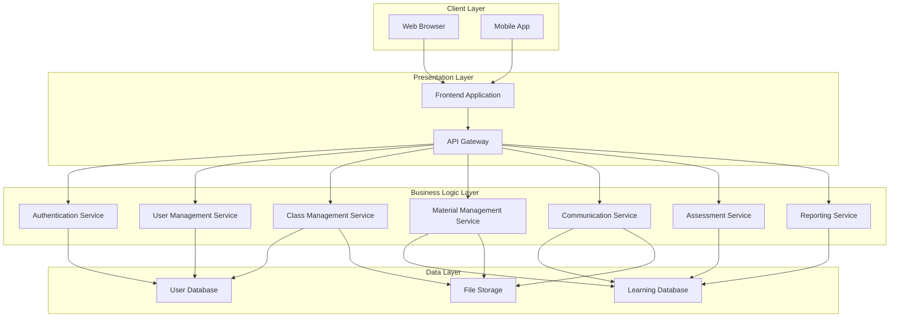
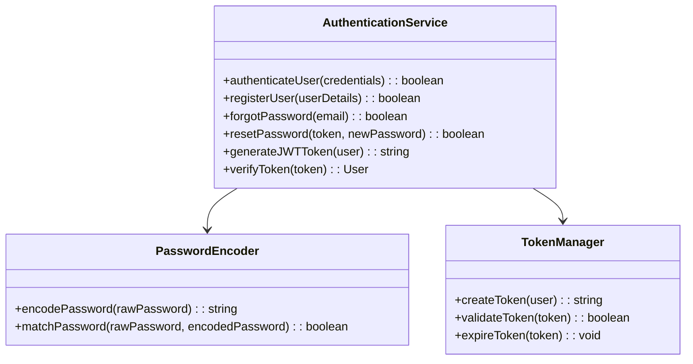
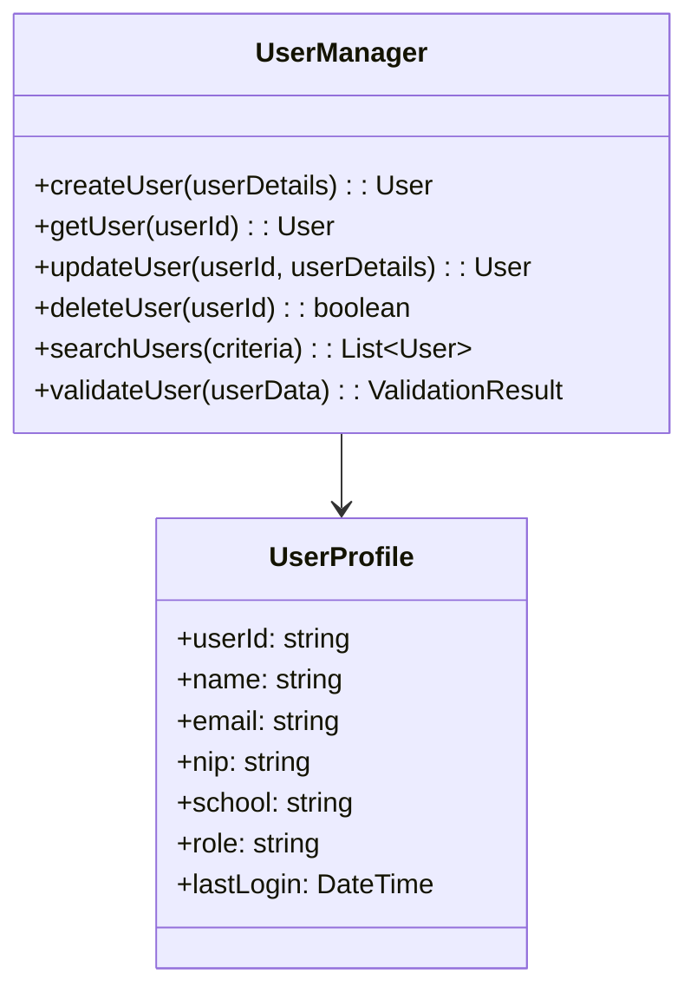
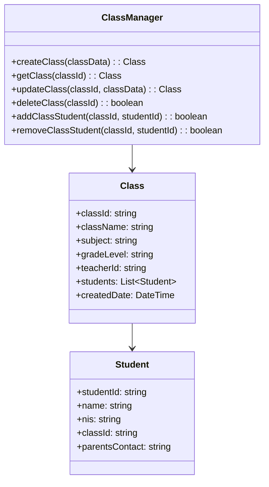
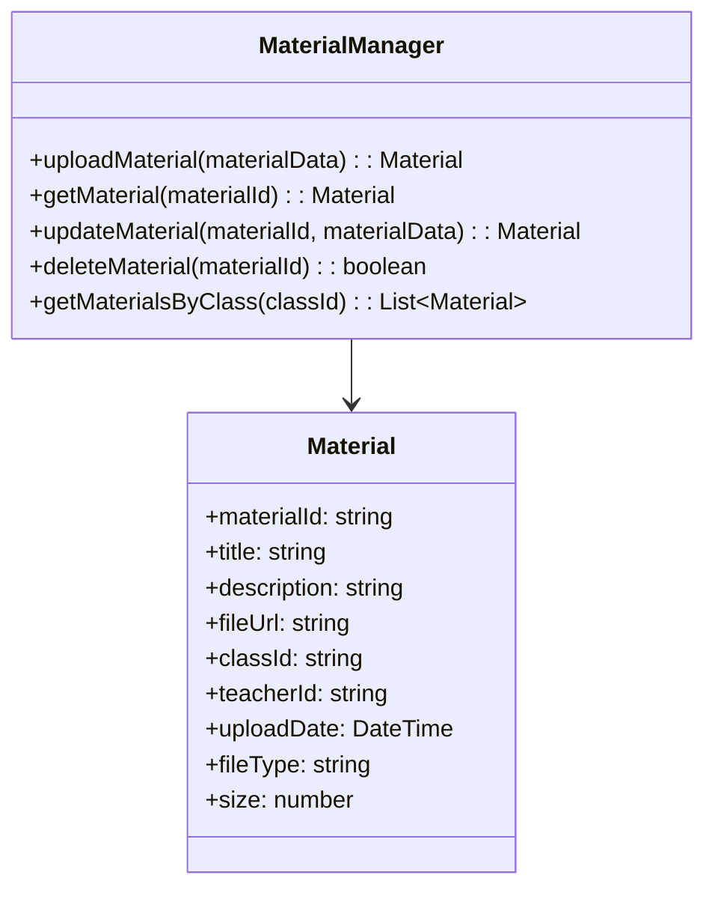
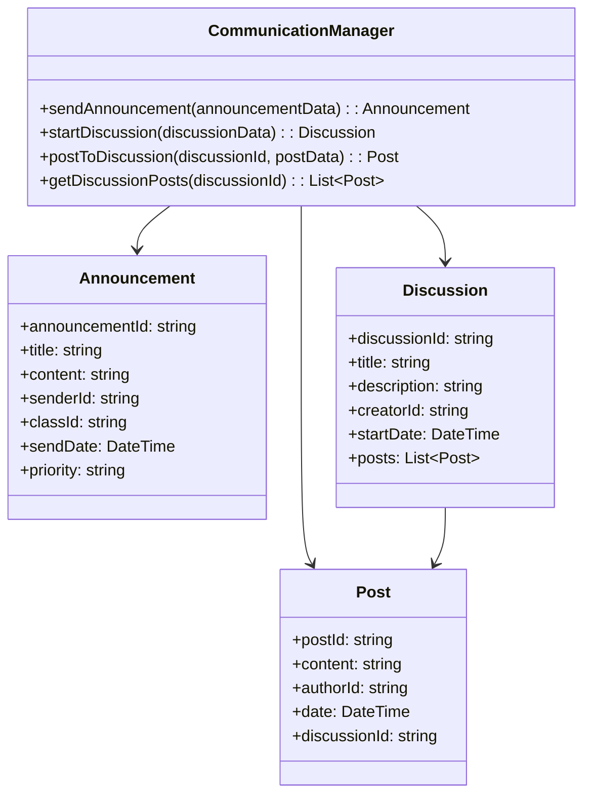
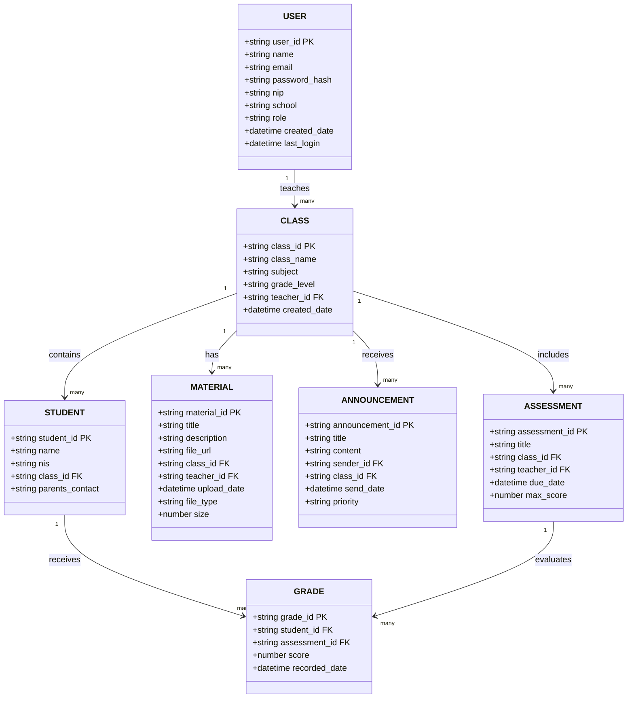
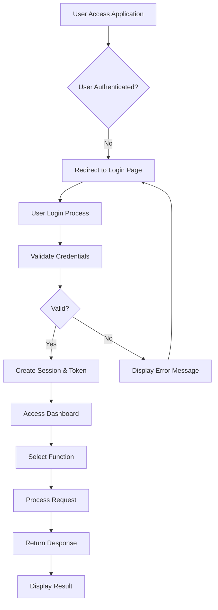
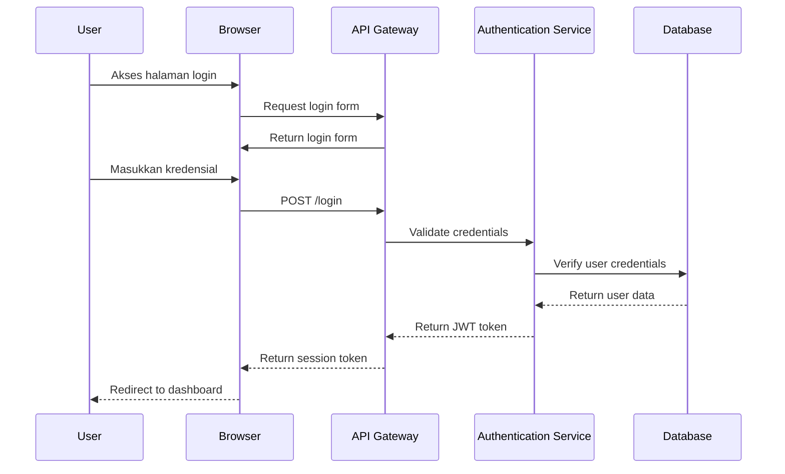
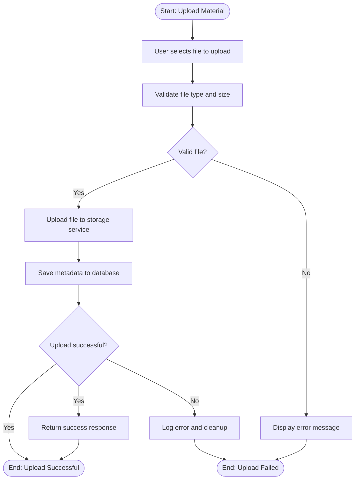

# Guru Aceh Application - Software Design Description (SDD)
**Dokumen Deskripsi Desain Perangkat Lunak**

---

**Standar Referensi:** IEEE 1016-2009

**Tanggal Pembuatan:** 29 Oktober 2025
**Penulis:** Sistem Arsitek
**Versi:** 1.0

---

## 1. Pendahuluan (Introduction)

### 1.1 Tujuan (Purpose)
Dokumen ini merupakan deskripsi desain perangkat lunak (Software Design Description/SDD) untuk aplikasi guru.acehapp.com. Tujuan dari dokumen ini adalah memberikan gambaran rinci tentang arsitektur dan desain sistem, termasuk struktur, komponen, antarmuka, dan fungsi-fungsi yang dirancang untuk memenuhi kebutuhan fungsional dan non-fungsional yang telah ditentukan dalam SRS.

### 1.2 Lingkup (Scope)
Dokumen ini mencakup desain arsitektur sistem, komponen perangkat lunak, desain data, desain antarmuka, dan pertimbangan implementasi untuk aplikasi guru.acehapp.com. Ini berfungsi sebagai panduan teknis untuk pengembang dalam mengimplementasikan sistem sesuai dengan spesifikasi kebutuhan.

### 1.3 Referensi ke SRS (Reference to SRS)
- Nama Dokumen: Guru Aceh Application - Software Requirements Specification
- Nomor Revisi: 1.0
- Tanggal: 29 Oktober 2025
- Penulis: Sistem Analis

### 1.4 Referensi Lain (Other References)
1. IEEE 1016-2009 - IEEE Recommended Practice for Software Design Descriptions
2. TOGAF 9.2 Standard for Enterprise Architecture
3. ISO/IEC/IEEE 42010 - Systems and software engineering — Architecture description

### 1.5 Ikhtisar (Overview)
Dokumen ini terstruktur dalam beberapa bagian utama: deskripsi arsitektur keseluruhan, desain komponen, desain data, desain antarmuka, desain proses, dan pertimbangan implementasi.

## 2. Gambaran Arsitektural (Architectural Overview)

### 2.1 Deskripsi Umum (General Description)
Aplikasi guru.acehapp.com mengadopsi pendekatan arsitektur berbasis layanan (Service-Oriented Architecture) dengan pola arsitektur tiga lapis (3-tier architecture) yang mencakup:
- Lapisan Presentasi (Presentation Layer)
- Lapisan Logika Bisnis (Business Logic Layer)
- Lapisan Data (Data Layer)

### 2.2 Diagram Arsitektur (Architecture Diagrams)



### 2.3 Prinsip-Prinsip Desain (Design Principles)
- Separation of Concerns: Memisahkan tanggung jawab antar komponen
- Scalability: Desain yang dapat berkembang sesuai kebutuhan
- Maintainability: Kode yang mudah dipelihara dan dimodifikasi
- Security by Design: Keamanan diterapkan sejak tahap desain
- Performance: Optimalisasi kinerja dari awal desain

## 3. Desain Komponen (Component Design)

### 3.1 Modul Otentikasi (Authentication Module)



**Deskripsi:**
- Modul ini bertanggung jawab untuk otentikasi dan otorisasi pengguna
- Menggunakan JWT (JSON Web Token) untuk manajemen sesi
- Mengimplementasikan enkripsi password menggunakan algoritma Bcrypt

### 3.2 Modul Manajemen Pengguna (User Management Module)



**Deskripsi:**
- Modul ini mengelola data profil pengguna
- Menyediakan fungsi CRUD (Create, Read, Update, Delete) untuk pengguna
- Melakukan validasi data pengguna sebelum disimpan

### 3.3 Modul Manajemen Kelas (Class Management Module)



**Deskripsi:**
- Modul ini mengelola kelas dan relasi antara guru dan siswa
- Menyediakan fungsi untuk membuat, mengupdate, dan menghapus kelas
- Mengatur keanggotaan siswa dalam kelas

### 3.4 Modul Manajemen Materi (Material Management Module)



**Deskripsi:**
- Modul ini mengelola materi pembelajaran yang diupload oleh guru
- Menyimpan informasi tentang file dan metadatanya
- Mengelola hubungan antara materi dan kelas

### 3.5 Modul Komunikasi (Communication Module)



**Deskripsi:**
- Modul ini mengelola komunikasi antara guru dan siswa
- Menyediakan fitur pengumuman dan forum diskusi
- Menyimpan riwayat komunikasi

## 4. Desain Data (Data Design)

### 4.1 Model Data Konseptual (Conceptual Data Model)



### 4.2 Model Data Logis (Logical Data Model)
(Deskripsi detail tentang struktur tabel, tipe data, dan hubungan antar tabel)

**Tabel User:**
- user_id: string (Primary Key)
- name: string (Not Null)
- email: string (Unique, Not Null)
- password_hash: string (Not Null)
- nip: string
- school: string
- role: enum(guru, admin)
- created_date: datetime
- last_login: datetime

**Tabel Class:**
- class_id: string (Primary Key)
- class_name: string (Not Null)
- subject: string (Not Null)
- grade_level: string (Not Null)
- teacher_id: string (Foreign Key to User)
- created_date: datetime

**Tabel Student:**
- student_id: string (Primary Key)
- name: string (Not Null)
- nis: string
- class_id: string (Foreign Key to Class)
- parents_contact: string

### 4.3 Model Data Fisik (Physical Data Model)
- Database: PostgreSQL
- Engine: InnoDB (jika menggunakan MySQL)
- Indeks pada kolom yang sering diquery
- Partisi tabel besar berdasarkan tanggal

## 5. Desain Antarmuka (Interface Design)

### 5.1 Antarmuka API (API Interface Design)

#### 5.1.1 Endpoints Otentikasi
```
POST /api/auth/login
Request: { "email": "string", "password": "string" }
Response: { "token": "string", "user": {...} }

POST /api/auth/register
Request: { "name": "string", "email": "string", "password": "string", ... }
Response: { "message": "string", "user": {...} }

POST /api/auth/forgot-password
Request: { "email": "string" }
Response: { "message": "string" }

POST /api/auth/reset-password
Request: { "token": "string", "newPassword": "string" }
Response: { "message": "string" }
```

#### 5.1.2 Endpoints Manajemen Kelas
```
GET /api/classes
Authorization: Bearer <token>
Response: [{ "class_id": "string", "class_name": "string", ... }]

POST /api/classes
Authorization: Bearer <token>
Request: { "class_name": "string", "subject": "string", "grade_level": "string" }
Response: { "class_id": "string", "message": "string" }

GET /api/classes/{class_id}
Authorization: Bearer <token>
Response: { "class_id": "string", "class_name": "string", ... }

PUT /api/classes/{class_id}
Authorization: Bearer <token>
Request: { "class_name": "string", "subject": "string", "grade_level": "string" }
Response: { "message": "string" }

DELETE /api/classes/{class_id}
Authorization: Bearer <token>
Response: { "message": "string" }
```

#### 5.1.3 Endpoints Manajemen Materi
```
GET /api/classes/{class_id}/materials
Authorization: Bearer <token>
Response: [{ "material_id": "string", "title": "string", ... }]

POST /api/classes/{class_id}/materials
Authorization: Bearer <token>
Content-Type: multipart/form-data
Request: { "title": "string", "description": "string", "file": "file" }
Response: { "material_id": "string", "message": "string" }

GET /api/materials/{material_id}/download
Authorization: Bearer <token>
Response: File download
```

### 5.2 Antarmuka Pengguna (UI Component Design)

#### 5.2.1 Komponen Dashboard
```
Dashboard Layout:
- Sidebar: Menu navigasi
- Header: Informasi pengguna dan notifikasi
- Main Content: Ringkasan informasi dan statistik
- Footer: Informasi sistem
```

#### 5.2.2 Komponen Kelas
```
Class List Component:
- Card untuk setiap kelas
- Tombol untuk membuat kelas baru
- Filter dan pencarian kelas

Class Detail Component:
- Informasi kelas
- Daftar siswa
- Tab untuk materi, pengumuman, dan penilaian
```

## 6. Desain Proses (Process Design)

### 6.1 Diagram Alur Proses (Process Flow Diagram)



### 6.2 Diagram Urutan (Sequence Diagram)



### 6.3 Diagram Aktivitas (Activity Diagram)



## 7. Desain Non-Fungsional (Non-Functional Design)

### 7.1 Desain Keamanan (Security Design)
- Otentikasi berbasis JWT token
- Otorisasi berbasis peran (Role-Based Access Control)
- Enkripsi data sensitif di database
- Validasi input untuk mencegah serangan SQL Injection dan XSS
- Rate limiting untuk mencegah abuse API

### 7.2 Desain Skalabilitas (Scalability Design)
- Arsitektur mikroservis untuk kemudahan scaling
- Penggunaan cache (Redis) untuk data yang sering diakses
- Load balancing untuk distribusi beban
- Database clustering dan replikasi

### 7.3 Desain Ketersediaan (Availability Design)
- Sistem backup dan failover
- Monitoring dan alerting sistem
- Penanganan error yang robust
- Graceful degradation untuk komponen yang tidak penting

### 7.4 Desain Pemeliharaan (Maintainability Design)
- Kode modular dan terdokumentasi
- Logging komprehensif
- Monitoring dan metric
- Konfigurasi yang fleksibel

## 8. Pertimbangan Implementasi (Implementation Considerations)

### 8.1 Teknologi yang Digunakan (Technology Stack)
- Backend: Node.js/Express atau Python/Django
- Frontend: React.js atau Vue.js
- Database: PostgreSQL
- File Storage: AWS S3 atau layanan cloud lainnya
- Cache: Redis
- Message Queue: RabbitMQ atau Apache Kafka

### 8.2 Pustaka dan Framework (Libraries and Frameworks)
- Otentikasi: Passport.js atau Auth0
- Validasi: Joi atau Yup
- ORM: Sequelize atau TypeORM
- Dokumentasi API: Swagger atau OpenAPI

### 8.3 Alat Pengembangan (Development Tools)
- Version Control: Git
- CI/CD: GitHub Actions atau GitLab CI
- Container: Docker
- Deployment: Kubernetes atau Docker Compose

## 9. Pertimbangan Uji Coba (Testing Considerations)

### 9.1 Strategi Pengujian (Testing Strategy)
- Unit Testing: Pengujian komponen individual
- Integration Testing: Pengujian integrasi antar komponen
- End-to-End Testing: Pengujian alur pengguna secara menyeluruh
- Security Testing: Pengujian keamanan sistem
- Performance Testing: Pengujian kinerja dan beban

### 9.2 Alat Uji Coba (Testing Tools)
- Jest atau Mocha: Unit dan integration testing
- Cypress atau Selenium: End-to-end testing
- OWASP ZAP: Security testing
- JMeter atau Artillery: Performance testing

---

**Lampiran:**
- Diagram UML Detail
- Spesifikasi API Lengkap
- Panduan Deployment
- Dokumentasi Konfigurasi
