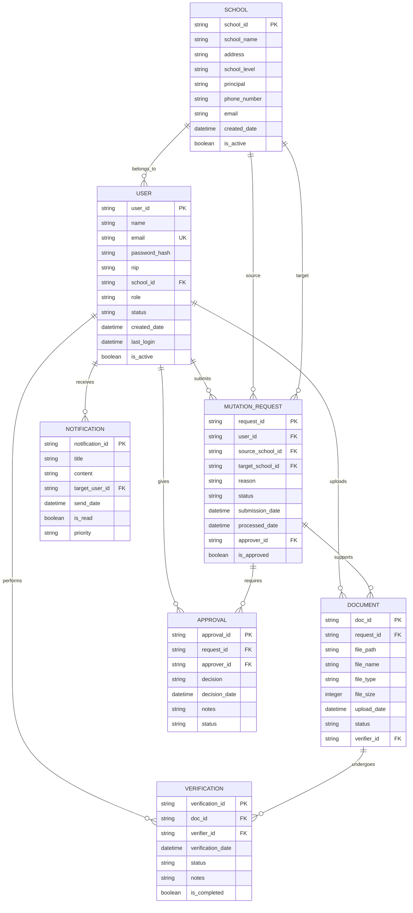
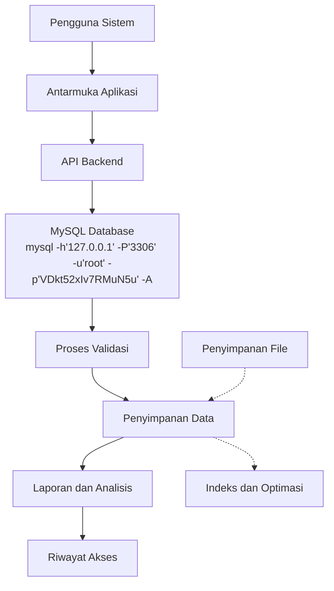

# Aplikasi SIMUTASI - Database Design Document (DBDD)
**Dokumen Desain Database**

---

**Standar Referensi:** IEEE 1016 + ISO/IEC/IEEE 42010

**Tanggal Pembuatan:** 29 Oktober 2025
**Penulis:** Database Arsitek
**Versi:** 1.0

---

## 1. Pendahuluan dan Lingkup (Introduction and Scope)

### 1.1 Tujuan Dokumen (Document Purpose)
Dokumen ini menyediakan desain database komprehensif untuk aplikasi SIMUTASI (Sistem Mutasi Pendidikan) yang berada di simutasi.acehapp.com, sesuai dengan standar IEEE 1016 dan ISO/IEC/IEEE 42010. Tujuan utama adalah untuk mendokumentasikan arsitektur data, struktur tabel, hubungan antar entitas, dan strategi manajemen data untuk mendukung kebutuhan fungsional dan non-fungsional dari sistem dengan koneksi database menggunakan: mysql -h'127.0.0.1' -P'3306' -u'root' -p'VDkt52xIv7RMuN5u' -A.

### 1.2 Lingkup Sistem (System Scope)
Database ini akan mendukung semua aspek operasional aplikasi SIMUTASI termasuk pengelolaan pengguna, proses mutasi pendidikan, manajemen dokumen pendukung, verifikasi data, dan pelaporan status mutasi. Database menggunakan MySQL dengan koneksi: mysql -h'127.0.0.1' -P'3306' -u'root' -p'VDkt52xIv7RMuN5u' -A.

### 1.3 Definisi, Akronim, dan Singkatan
- **DBMS:** Database Management System
- **ERD:** Entity Relationship Diagram
- **PK:** Primary Key
- **FK:** Foreign Key
- **DDL:** Data Definition Language
- **DML:** Data Manipulation Language
- **ACID:** Atomicity, Consistency, Isolation, Durability
- **SQL:** Structured Query Language
- **MySQL:** Sistem manajemen basis data relasional open-source
- **SIMUTASI:** Sistem Mutasi Pendidikan

### 1.4 Referensi
1. IEEE 1016-2009 - IEEE Recommended Practice for Software Design Descriptions
2. ISO/IEC/IEEE 42010 - Systems and software engineering — Architecture description
3. MySQL 8.0 Documentation
4. Database Design for Mere Mortals by Michael J. Hernandez
5. Aplikasi SIMUTASI - Software Requirements Specification
6. Aplikasi SIMUTASI - Software Design Description
7. Database Connection: mysql -h'127.0.0.1' -P'3306' -u'root' -p'VDkt52xIv7RMuN5u' -A

## 2. Model Data Konseptual (Conceptual Data Model)

### 2.1 Gambaran Umum (Overview)
Model data konseptual menyediakan representasi tingkat tinggi dari entitas data dan hubungan antar entitas dalam sistem SIMUTASI. Model ini tidak tergantung pada teknologi atau DBMS tertentu dan fokus pada elemen data dan hubungan bisnis.

### 2.2 Entitas Utama dan Atribut (Main Entities and Attributes)

#### 2.2.1 Entitas Pengguna (User Entity)
- Entitas ini merepresentasikan semua jenis pengguna sistem (guru, siswa, admin, verifikator, approver)
- Atribut utama: ID Pengguna, Nama, Email, NIP, Sekolah, Peran, Status

#### 2.2.2 Entitas Sekolah (School Entity)
- Entitas ini merepresentasikan sekolah-sekolah yang terlibat dalam sistem mutasi
- Atribut utama: ID Sekolah, Nama Sekolah, Alamat, Jenjang Pendidikan, Status

#### 2.2.3 Entitas Permintaan Mutasi (Mutation Request Entity)
- Entitas ini merepresentasikan permintaan mutasi dari pengguna
- Atribut utama: ID Permintaan, Pengguna, Sekolah Asal, Sekolah Tujuan, Status, Tanggal Pengajuan

#### 2.2.4 Entitas Dokumen (Document Entity)
- Entitas ini merepresentasikan dokumen pendukung untuk permintaan mutasi
- Atribut utama: ID Dokumen, Path File, Nama File, Tipe File, Status Verifikasi

#### 2.2.5 Entitas Verifikasi (Verification Entity)
- Entitas ini merepresentasikan proses verifikasi dokumen atau data
- Atribut utama: ID Verifikasi, Dokumen, Verifikator, Status, Tanggal Verifikasi

#### 2.2.6 Entitas Persetujuan (Approval Entity)
- Entitas ini merepresentasikan proses persetujuan permintaan mutasi
- Atribut utama: ID Persetujuan, Permintaan, Pemberi Persetujuan, Keputusan, Tanggal

### 2.3 Diagram Entitas Relasi (Entity Relationship Diagram)



## 3. Model Data Logis (Logical Data Model)

### 3.1 Desain Detail Tabel (Detailed Table Design)

#### 3.1.1 Tabel Users
| Kolom | Tipe Data | Kunci | Nullable | Deskripsi |
|-------|-----------|-------|----------|-----------|
| user_id | VARCHAR(36) | PK | Tidak | ID unik pengguna (UUID) |
| name | VARCHAR(100) | - | Tidak | Nama lengkap pengguna |
| email | VARCHAR(100) | UK | Tidak | Email pengguna (unik) |
| password_hash | VARCHAR(255) | - | Tidak | Hash password (bcrypt) |
| nip | VARCHAR(20) | - | Ya | Nomor Induk Pegawai (jika guru) |
| school_id | VARCHAR(36) | FK | Ya | ID sekolah pengguna |
| role | ENUM('guru','siswa','admin','verifier','approver') | - | Tidak | Peran pengguna dalam sistem |
| status | ENUM('aktif','nonaktif','terverifikasi') | - | Tidak | Status keanggotaan |
| created_date | TIMESTAMP | - | Tidak | Tanggal pembuatan akun |
| last_login | TIMESTAMP | - | Ya | Tanggal login terakhir |
| is_active | BOOLEAN | - | Tidak | Status aktif pengguna |

#### 3.1.2 Tabel Schools
| Kolom | Tipe Data | Kunci | Nullable | Deskripsi |
|-------|-----------|-------|----------|-----------|
| school_id | VARCHAR(36) | PK | Tidak | ID unik sekolah (UUID) |
| school_name | VARCHAR(200) | - | Tidak | Nama sekolah |
| address | TEXT | - | Tidak | Alamat lengkap sekolah |
| school_level | ENUM('sd','smp','sma','smk','slb') | - | Tidak | Jenjang pendidikan |
| principal | VARCHAR(100) | - | Ya | Nama kepala sekolah |
| phone_number | VARCHAR(20) | - | Ya | Nomor telepon sekolah |
| email | VARCHAR(100) | - | Ya | Email sekolah |
| created_date | TIMESTAMP | - | Tidak | Tanggal pembuatan entri |
| is_active | BOOLEAN | - | Tidak | Status aktif sekolah |

#### 3.1.3 Tabel MutationRequests
| Kolom | Tipe Data | Kunci | Nullable | Deskripsi |
|-------|-----------|-------|----------|-----------|
| request_id | VARCHAR(36) | PK | Tidak | ID unik permintaan (UUID) |
| user_id | VARCHAR(36) | FK | Tidak | ID pengguna pemohon |
| source_school_id | VARCHAR(36) | FK | Tidak | ID sekolah asal |
| target_school_id | VARCHAR(36) | FK | Tidak | ID sekolah tujuan |
| reason | TEXT | - | Tidak | Alasan permintaan mutasi |
| status | ENUM('pengajuan','verifikasi','persetujuan','disetujui','ditolak','dibatalkan') | - | Tidak | Status permintaan |
| submission_date | TIMESTAMP | - | Tidak | Tanggal pengajuan |
| processed_date | TIMESTAMP | - | Ya | Tanggal diproses |
| approver_id | VARCHAR(36) | FK | Ya | ID user yang menyetujui |
| is_approved | BOOLEAN | - | Ya | Status persetujuan |

#### 3.1.4 Tabel Documents
| Kolom | Tipe Data | Kunci | Nullable | Deskripsi |
|-------|-----------|-------|----------|-----------|
| doc_id | VARCHAR(36) | PK | Tidak | ID unik dokumen (UUID) |
| request_id | VARCHAR(36) | FK | Tidak | ID permintaan yang didukung |
| file_path | VARCHAR(500) | - | Tidak | Path penyimpanan file |
| file_name | VARCHAR(200) | - | Tidak | Nama asli file |
| file_type | VARCHAR(20) | - | Tidak | Ekstensi file |
| file_size | INTEGER | - | Tidak | Ukuran file dalam bytes |
| upload_date | TIMESTAMP | - | Tidak | Tanggal upload dokumen |
| status | ENUM('upload','verifikasi','terverifikasi','revisi') | - | Tidak | Status verifikasi |
| verifier_id | VARCHAR(36) | FK | Ya | ID verifikator |

#### 3.1.5 Tabel Verifications
| Kolom | Tipe Data | Kunci | Nullable | Deskripsi |
|-------|-----------|-------|----------|-----------|
| verification_id | VARCHAR(36) | PK | Tidak | ID unik verifikasi (UUID) |
| doc_id | VARCHAR(36) | FK | Tidak | ID dokumen yang diverifikasi |
| verifier_id | VARCHAR(36) | FK | Tidak | ID user verifikator |
| verification_date | TIMESTAMP | - | Tidak | Tanggal verifikasi |
| status | ENUM('pending','verified','rejected') | - | Tidak | Hasil verifikasi |
| notes | TEXT | - | Ya | Catatan verifikator |
| is_completed | BOOLEAN | - | Tidak | Status komplet verifikasi |

#### 3.1.6 Tabel Approvals
| Kolom | Tipe Data | Kunci | Nullable | Deskripsi |
|-------|-----------|-------|----------|-----------|
| approval_id | VARCHAR(36) | PK | Tidak | ID unik persetujuan (UUID) |
| request_id | VARCHAR(36) | FK | Tidak | ID permintaan mutasi |
| approver_id | VARCHAR(36) | FK | Tidak | ID user pemberi persetujuan |
| decision | ENUM('setuju','tolak','tunda') | - | Tidak | Keputusan akhir |
| decision_date | TIMESTAMP | - | Tidak | Tanggal keputusan |
| notes | TEXT | - | Ya | Catatan tambahan |
| status | ENUM('pending','completed') | - | Tidak | Status proses |

#### 3.1.7 Tabel Notifications
| Kolom | Tipe Data | Kunci | Nullable | Deskripsi |
|-------|-----------|-------|----------|-----------|
| notification_id | VARCHAR(36) | PK | Tidak | ID unik notifikasi (UUID) |
| title | VARCHAR(200) | - | Tidak | Judul notifikasi |
| content | TEXT | - | Tidak | Isi notifikasi |
| target_user_id | VARCHAR(36) | FK | Tidak | ID pengguna target |
| send_date | TIMESTAMP | - | Tidak | Tanggal pengiriman |
| is_read | BOOLEAN | - | Tidak | Status pembacaan |
| priority | ENUM('low','medium','high') | - | Tidak | Prioritas notifikasi |

### 3.2 Hubungan Antar Tabel (Table Relationships)

**Hubungan Satu-ke-Banyak (One-to-Many):**
- Users → MutationRequests (satu pengguna bisa membuat banyak permintaan)
- Schools → Users (satu sekolah bisa memiliki banyak pengguna)
- Schools → MutationRequests (sekolah bisa menjadi asal/tujuan banyak mutasi)
- MutationRequests → Documents (satu permintaan bisa memiliki banyak dokumen)
- Documents → Verifications (satu dokumen bisa memiliki satu verifikasi)
- MutationRequests → Approvals (satu permintaan bisa memiliki satu persetujuan)

**Hubungan Banyak-ke-Banyak (Many-to-Many):**
- Menggunakan tabel perantara untuk hubungan kompleks

## 4. Model Data Fisik (Physical Data Model)

### 4.1 Spesifikasi Database
- Database Management System: MySQL
- Nama Database: simutasi_db
- Skema Utama: public 
- Koneksi: mysql -h'127.0.0.1' -P'3306' -u'root' -p'VDkt52xIv7RMuN5u' -A
- Engine: InnoDB

### 4.2 Skrip Pembuatan Tabel (Table Creation Scripts)

```sql
-- Tabel Schools
CREATE TABLE schools (
    school_id VARCHAR(36) PRIMARY KEY,
    school_name VARCHAR(200) NOT NULL,
    address TEXT NOT NULL,
    school_level ENUM('sd', 'smp', 'sma', 'smk', 'slb') NOT NULL,
    principal VARCHAR(100),
    phone_number VARCHAR(20),
    email VARCHAR(100),
    created_date TIMESTAMP NOT NULL DEFAULT CURRENT_TIMESTAMP,
    is_active BOOLEAN NOT NULL DEFAULT TRUE
);

-- Tabel Users
CREATE TABLE users (
    user_id VARCHAR(36) PRIMARY KEY,
    name VARCHAR(100) NOT NULL,
    email VARCHAR(100) NOT NULL UNIQUE,
    password_hash VARCHAR(255) NOT NULL,
    nip VARCHAR(20),
    school_id VARCHAR(36),
    role ENUM('guru', 'siswa', 'admin', 'verifier', 'approver') NOT NULL,
    status ENUM('aktif', 'nonaktif', 'terverifikasi') NOT NULL DEFAULT 'aktif',
    created_date TIMESTAMP NOT NULL DEFAULT CURRENT_TIMESTAMP,
    last_login TIMESTAMP NULL,
    is_active BOOLEAN NOT NULL DEFAULT TRUE,
    FOREIGN KEY (school_id) REFERENCES schools(school_id)
);

-- Tabel MutationRequests
CREATE TABLE mutation_requests (
    request_id VARCHAR(36) PRIMARY KEY,
    user_id VARCHAR(36) NOT NULL,
    source_school_id VARCHAR(36) NOT NULL,
    target_school_id VARCHAR(36) NOT NULL,
    reason TEXT NOT NULL,
    status ENUM('pengajuan', 'verifikasi', 'persetujuan', 'disetujui', 'ditolak', 'dibatalkan') NOT NULL DEFAULT 'pengajuan',
    submission_date TIMESTAMP NOT NULL DEFAULT CURRENT_TIMESTAMP,
    processed_date TIMESTAMP NULL,
    approver_id VARCHAR(36) NULL,
    is_approved BOOLEAN NULL,
    FOREIGN KEY (user_id) REFERENCES users(user_id),
    FOREIGN KEY (source_school_id) REFERENCES schools(school_id),
    FOREIGN KEY (target_school_id) REFERENCES schools(school_id),
    FOREIGN KEY (approver_id) REFERENCES users(user_id)
);

-- Tabel Documents
CREATE TABLE documents (
    doc_id VARCHAR(36) PRIMARY KEY,
    request_id VARCHAR(36) NOT NULL,
    file_path VARCHAR(500) NOT NULL,
    file_name VARCHAR(200) NOT NULL,
    file_type VARCHAR(20) NOT NULL,
    file_size INT NOT NULL,
    upload_date TIMESTAMP NOT NULL DEFAULT CURRENT_TIMESTAMP,
    status ENUM('upload', 'verifikasi', 'terverifikasi', 'revisi') NOT NULL DEFAULT 'upload',
    verifier_id VARCHAR(36) NULL,
    FOREIGN KEY (request_id) REFERENCES mutation_requests(request_id) ON DELETE CASCADE,
    FOREIGN KEY (verifier_id) REFERENCES users(user_id)
);

-- Tabel Verifications
CREATE TABLE verifications (
    verification_id VARCHAR(36) PRIMARY KEY,
    doc_id VARCHAR(36) NOT NULL,
    verifier_id VARCHAR(36) NOT NULL,
    verification_date TIMESTAMP NOT NULL DEFAULT CURRENT_TIMESTAMP,
    status ENUM('pending', 'verified', 'rejected') NOT NULL,
    notes TEXT,
    is_completed BOOLEAN NOT NULL DEFAULT FALSE,
    FOREIGN KEY (doc_id) REFERENCES documents(doc_id) ON DELETE CASCADE,
    FOREIGN KEY (verifier_id) REFERENCES users(user_id)
);

-- Tabel Approvals
CREATE TABLE approvals (
    approval_id VARCHAR(36) PRIMARY KEY,
    request_id VARCHAR(36) NOT NULL,
    approver_id VARCHAR(36) NOT NULL,
    decision ENUM('setuju', 'tolak', 'tunda') NOT NULL,
    decision_date TIMESTAMP NOT NULL DEFAULT CURRENT_TIMESTAMP,
    notes TEXT,
    status ENUM('pending', 'completed') NOT NULL DEFAULT 'pending',
    FOREIGN KEY (request_id) REFERENCES mutation_requests(request_id) ON DELETE CASCADE,
    FOREIGN KEY (approver_id) REFERENCES users(user_id)
);

-- Tabel Notifications
CREATE TABLE notifications (
    notification_id VARCHAR(36) PRIMARY KEY,
    title VARCHAR(200) NOT NULL,
    content TEXT NOT NULL,
    target_user_id VARCHAR(36) NOT NULL,
    send_date TIMESTAMP NOT NULL DEFAULT CURRENT_TIMESTAMP,
    is_read BOOLEAN NOT NULL DEFAULT FALSE,
    priority ENUM('low', 'medium', 'high') NOT NULL DEFAULT 'medium',
    FOREIGN KEY (target_user_id) REFERENCES users(user_id) ON DELETE CASCADE
);
```

### 4.3 Indeks (Indexes)

```sql
-- Indeks pada kolom yang sering digunakan untuk pencarian
CREATE INDEX idx_users_email ON users(email);
CREATE INDEX idx_users_school_id ON users(school_id);
CREATE INDEX idx_users_role ON users(role);
CREATE INDEX idx_mutation_requests_user_id ON mutation_requests(user_id);
CREATE INDEX idx_mutation_requests_status ON mutation_requests(status);
CREATE INDEX idx_mutation_requests_source_school ON mutation_requests(source_school_id);
CREATE INDEX idx_mutation_requests_target_school ON mutation_requests(target_school_id);
CREATE INDEX idx_documents_request_id ON documents(request_id);
CREATE INDEX idx_verifications_doc_id ON verifications(doc_id);
CREATE INDEX idx_approvals_request_id ON approvals(request_id);
CREATE INDEX idx_notifications_target_user ON notifications(target_user_id);

-- Indeks komposit untuk query kompleks
CREATE INDEX idx_mutation_requests_status_date ON mutation_requests(status, submission_date);
CREATE INDEX idx_documents_status_verifier ON documents(status, verifier_id);
CREATE INDEX idx_notifications_unread_priority ON notifications(is_read, priority);
```

### 4.4 Tampilan (Views)

```sql
-- View untuk ringkasan mutasi per pengguna
CREATE VIEW user_mutation_summary AS
SELECT 
    u.user_id,
    u.name,
    COUNT(mr.request_id) AS total_requests,
    COUNT(CASE WHEN mr.status = 'pengajuan' THEN 1 END) AS pending_requests,
    COUNT(CASE WHEN mr.status = 'disetujui' THEN 1 END) AS approved_requests,
    COUNT(CASE WHEN mr.status = 'ditolak' THEN 1 END) AS rejected_requests
FROM users u
LEFT JOIN mutation_requests mr ON u.user_id = mr.user_id
WHERE u.is_active = TRUE
GROUP BY u.user_id, u.name;

-- View untuk daftar permintaan dengan detail sekolah
CREATE VIEW mutation_requests_with_schools AS
SELECT 
    mr.request_id,
    mr.reason,
    mr.status,
    mr.submission_date,
    u.name AS user_name,
    source_school.school_name AS source_school_name,
    target_school.school_name AS target_school_name
FROM mutation_requests mr
JOIN users u ON mr.user_id = u.user_id
JOIN schools source_school ON mr.source_school_id = source_school.school_id
JOIN schools target_school ON mr.target_school_id = target_school.school_id;

-- View untuk status lengkap verifikasi
CREATE VIEW verification_status AS
SELECT 
    mr.request_id,
    mr.status AS request_status,
    d.doc_id,
    d.file_name,
    d.status AS document_status,
    v.status AS verification_status,
    v.notes AS verification_notes
FROM mutation_requests mr
LEFT JOIN documents d ON mr.request_id = d.request_id
LEFT JOIN verifications v ON d.doc_id = v.doc_id;
```

### 4.5 Prosedur dan Fungsi (Stored Procedures and Functions)

```sql
-- Prosedur untuk membuat permintaan mutasi baru
DELIMITER //
CREATE PROCEDURE CreateMutationRequest(
    IN p_user_id VARCHAR(36),
    IN p_source_school_id VARCHAR(36),
    IN p_target_school_id VARCHAR(36),
    IN p_reason TEXT
)
BEGIN
    INSERT INTO mutation_requests (request_id, user_id, source_school_id, target_school_id, reason, status, submission_date)
    VALUES (UUID(), p_user_id, p_source_school_id, p_target_school_id, p_reason, 'pengajuan', NOW());
END //
DELIMITER ;

-- Fungsi untuk mendapatkan jumlah permintaan tertunda
DELIMITER //
CREATE FUNCTION GetPendingRequestsCount(p_user_id VARCHAR(36)) 
RETURNS INT
READS SQL DATA
DETERMINISTIC
BEGIN
    DECLARE pending_count INT;
    SELECT COUNT(*) INTO pending_count 
    FROM mutation_requests 
    WHERE user_id = p_user_id AND status = 'pengajuan';
    RETURN pending_count;
END //
DELIMITER ;

-- Prosedur untuk memperbarui status dokumen
DELIMITER //
CREATE PROCEDURE UpdateDocumentStatus(
    IN p_doc_id VARCHAR(36),
    IN p_status VARCHAR(20),
    IN p_verifier_id VARCHAR(36)
)
BEGIN
    UPDATE documents
    SET status = p_status, verifier_id = p_verifier_id
    WHERE doc_id = p_doc_id;
END //
DELIMITER ;
```

## 5. Kamus Data (Data Dictionary)

| Entitas | Atribut | Tipe Data | Panjang | Kunci | Nullable | Deskripsi | Validasi |
|---------|---------|-----------|---------|-------|----------|-----------|----------|
| Users | user_id | VARCHAR | 36 | PK | Tidak | ID unik pengguna | Format UUID |
| Users | email | VARCHAR | 100 | UK | Tidak | Email pengguna | Format email valid |
| Users | role | ENUM | - | - | Tidak | Peran pengguna | guru, siswa, admin, verifier, approver |
| Schools | school_id | VARCHAR | 36 | PK | Tidak | ID unik sekolah | Format UUID |
| Schools | school_level | ENUM | - | - | Tidak | Jenjang pendidikan | sd, smp, sma, smk, slb |
| MutationRequests | request_id | VARCHAR | 36 | PK | Tidak | ID unik permintaan | Format UUID |
| MutationRequests | status | ENUM | - | - | Tidak | Status permintaan | pengajuan, verifikasi, persetujuan, disetujui, ditolak, dibatalkan |
| Documents | file_size | INTEGER | - | - | Tidak | Ukuran file | Dalam bytes |
| Verifications | status | ENUM | - | - | Tidak | Status verifikasi | pending, verified, rejected |
| Approvals | decision | ENUM | - | - | Tidak | Keputusan akhir | setuju, tolak, tunda |

## 6. Integritas Data dan Keamanan (Data Integrity and Security)

### 6.1 Aturan Integritas Referensial (Referential Integrity Rules)
- CASCADE pada penghapusan permintaan mutasi: dokumen terkait akan dihapus
- RESTRICT pada penghapusan sekolah jika masih memiliki permintaan aktif
- SET NULL pada approver_id jika user dihapus (untuk menjaga riwayat)

### 6.2 Keamanan Data (Data Security)
- Enkripsi kolom sensitif seperti password dengan algoritma bcrypt
- Pembatasan akses berbasis peran (RBAC) di tingkat aplikasi
- Koneksi database: mysql -h'127.0.0.1' -P'3306' -u'root' -p'VDkt52xIv7RMuN5u' -A
- Audit trail untuk operasi penting pada data

### 6.3 Backup dan Restorasi (Backup and Recovery)
- Backup harian untuk data transaksional
- Backup mingguan untuk schema dan konfigurasi
- Backup offsite untuk keamanan bencana
- RTO (Recovery Time Objective): 4 jam
- RPO (Recovery Point Objective): 1 jam

## 7. Diagram Alir Data (Data Flow Diagram)



## 8. Rencana Migrasi dan Versi (Migration and Versioning Plan)

### 8.1 Strategi Migrasi Data
- Migrasi bertahap dari sistem lama (jika ada)
- Validasi data setelah migrasi
- Backup sebelum migrasi
- Uji coba migrasi di lingkungan staging

### 8.2 Manajemen Versi Skema
- Penggunaan skrip migrasi otomatis
- Sistem versi skema terpusat
- Rollback otomatis jika migrasi gagal
- Dokumentasi perubahan skema

### 8.3 Skrip Migrasi Contoh
```sql
-- Versi 1.1: Tambah kolom baru ke tabel users
ALTER TABLE users ADD COLUMN phone_number VARCHAR(20);

-- Versi 1.2: Perbarui batasan pada kolom status
ALTER TABLE mutation_requests MODIFY COLUMN status ENUM('pengajuan','verifikasi','persetujuan','disetujui','ditolak','dibatalkan','diproses') NOT NULL DEFAULT 'pengajuan';

-- Versi 1.3: Tambah tabel baru untuk log aktivitas
CREATE TABLE activity_logs (
    log_id VARCHAR(36) PRIMARY KEY,
    user_id VARCHAR(36) NOT NULL,
    action VARCHAR(100) NOT NULL,
    description TEXT,
    created_date TIMESTAMP NOT NULL DEFAULT CURRENT_TIMESTAMP,
    FOREIGN KEY (user_id) REFERENCES users(user_id)
);
```

---

**Lampiran:**
- Skrip SQL Lengkap
- Contoh Query Umum
- Panduan Administrasi Database
- Prosedur Backup dan Pemulihan
- Dokumentasi Koneksi: mysql -h'127.0.0.1' -P'3306' -u'root' -p'VDkt52xIv7RMuN5u' -A