# Aplikasi SIMUTASI - Software Design Description (SDD)
**Dokumen Deskripsi Desain Perangkat Lunak**

---

**Standar Referensi:** IEEE 1016-2009

**Tanggal Pembuatan:** 29 Oktober 2025
**Penulis:** Sistem Arsitek
**Versi:** 1.0

---

## 1. Pendahuluan (Introduction)

### 1.1 Tujuan (Purpose)
Dokumen ini merupakan deskripsi desain perangkat lunak (Software Design Description/SDD) untuk aplikasi SIMUTASI (Sistem Mutasi Pendidikan) yang berada di simutasi.acehapp.com. Tujuan dari dokumen ini adalah memberikan gambaran rinci tentang arsitektur dan desain sistem, termasuk struktur, komponen, antarmuka, dan fungsi-fungsi yang dirancang untuk memenuhi kebutuhan fungsional dan non-fungsional yang telah ditentukan dalam SRS.

### 1.2 Lingkup (Scope)
Dokumen ini mencakup desain arsitektur sistem, komponen perangkat lunak, desain data, desain antarmuka, dan pertimbangan implementasi untuk aplikasi SIMUTASI. Ini berfungsi sebagai panduan teknis untuk pengembang dalam mengimplementasikan sistem sesuai dengan spesifikasi kebutuhan dengan koneksi database MySQL menggunakan kredensial: mysql -h'127.0.0.1' -P'3306' -u'root' -p'VDkt52xIv7RMuN5u' -A.

### 1.3 Referensi ke SRS (Reference to SRS)
- Nama Dokumen: Aplikasi SIMUTASI - Software Requirements Specification
- Nomor Revisi: 1.0
- Tanggal: 29 Oktober 2025
- Penulis: Sistem Analis

### 1.4 Referensi Lain (Other References)
1. IEEE 1016-2009 - IEEE Recommended Practice for Software Design Descriptions
2. TOGAF 9.2 Standard for Enterprise Architecture
3. ISO/IEC/IEEE 42010 - Systems and software engineering — Architecture description
4. MySQL 8.0 Documentation
5. Standar Pengembangan Aplikasi Web
6. Database Connection: mysql -h'127.0.0.1' -P'3306' -u'root' -p'VDkt52xIv7RMuN5u' -A

### 1.5 Ikhtisar (Overview)
Dokumen ini terstruktur dalam beberapa bagian utama: deskripsi arsitektur keseluruhan, desain komponen, desain data, desain antarmuka, desain proses, dan pertimbangan implementasi.

## 2. Gambaran Arsitektural (Architectural Overview)

### 2.1 Deskripsi Umum (General Description)
Aplikasi SIMUTASI mengadopsi pendekatan arsitektur berbasis layanan (Service-Oriented Architecture) dengan pola arsitektur tiga lapis (3-tier architecture) yang mencakup:
- Lapisan Presentasi (Presentation Layer)
- Lapisan Logika Bisnis (Business Logic Layer)
- Lapisan Data (Data Layer)

Sistem ini menggunakan database MySQL dengan koneksi: mysql -h'127.0.0.1' -P'3306' -u'root' -p'VDkt52xIv7RMuN5u' -A.

### 2.2 Diagram Arsitektur (Architecture Diagrams)

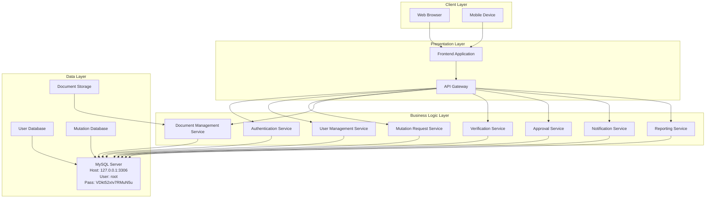

### 2.3 Prinsip-Prinsip Desain (Design Principles)
- Separation of Concerns: Memisahkan tanggung jawab antar komponen
- Scalability: Desain yang dapat berkembang sesuai kebutuhan
- Maintainability: Kode yang mudah dipelihara dan dimodifikasi
- Security by Design: Keamanan diterapkan sejak tahap desain
- Performance: Optimalisasi kinerja dari awal desain
- Database Integration: Penggunaan database MySQL sesuai kredensial yang ditentukan

## 3. Desain Komponen (Component Design)

### 3.1 Modul Otentikasi (Authentication Module)

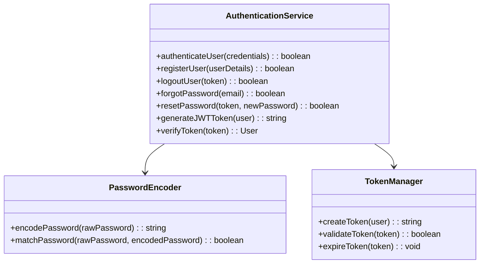

**Deskripsi:**
- Modul ini bertanggung jawab untuk otentikasi dan otorisasi pengguna
- Menggunakan JWT (JSON Web Token) untuk manajemen sesi
- Mengimplementasikan enkripsi password menggunakan algoritma Bcrypt
- Terkoneksi ke database MySQL menggunakan: mysql -h'127.0.0.1' -P'3306' -u'root' -p'VDkt52xIv7RMuN5u' -A

### 3.2 Modul Manajemen Pengguna (User Management Module)

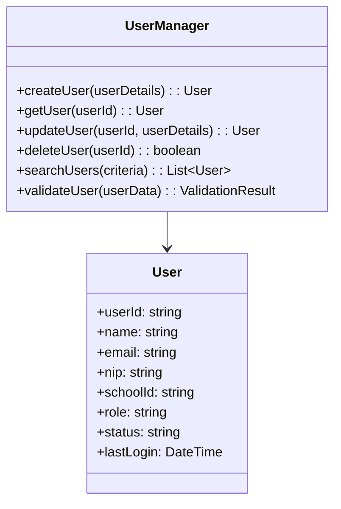

**Deskripsi:**
- Modul ini mengelola data profil pengguna
- Menyediakan fungsi CRUD (Create, Read, Update, Delete) untuk pengguna
- Melakukan validasi data pengguna sebelum disimpan

### 3.3 Modul Pengajuan Mutasi (Mutation Request Module)

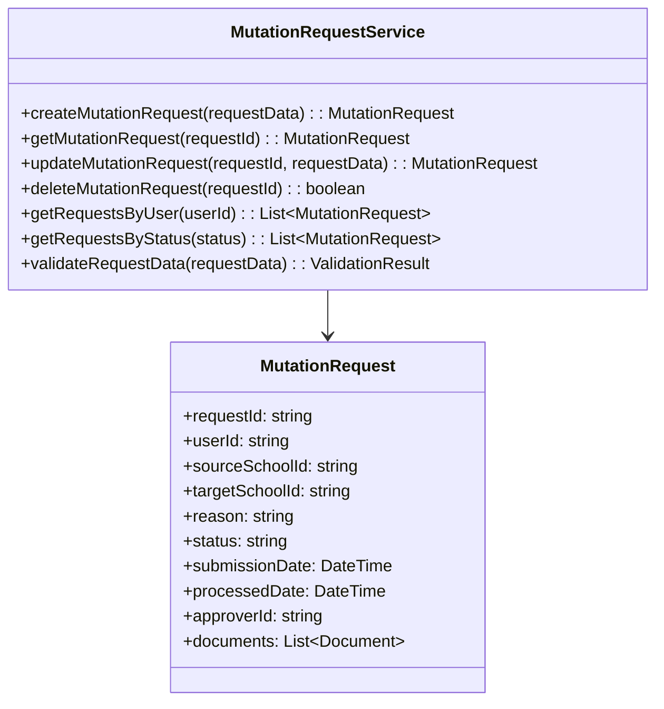

**Deskripsi:**
- Modul ini mengelola permintaan mutasi dari pengguna
- Melacak status dan proses permintaan mutasi
- Mengelola hubungan antara permintaan dan dokumen pendukung

### 3.4 Modul Manajemen Dokumen (Document Management Module)

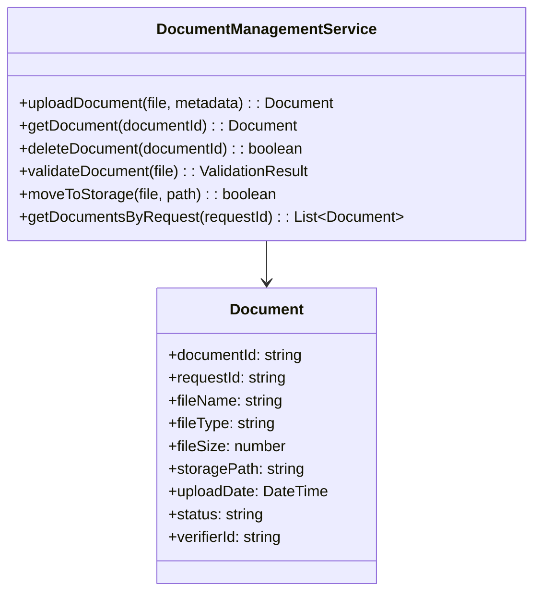

**Deskripsi:**
- Modul ini mengelola dokumen pendukung permintaan mutasi
- Menyediakan fungsi upload, download, dan validasi dokumen
- Mengelola penyimpanan dokumen secara aman

### 3.5 Modul Verifikasi (Verification Module)

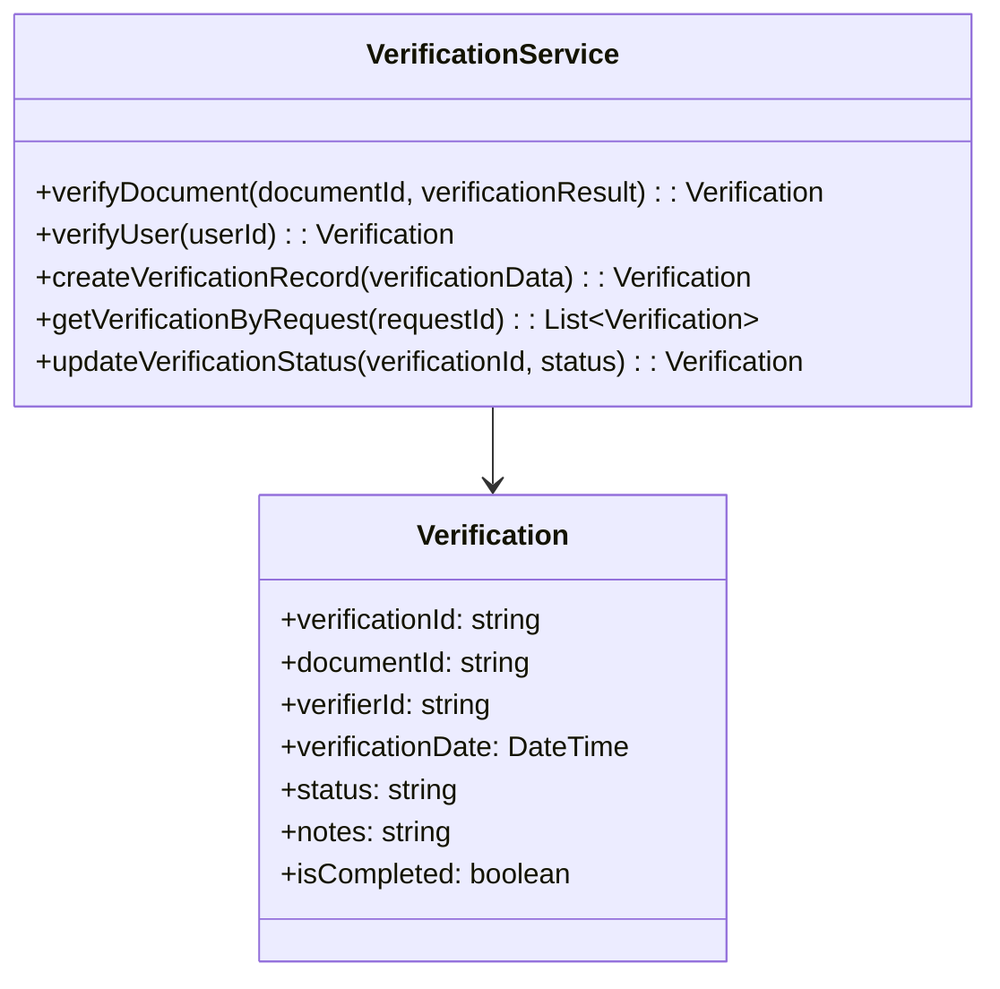

**Deskripsi:**
- Modul ini bertanggung jawab atas proses verifikasi dokumen dan data pengguna
- Menyimpan riwayat verifikasi untuk audit trail
- Mengelola status verifikasi dan catatan verifikasi

### 3.6 Modul Persetujuan (Approval Module)

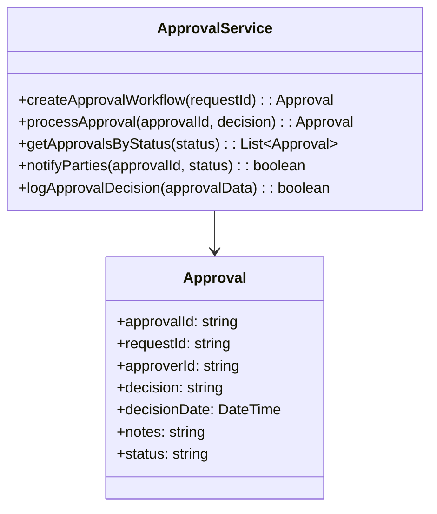

**Deskripsi:**
- Modul ini mengelola proses persetujuan mutasi
- Menerapkan alur persetujuan berdasarkan kebijakan
- Mengirimkan notifikasi terkait keputusan persetujuan

## 4. Desain Data (Data Design)

### 4.1 Model Data Konseptual (Conceptual Data Model)

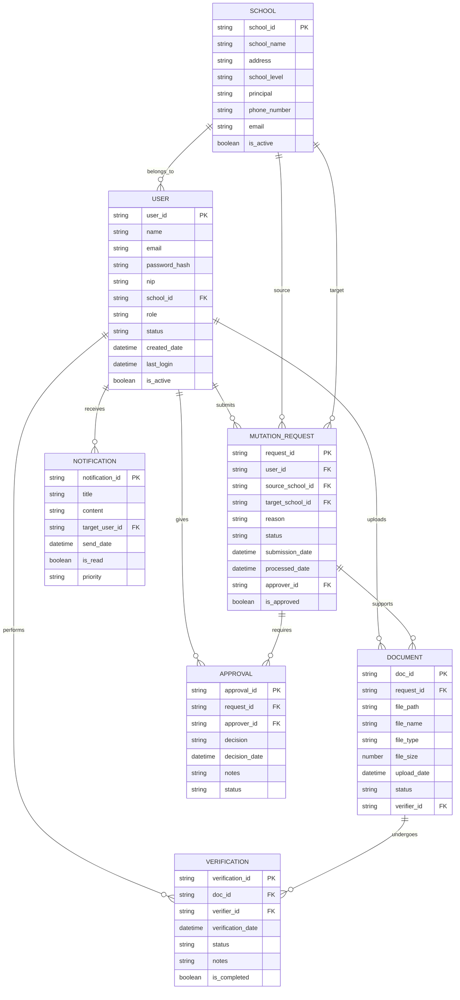

### 4.2 Model Data Logis (Logical Data Model)

**Tabel User:**
- user_id: VARCHAR(36) (Primary Key, UUID)
- name: VARCHAR(100) (Not Null)
- email: VARCHAR(100) (Unique, Not Null)
- password_hash: VARCHAR(255) (Not Null)
- nip: VARCHAR(20) (Nullable)
- school_id: VARCHAR(36) (Foreign Key to School)
- role: ENUM('guru', 'siswa', 'admin', 'verifier', 'approver') (Not Null)
- status: ENUM('aktif', 'nonaktif', 'terverifikasi') (Default: 'aktif')
- created_date: TIMESTAMP (Not Null, Default: CURRENT_TIMESTAMP)
- last_login: TIMESTAMP (Nullable)
- is_active: BOOLEAN (Not Null, Default: TRUE)

**Tabel School:**
- school_id: VARCHAR(36) (Primary Key, UUID)
- school_name: VARCHAR(200) (Not Null)
- address: TEXT (Not Null)
- school_level: ENUM('sd', 'smp', 'sma', 'smk', 'slb') (Not Null)
- principal: VARCHAR(100) (Nullable)
- phone_number: VARCHAR(20) (Nullable)
- email: VARCHAR(100) (Nullable)
- is_active: BOOLEAN (Not Null, Default: TRUE)

**Tabel MutationRequest:**
- request_id: VARCHAR(36) (Primary Key, UUID)
- user_id: VARCHAR(36) (Foreign Key to User, Not Null)
- source_school_id: VARCHAR(36) (Foreign Key to School, Not Null)
- target_school_id: VARCHAR(36) (Foreign Key to School, Not Null)
- reason: TEXT (Not Null)
- status: ENUM('pengajuan', 'verifikasi', 'persetujuan', 'disetujui', 'ditolak', 'dibatalkan') (Default: 'pengajuan')
- submission_date: TIMESTAMP (Not Null, Default: CURRENT_TIMESTAMP)
- processed_date: TIMESTAMP (Nullable)
- approver_id: VARCHAR(36) (Foreign Key to User, Nullable)
- is_approved: BOOLEAN (Default: NULL)

**Tabel Document:**
- doc_id: VARCHAR(36) (Primary Key, UUID)
- request_id: VARCHAR(36) (Foreign Key to MutationRequest, Not Null)
- file_path: VARCHAR(500) (Not Null)
- file_name: VARCHAR(200) (Not Null)
- file_type: VARCHAR(20) (Not Null)
- file_size: INTEGER (Not Null)
- upload_date: TIMESTAMP (Not Null, Default: CURRENT_TIMESTAMP)
- status: ENUM('upload', 'verifikasi', 'terverifikasi', 'revisi') (Default: 'upload')
- verifier_id: VARCHAR(36) (Foreign Key to User, Nullable)

**Tabel Verification:**
- verification_id: VARCHAR(36) (Primary Key, UUID)
- doc_id: VARCHAR(36) (Foreign Key to Document, Not Null)
- verifier_id: VARCHAR(36) (Foreign Key to User, Not Null)
- verification_date: TIMESTAMP (Not Null, Default: CURRENT_TIMESTAMP)
- status: ENUM('pending', 'verified', 'rejected') (Not Null)
- notes: TEXT (Nullable)
- is_completed: BOOLEAN (Not Null, Default: FALSE)

**Tabel Approval:**
- approval_id: VARCHAR(36) (Primary Key, UUID)
- request_id: VARCHAR(36) (Foreign Key to MutationRequest, Not Null)
- approver_id: VARCHAR(36) (Foreign Key to User, Not Null)
- decision: ENUM('setuju', 'tolak', 'tunda') (Not Null)
- decision_date: TIMESTAMP (Not Null, Default: CURRENT_TIMESTAMP)
- notes: TEXT (Nullable)
- status: ENUM('pending', 'completed') (Not Null, Default: 'pending')

### 4.3 Model Data Fisik (Physical Data Model)
- Database: MySQL
- Connection: mysql -h'127.0.0.1' -P'3306' -u'root' -p'VDkt52xIv7RMuN5u' -A
- Engine: InnoDB
- Indeks pada kolom yang sering diquery
- Partisi tabel besar berdasarkan tanggal

## 5. Desain Antarmuka (Interface Design)

### 5.1 Antarmuka API (API Interface Design)

#### 5.1.1 Endpoints Otentikasi
```
POST /api/auth/login
Request: { "email": "string", "password": "string" }
Response: { "token": "string", "user": {...} }

POST /api/auth/register
Request: { "name": "string", "email": "string", "password": "string", "nip": "string", "role": "string" }
Response: { "message": "string", "user": {...} }

POST /api/auth/logout
Authorization: Bearer <token>
Response: { "message": "string" }

POST /api/auth/forgot-password
Request: { "email": "string" }
Response: { "message": "string" }
```

#### 5.1.2 Endpoints Pengajuan Mutasi
```
GET /api/mutation-requests
Authorization: Bearer <token>
Response: [{ "request_id": "string", "status": "string", ... }]

POST /api/mutation-requests
Authorization: Bearer <token>
Request: { "source_school_id": "string", "target_school_id": "string", "reason": "string" }
Response: { "request_id": "string", "message": "string" }

GET /api/mutation-requests/{request_id}
Authorization: Bearer <token>
Response: { "request_id": "string", "status": "string", ... }

PUT /api/mutation-requests/{request_id}
Authorization: Bearer <token>
Request: { "reason": "string" }
Response: { "message": "string" }

DELETE /api/mutation-requests/{request_id}
Authorization: Bearer <token>
Response: { "message": "string" }
```

#### 5.1.3 Endpoints Dokumen
```
POST /api/mutation-requests/{request_id}/documents
Authorization: Bearer <token>
Content-Type: multipart/form-data
Request: { "file": "file" }
Response: { "doc_id": "string", "message": "string" }

GET /api/documents/{doc_id}/download
Authorization: Bearer <token>
Response: File download
```

#### 5.1.4 Endpoints Persetujuan
```
PUT /api/approvals/{approval_id}
Authorization: Bearer <token> (hanya untuk approver)
Request: { "decision": "setuju|tolak|tunda", "notes": "string" }
Response: { "message": "string" }
```

### 5.2 Antarmuka Pengguna (UI Component Design)

#### 5.2.1 Komponen Dashboard
```
Dashboard Layout:
- Sidebar: Menu navigasi
- Header: Informasi pengguna dan notifikasi
- Main Content: Ringkasan permintaan mutasi
- Footer: Informasi sistem
```

#### 5.2.2 Komponen Formulir Mutasi
```
Mutation Request Form:
- Dropdown sekolah asal
- Dropdown sekolah tujuan
- Textarea alasan mutasi
- Tombol submit permintaan
- Preview dokumen yang telah diupload
```

#### 5.2.3 Komponen Upload Dokumen
```
Document Upload Component:
- Drag and drop area
- List dokumen yang diupload
- Status verifikasi dokumen
- Tombol untuk melihat/detail dokumen
```

## 6. Desain Proses (Process Design)

### 6.1 Diagram Alur Proses (Process Flow Diagram)

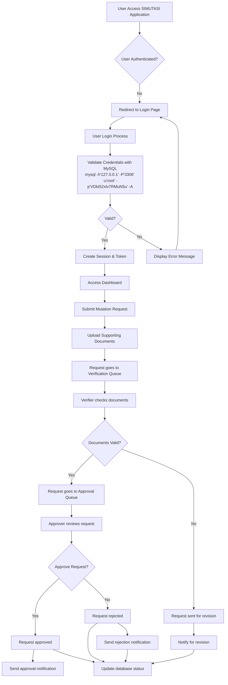

### 6.2 Diagram Urutan (Sequence Diagram)

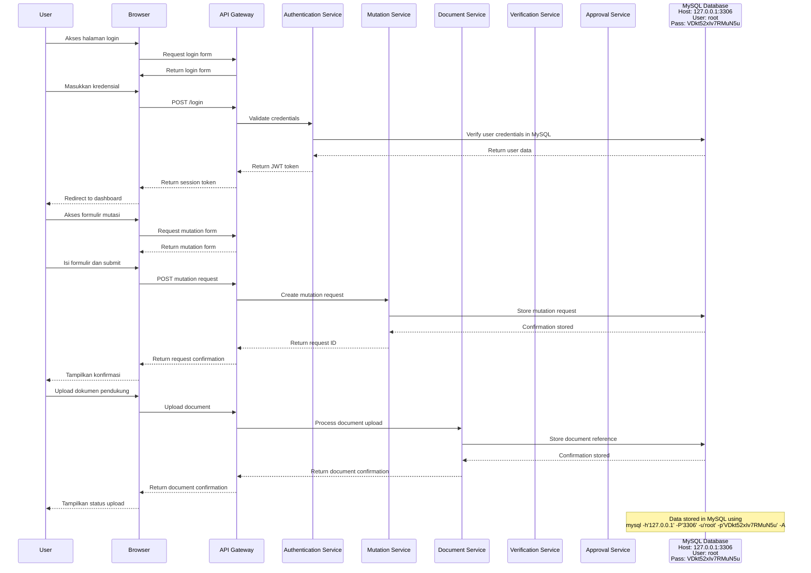

### 6.3 Diagram Aktivitas (Activity Diagram)

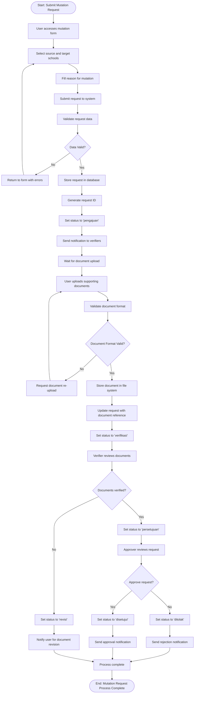

## 7. Desain Non-Fungsional (Non-Functional Design)

### 7.1 Desain Keamanan (Security Design)
- Otentikasi berbasis JWT token
- Otorisasi berbasis peran (Role-Based Access Control)
- Enkripsi data sensitif di database MySQL
- Validasi input untuk mencegah serangan SQL Injection dan XSS
- Rate limiting untuk mencegah abuse API
- Koneksi aman ke database: mysql -h'127.0.0.1' -P'3306' -u'root' -p'VDkt52xIv7RMuN5u' -A

### 7.2 Desain Skalabilitas (Scalability Design)
- Arsitektur mikroservis untuk kemudahan scaling
- Penggunaan cache (Redis) untuk data yang sering diakses
- Load balancing untuk distribusi beban
- Database clustering dan replikasi MySQL

### 7.3 Desain Ketersediaan (Availability Design)
- Sistem backup dan failover
- Monitoring dan alerting sistem
- Penanganan error yang robust
- Graceful degradation untuk komponen yang tidak penting

### 7.4 Desain Pemeliharaan (Maintainability Design)
- Kode modular dan terdokumentasi
- Logging komprehensif
- Monitoring dan metric
- Konfigurasi yang fleksibel

## 8. Pertimbangan Implementasi (Implementation Considerations)

### 8.1 Teknologi yang Digunakan (Technology Stack)
- Backend: PHP/Python/Node.js
- Frontend: React.js, Vue.js, atau framework HTML5
- Database: MySQL dengan koneksi: mysql -h'127.0.0.1' -P'3306' -u'root' -p'VDkt52xIv7RMuN5u' -A
- Web Server: Apache/Nginx
- File Storage: Sistem file lokal atau cloud storage

### 8.2 Pustaka dan Framework (Libraries and Frameworks)
- Otentikasi: JWT atau library auth bawaan framework
- Validasi: Library validasi input
- Database ORM: Library koneksi MySQL
- Dokumentasi API: Swagger atau OpenAPI

### 8.3 Alat Pengembangan (Development Tools)
- Version Control: Git
- CI/CD: GitHub Actions atau GitLab CI
- Deployment: Docker atau deployment script
- Database Management: phpMyAdmin atau MySQL Workbench

### 8.4 Spesifikasi Koneksi Database
- Database Server: MySQL
- Host: 127.0.0.1
- Port: 3306
- Username: root
- Password: VDkt52xIv7RMuN5u
- Connection Command: mysql -h'127.0.0.1' -P'3306' -u'root' -p'VDkt52xIv7RMuN5u' -A

## 9. Pertimbangan Uji Coba (Testing Considerations)

### 9.1 Strategi Pengujian (Testing Strategy)
- Unit Testing: Pengujian komponen individual
- Integration Testing: Pengujian integrasi antar komponen
- End-to-End Testing: Pengujian alur pengguna secara menyeluruh
- Security Testing: Pengujian keamanan sistem
- Performance Testing: Pengujian kinerja dan beban
- Database Testing: Pengujian koneksi dan operasi database dengan kredensial yang ditentukan

### 9.2 Alat Uji Coba (Testing Tools)
- Unit Testing: Framework testing sesuai bahasa backend
- End-to-End Testing: Selenium atau Cypress
- Load Testing: JMeter atau Artillery
- Security Testing: OWASP ZAP atau tools sejenis
- Database Testing: Alat pengujian koneksi MySQL

---

**Lampiran:**
- Diagram UML Detail
- Spesifikasi API Lengkap
- Panduan Deployment
- Dokumentasi Konfigurasi Database MySQL
- Database Connection Details: mysql -h'127.0.0.1' -P'3306' -u'root' -p'VDkt52xIv7RMuN5u' -A