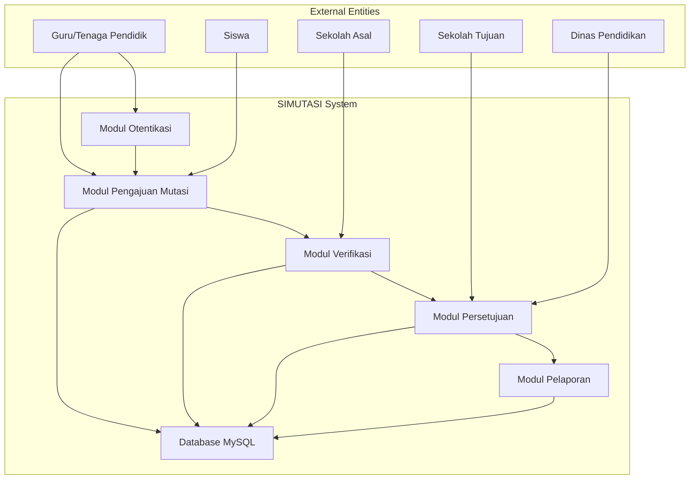

# Aplikasi SIMUTASI - Software Requirements Specification (SRS)
**Dokumen Spesifikasi Kebutuhan Perangkat Lunak**

---

**Standar Referensi:** ISO/IEC/IEEE 29148:2018

**Tanggal Pembuatan:** 29 Oktober 2025
**Penulis:** Muhammad Ali Murtaza
**Versi:** 1.0

---

## 1. Pendahuluan (Introduction)

### 1.1 Tujuan (Purpose)
Dokumen ini merupakan Spesifikasi Kebutuhan Perangkat Lunak (Software Requirements Specification/SRS) untuk aplikasi SIMUTASI (Sistem Mutasi Pendidikan) yang berada di simutasi.acehapp.com. Tujuan dari dokumen ini adalah untuk menentukan secara rinci kebutuhan fungsional dan non-fungsional dari sistem aplikasi yang mendukung proses mutasi pendidikan di wilayah Aceh.

### 1.2 Lingkup (Scope)
Aplikasi SIMUTASI adalah platform digital yang dirancang untuk mendukung proses mutasi pendidikan, termasuk mutasi guru, siswa, dan tenaga kependidikan antar sekolah di wilayah Aceh. Platform ini menyediakan berbagai fitur untuk pengajuan permintaan mutasi, proses verifikasi, pelaporan status, serta komunikasi efektif antar pihak terkait dalam proses mutasi.

### 1.3 Definisi, Akronim, dan Singkatan
- **SIMUTASI**: Sistem Mutasi Pendidikan
- **Mutasi**: Proses perpindahan tenaga pendidik atau siswa antar sekolah
- **Guru**: Tenaga pendidik yang terlibat dalam proses mutasi
- **Sekolah Asal**: Sekolah tempat tenaga pendidik/siswa berasal
- **Sekolah Tujuan**: Sekolah tujuan perpindahan tenaga pendidik/siswa
- **Admin**: Pengguna dengan hak akses tertinggi untuk mengelola sistem
- **Permintaan Mutasi**: Proses pengajuan perpindahan dari satu sekolah ke sekolah lain
- **API**: Application Programming Interface
- **UI**: User Interface
- **UX**: User Experience
- **MySQL**: Sistem manajemen basis data relasional
- **Database Access**: mysql -h'127.0.0.1' -P'3306' -u'root' -p'VDkt52xIv7RMuN5u' -A

### 1.4 Referensi
1. ISO/IEC/IEEE 29148:2018 - Systems and software engineering - Life cycle processes - Requirements engineering
2. Permendikbud Nomor 22 Tahun 2016 tentang Standar Proses Pendidikan
3. Peraturan Pemerintah Nomor 53 Tahun 2010 tentang Disiplin Pegawai Negeri Sipil
4. Panduan Penggunaan Teknologi Informasi dalam Pendidikan
5. Standar Data Pendidikan Indonesia

### 1.5 Ikhtisar (Overview)
Bagian ini menyediakan informasi tentang struktur dokumen SRS, mencakup pendahuluan, deskripsi umum, persyaratan fungsional dan non-fungsional, serta kebutuhan antarmuka eksternal.

## 2. Deskripsi Umum (Overall Description)

### 2.1 Konteks Sistem (System Context)
Aplikasi SIMUTASI berfungsi sebagai sistem pusat untuk pengelolaan proses mutasi pendidikan di Aceh. Sistem ini berjalan sebagai platform web yang dapat diakses dari berbagai perangkat dan terintegrasi dengan database MySQL menggunakan kredensial: mysql -h'127.0.0.1' -P'3306' -u'root' -p'VDkt52xIv7RMuN5u' -A.

### 2.2 Posisi Sistem (System Positioning)
- Pengguna Utama: Guru, siswa, staf administrasi sekolah
- Sistem Pendukung: Sistem akademik sekolah, sistem pendataan pendidikan
- Integrasi Eksternal: Sistem Dinas Pendidikan Aceh

### 2.3 Definisi dan Asumsi (Definitions and Assumptions)
- Asumsi konektivitas internet tersedia bagi pengguna
- Pengguna memiliki pengetahuan dasar dalam penggunaan aplikasi digital
- Sistem akan digunakan di seluruh wilayah Aceh dengan berbagai kondisi infrastruktur

### 2.4 Keterbatasan (Constraints)
- Keterbatasan bandwidth di beberapa daerah di Aceh
- Kebutuhan akan kompatibilitas dengan berbagai perangkat dan browser
- Kepatuhan terhadap regulasi perlindungan data pendidikan
- Validasi dan persetujuan mutasi harus melalui prosedur resmi

### 2.5 Fungsi-fungsi Sistem (System Functions)
- Pengajuan permintaan mutasi
- Proses verifikasi dokumen
- Persetujuan mutasi oleh pihak berwenang
- Pelaporan status mutasi
- Pengelolaan akun pengguna
- Notifikasi perubahan status

### 2.6 Karakteristik Pengguna (User Characteristics)
- Guru atau tenaga pendidik di sekolah-sekolah di Aceh
- Siswa yang ingin pindah sekolah
- Staf administrasi sekolah
- Administrator dari Dinas Pendidikan
- Memiliki pengetahuan dasar komputer
- Menggunakan sistem untuk mengajukan dan memproses mutasi

## 3. Persyaratan Fungsional (Functional Requirements)

### 3.1 Modul Otentikasi (Authentication Module)
**FR-001 - Register Pengguna**
- ID: FR-001
- Deskripsi: Sistem harus memungkinkan pengguna untuk mendaftar sebagai pengguna baru
- Input: Nama, email, NIP/NIS, nomor identitas, password
- Output: Konfirmasi registrasi dan akun pengguna
- Kondisi Awal: Pengguna belum memiliki akun
- Kondisi Akhir: Pengguna memiliki akun yang dapat digunakan untuk login

**FR-002 - Login Pengguna**
- ID: FR-002
- Deskripsi: Sistem harus memungkinkan pengguna untuk login menggunakan kredensial
- Input: Email dan password
- Output: Akses ke dashboard pengguna
- Kondisi Awal: Pengguna memiliki akun yang valid
- Kondisi Akhir: Pengguna diotentikasi dan dapat mengakses fitur sesuai peran

**FR-003 - Logout Pengguna**
- ID: FR-003
- Deskripsi: Sistem harus memungkinkan pengguna untuk logout dari sistem
- Input: Permintaan logout
- Output: Pengguna tidak lagi login
- Kondisi Awal: Pengguna dalam keadaan login
- Kondisi Akhir: Pengguna kembali ke halaman login

**FR-004 - Reset Password**
- ID: FR-004
- Deskripsi: Sistem harus memungkinkan pengguna untuk mereset password jika lupa
- Input: Email terdaftar
- Output: Link reset password dikirim ke email
- Kondisi Awal: Pengguna mengakses halaman lupa password
- Kondisi Akhir: Link reset dikirim ke email pengguna

### 3.2 Modul Profil Pengguna (User Profile Module)
**FR-005 - Lihat Profil**
- ID: FR-005
- Deskripsi: Pengguna dapat melihat informasi profil mereka
- Input: Tidak ada
- Output: Informasi profil lengkap
- Kondisi Awal: Pengguna telah login
- Kondisi Akhir: Informasi profil ditampilkan

**FR-006 - Edit Profil**
- ID: FR-006
- Deskripsi: Pengguna dapat memperbarui informasi profil mereka
- Input: Informasi profil yang diperbarui
- Output: Konfirmasi perubahan profil
- Kondisi Awal: Pengguna telah login dan mengakses edit profil
- Kondisi Akhir: Informasi profil telah diperbarui

**FR-007 - Verifikasi Profil**
- ID: FR-007
- Deskripsi: Sistem harus memverifikasi kebenaran data profil pengguna
- Input: Informasi profil pengguna
- Output: Status verifikasi
- Kondisi Awal: Pengguna telah mengisi profil
- Kondisi Akhir: Profil telah diverifikasi atau ditandai perlu verifikasi

### 3.3 Modul Pengajuan Mutasi (Mutation Request Module)
**FR-008 - Buat Permintaan Mutasi**
- ID: FR-008
- Deskripsi: Pengguna dapat membuat permintaan mutasi
- Input: Detail mutasi (sekolah asal, sekolah tujuan, alasan, dokumen pendukung)
- Output: ID permintaan mutasi dan konfirmasi
- Kondisi Awal: Pengguna telah login dan memiliki akses membuat permintaan
- Kondisi Akhir: Permintaan mutasi terdaftar dalam sistem

**FR-009 - Lihat Daftar Permintaan Mutasi**
- ID: FR-009
- Deskripsi: Pengguna dapat melihat daftar permintaan mutasi yang diajukan
- Input: ID pengguna atau parameter filter
- Output: Daftar permintaan mutasi
- Kondisi Awal: Pengguna telah login
- Kondisi Akhir: Daftar permintaan mutasi ditampilkan

**FR-010 - Update Permintaan Mutasi**
- ID: FR-010
- Deskripsi: Pengguna dapat memperbarui informasi permintaan mutasi (sebelum diproses)
- Input: ID permintaan dan informasi yang diperbarui
- Output: Konfirmasi perubahan
- Kondisi Awal: Pengguna adalah pemilik permintaan dan status belum diproses
- Kondisi Akhir: Informasi permintaan telah diperbarui

**FR-011 - Batal Permintaan Mutasi**
- ID: FR-011
- Deskripsi: Pengguna dapat membatalkan permintaan mutasi yang belum diproses
- Input: ID permintaan mutasi
- Output: Status permintaan mutasi diubah menjadi dibatalkan
- Kondisi Awal: Permintaan belum diproses
- Kondisi Akhir: Status permintaan menjadi dibatalkan

### 3.4 Modul Dokumen Mutasi (Mutation Documents Module)
**FR-012 - Upload Dokumen Pendukung**
- ID: FR-012
- Deskripsi: Pengguna dapat mengunggah dokumen pendukung untuk permintaan mutasi
- Input: File dokumen dan ID permintaan
- Output: Konfirmasi upload dokumen
- Kondisi Awal: Pengguna telah membuat permintaan mutasi
- Kondisi Akhir: Dokumen tersimpan dan terkait dengan permintaan mutasi

**FR-013 - Download Dokumen Pendukung**
- ID: FR-013
- Deskripsi: Pengguna berwenang dapat mengunduh dokumen pendukung
- Input: ID dokumen dan otorisasi
- Output: File dokumen
- Kondisi Awal: Pengguna memiliki akses ke dokumen
- Kondisi Akhir: File dokumen tersedia untuk diunduh

**FR-014 - Validasi Dokumen**
- ID: FR-014
- Deskripsi: Sistem harus memvalidasi format dan isi dokumen yang diupload
- Input: File dokumen
- Output: Status validasi
- Kondisi Awal: File telah diupload
- Kondisi Akhir: File telah divalidasi dan statusnya dicatat

### 3.5 Modul Verifikasi (Verification Module)
**FR-015 - Verifikasi Dokumen**
- ID: FR-015
- Deskripsi: Petugas verifikasi dapat mengecek keabsahan dokumen
- Input: ID dokumen, hasil verifikasi, catatan
- Output: Status verifikasi dokumen
- Kondisi Awal: Petugas telah login dan memiliki akses ke dokumen
- Kondisi Akhir: Status verifikasi dokumen diperbarui

**FR-016 - Verifikasi Data Pengguna**
- ID: FR-016
- Deskripsi: Sistem memverifikasi data pengguna terkait dengan permintaan mutasi
- Input: Data pengguna dan informasi mutasi
- Output: Status verifikasi data
- Kondisi Awal: Permintaan mutasi telah dibuat
- Kondisi Akhir: Data pengguna terverifikasi atau ditandai masalah

**FR-017 - Riwayat Verifikasi**
- ID: FR-017
- Deskripsi: Sistem menyimpan riwayat verifikasi untuk audit
- Input: Data verifikasi dan informasi pihak yang diverifikasi
- Output: Catatan verifikasi
- Kondisi Awal: Proses verifikasi selesai
- Kondisi Akhir: Riwayat verifikasi tersimpan dalam sistem

### 3.6 Modul Persetujuan (Approval Module)
**FR-018 - Proses Persetujuan**
- ID: FR-018
- Deskripsi: Pihak berwenang dapat memproses permintaan mutasi
- Input: ID permintaan, keputusan (setuju/tolak), alasan
- Output: Status permintaan mutasi diperbarui
- Kondisi Awal: Permintaan telah lolos verifikasi
- Kondisi Akhir: Status permintaan mutasi diperbarui sesuai keputusan

**FR-019 - Alur Persetujuan**
- ID: FR-019
- Deskripsi: Sistem mengikuti alur persetujuan yang ditentukan
- Input: ID permintaan mutasi
- Output: Proses persetujuan dijalankan sesuai alur
- Kondisi Awal: Permintaan mutasi telah diverifikasi
- Kondisi Akhir: Proses persetujuan sesuai alur telah dimulai

**FR-020 - Notifikasi Persetujuan**
- ID: FR-020
- Deskripsi: Sistem mengirimkan notifikasi terkait status permintaan mutasi
- Input: ID permintaan dan status terbaru
- Output: Notifikasi terkirim ke pihak terkait
- Kondisi Awal: Status permintaan mutasi berubah
- Kondisi Akhir: Pihak terkait menerima notifikasi

### 3.7 Modul Pelaporan dan Statistik (Reporting Module)
**FR-021 - Laporan Status Mutasi**
- ID: FR-021
- Deskripsi: Sistem menyediakan laporan status mutasi
- Input: Kriteria filter dan periode waktu
- Output: Laporan dalam format yang dapat diunduh
- Kondisi Awal: Pengguna memiliki akses laporan
- Kondisi Akhir: File laporan tersedia untuk diunduh

**FR-022 - Statistik Mutasi**
- ID: FR-022
- Deskripsi: Sistem menyediakan statistik mutasi secara real-time
- Input: Parameter statistik
- Output: Grafik dan ringkasan statistik
- Kondisi Awal: Data mutasi telah tersedia
- Kondisi Akhir: Statistik mutasi ditampilkan

**FR-023 - Rekam Mutasi**
- ID: FR-023
- Deskripsi: Sistem menyimpan rekaman semua proses mutasi
- Input: Data mutasi dan keputusan akhir
- Output: Catatan mutasi permanen
- Kondisi Awal: Proses mutasi selesai
- Kondisi Akhir: Rekaman mutasi tersimpan untuk referensi

### 3.8 Modul Notifikasi (Notification Module)
**FR-024 - Kirim Notifikasi**
- ID: FR-024
- Deskripsi: Sistem mengirimkan notifikasi kepada pihak terkait
- Input: Target penerima, jenis notifikasi, isi pesan
- Output: Notifikasi terkirim
- Kondisi Awal: Terjadi perubahan status penting
- Kondisi Akhir: Penerima menerima notifikasi

**FR-025 - Manajemen Preferensi Notifikasi**
- ID: FR-025
- Deskripsi: Pengguna dapat mengatur preferensi notifikasi
- Input: Pengaturan notifikasi dari pengguna
- Output: Konfigurasi notifikasi diperbarui
- Kondisi Awal: Pengguna mengakses pengaturan notifikasi
- Kondisi Akhir: Preferensi notifikasi disimpan

## 4. Persyaratan Non-Fungsional (Non-Functional Requirements)

### 4.1 Kinerja (Performance Requirements)
**NFR-001 - Waktu Respon**
- Deskripsi: Sistem harus merespon permintaan pengguna dalam waktu kurang dari 3 detik
- Kondisi: Normal load (maksimal 1000 pengguna aktif simultan)
- Kriteria: 95% permintaan diselesaikan dalam waktu < 3 detik

**NFR-002 - Throughput**
- Deskripsi: Sistem harus mampu menangani minimal 500 permintaan per detik
- Kondisi: Normal load
- Kriteria: Tidak ada penurunan kinerja yang signifikan

**NFR-003 - Kapasitas**
- Deskripsi: Sistem harus mendukung hingga 50.000 pengguna terdaftar
- Kondisi: Jumlah total pengguna
- Kriteria: Sistem tetap stabil dan responsif

**NFR-004 - Konektivitas Database**
- Deskripsi: Koneksi ke database MySQL harus stabil dan cepat
- Kriteria: Waktu respons database < 500ms

### 4.2 Kegunaan (Usability Requirements)
**NFR-005 - Intuitifitas**
- Deskripsi: Antarmuka pengguna harus intuitif dan mudah digunakan oleh tenaga pendidik
- Kondisi: Pengguna baru yang belum familiar dengan sistem
- Kriteria: Pengguna baru dapat menyelesaikan task utama dalam waktu < 10 menit pelatihan

**NFR-006 - Aksesibilitas**
- Deskripsi: Sistem harus bisa diakses oleh pengguna dengan berbagai kondisi
- Kondisi: Semua pengguna
- Kriteria: Memenuhi standar WCAG 2.1 Level AA

**NFR-007 - Bantuan dan Panduan**
- Deskripsi: Sistem harus menyediakan bantuan dan panduan penggunaan
- Kondisi: Saat pengguna membutuhkan bantuan
- Kriteria: Bantuan tersedia dalam bentuk tooltips, FAQ, dan dokumentasi

### 4.3 Keamanan (Security Requirements)
**NFR-008 - Otentikasi**
- Deskripsi: Sistem harus mengotentikasi semua pengguna sebelum memberikan akses
- Kondisi: Saat pengguna mencoba mengakses fitur yang dilindungi
- Kriteria: Otentikasi wajib sebelum akses diberikan

**NFR-009 - Enkripsi Data**
- Deskripsi: Data sensitif harus dienkripsi saat disimpan dan saat transmisi
- Kondisi: Saat menyimpan atau mentransmisikan data sensitif
- Kriteria: Menggunakan TLS 1.3 dan enkripsi AES-256

**NFR-010 - Hak Akses**
- Deskripsi: Sistem harus menerapkan kontrol hak akses berdasarkan peran
- Kondisi: Saat pengguna mengakses fitur
- Kriteria: Hanya pengguna dengan hak akses yang sesuai yang dapat mengakses fitur

**NFR-011 - Keamanan Database**
- Deskripsi: Koneksi ke database MySQL harus aman dan terlindungi
- Kondisi: Akses menggunakan kredensial mysql -h'127.0.0.1' -P'3306' -u'root' -p'VDkt52xIv7RMuN5u' -A
- Kriteria: Tidak ada eksploitasi SQL injection atau akses tidak sah

### 4.4 Kehandalan (Reliability Requirements)
**NFR-012 - Waktu Hidup (Uptime)**
- Deskripsi: Sistem harus tersedia 99.5% dari waktu dalam satu bulan
- Kondisi: Normal operation
- Kriteria: Downtime < 36 jam per bulan

**NFR-013 - Pemulihan Bencana**
- Deskripsi: Sistem harus dapat dipulihkan dalam waktu maksimal 4 jam setelah kegagalan
- Kondisi: Terjadi kegagalan sistem
- Kriteria: Sistem beroperasi kembali dalam 4 jam

### 4.5 Pemeliharaan (Maintainability Requirements)
**NFR-014 - Modularitas**
- Deskripsi: Kode harus modular untuk memudahkan pemeliharaan dan pengembangan
- Kondisi: Seluruh kode aplikasi
- Kriteria: Modul bersifat loosely coupled dan highly cohesive

**NFR-015 - Dokumentasi Kode**
- Deskripsi: Semua kode harus didokumentasikan dengan baik
- Kondisi: Setiap penambahan atau perubahan kode
- Kriteria: Komentar dan dokumentasi memenuhi standar

### 4.6 Portabilitas (Portability Requirements)
**NFR-016 - Kompatibilitas Database**
- Deskripsi: Sistem harus berjalan secara efektif di lingkungan MySQL sesuai kredensial yang ditentukan
- Kriteria: Semua fungsi database berjalan tanpa kesalahan

**NFR-017 - Responsif**
- Deskripsi: Tampilan harus responsif untuk berbagai ukuran perangkat
- Kondisi: Akses dari desktop, tablet, dan mobile
- Kriteria: Tampilan sesuai dengan ukuran layar

## 5. Persyaratan Antarmuka Eksternal (External Interface Requirements)

### 5.1 Antarmuka Pengguna (User Interfaces)
**EI-001 - Dashboard**
- Deskripsi: Tampilan utama untuk pengguna setelah login
- Format: HTML, CSS, JavaScript
- Standar: Antarmuka web responsif yang kompatibel dengan berbagai ukuran layar

**EI-002 - Formulir Pengajuan Mutasi**
- Deskripsi: Antarmuka untuk membuat dan mengelola permintaan mutasi
- Format: HTML form dengan validasi
- Standar: Pengalaman pengguna yang konsisten dan validasi real-time

**EI-003 - Antarmuka Dokumen**
- Deskripsi: Antarmuka untuk upload dan manajemen dokumen
- Format: HTML form dengan drag-and-drop
- Standar: Dukungan berbagai format file dan batas ukuran

### 5.2 Antarmuka Database (Database Interface)
**EI-004 - MySQL Connection**
- Deskripsi: Koneksi ke database MySQL dengan kredensial yang ditentukan
- Format: Koneksi TCP/IP ke server database di 127.0.0.1:3306
- Standar: Protokol MySQL 

### 5.3 Antarmuka API (API Interfaces)
**EI-005 - REST API**
- Deskripsi: Antarmuka untuk integrasi sistem eksternal
- Format: RESTful API dengan JSON
- Standar: OAuth 2.0 untuk otentikasi dan autorisasi

**EI-006 - API Dokumen**
- Deskripsi: API khusus untuk upload dan manajemen dokumen
- Format: Multipart form data untuk upload file
- Standar: Penanganan ukuran file dan tipe file yang aman

### 5.4 Antarmuka Jaringan (Network Interfaces)
**NFR-018 - Protokol Jaringan**
- Deskripsi: Sistem harus mendukung protokol jaringan standar
- Standar: HTTP/HTTPS, TCP/IP, DNS

## 6. Matriks Jejakbilitas (Traceability Matrix)

| ID Kebutuhan | Kode Modul | Tujuan Bisnis | Prioritas | Sumber |
|--------------|------------|---------------|-----------|---------|
| FR-001 | AUTH | Membuat akun pengguna | Tinggi | Kebijakan pendidikan |
| FR-002 | AUTH | Mendapatkan akses ke sistem | Tinggi | Kebijakan pendidikan |
| FR-003 | AUTH | Logout aman dari sistem | Sedang | Kebijakan pendidikan |
| FR-004 | AUTH | Reset password | Sedang | Kebijakan pendidikan |
| FR-005 | PROFILE | Menampilkan informasi pengguna | Sedang | Kebijakan pendidikan |
| FR-006 | PROFILE | Memperbarui informasi pengguna | Sedang | Kebijakan pendidikan |
| FR-007 | PROFILE | Verifikasi data pengguna | Tinggi | Kebijakan pendidikan |
| FR-008 | MUTATION | Pengajuan mutasi | Tinggi | Kebijakan pendidikan |
| FR-009 | MUTATION | Melihat status mutasi | Tinggi | Kebijakan pendidikan |
| FR-010 | MUTATION | Memperbarui mutasi | Sedang | Kebijakan pendidikan |
| FR-011 | MUTATION | Membatalkan mutasi | Sedang | Kebijakan pendidikan |
| FR-012 | DOCUMENT | Upload dokumen mutasi | Tinggi | Kebijakan pendidikan |
| FR-013 | DOCUMENT | Download dokumen | Sedang | Kebijakan pendidikan |
| FR-014 | DOCUMENT | Validasi dokumen | Tinggi | Kebijakan pendidikan |
| FR-015 | VERIFICATION | Verifikasi dokumen | Tinggi | Kebijakan pendidikan |
| FR-016 | VERIFICATION | Verifikasi pengguna | Tinggi | Kebijakan pendidikan |
| FR-017 | VERIFICATION | Riwayat verifikasi | Sedang | Kebijakan pendidikan |
| FR-018 | APPROVAL | Proses persetujuan | Tinggi | Kebijakan pendidikan |
| FR-019 | APPROVAL | Alur persetujuan | Tinggi | Kebijakan pendidikan |
| FR-020 | NOTIFICATION | Notifikasi mutasi | Sedang | Kebijakan pendidikan |
| FR-021 | REPORT | Laporan mutasi | Sedang | Kebijakan pendidikan |
| FR-022 | REPORT | Statistik mutasi | Sedang | Kebijakan pendidikan |
| FR-023 | REPORT | Rekam mutasi | Sedang | Kebijakan pendidikan |
| FR-024 | NOTIFICATION | Kirim notifikasi | Sedang | Kebijakan pendidikan |
| FR-025 | NOTIFICATION | Preferensi notifikasi | Rendah | Kebijakan pendidikan |

## 7. Kriteria Penerimaan (Acceptance Criteria)

### 7.1 Fitur Otentikasi
- Pengguna dapat mendaftar, login, dan logout tanpa kesalahan
- Reset password berfungsi dengan benar
- Keamanan otentikasi terpenuhi sesuai standar

### 7.2 Fitur Pengajuan Mutasi
- Proses pengajuan mutasi berjalan lancar dari awal hingga selesai
- Validasi data dilakukan secara ketat
- Status permintaan dapat dilacak

### 7.3 Fitur Dokumen
- Upload dokumen berfungsi untuk berbagai format
- File disimpan dengan aman dan terenkripsi
- Akses download terkontrol

### 7.4 Fitur Verifikasi dan Persetujuan
- Proses verifikasi dilakukan secara akurat
- Alur persetujuan berjalan sesuai prosedur
- Notifikasi dikirim secara tepat waktu

### 7.5 Fitur Pelaporan
- Laporan dapat dihasilkan sesuai kebutuhan
- Data statistik akurat dan real-time
- Rekam mutasi lengkap dan dapat diandalkan

---

**Lampiran:**
- Glossary of Terms
- Use Case Diagrams
- User Story Map
